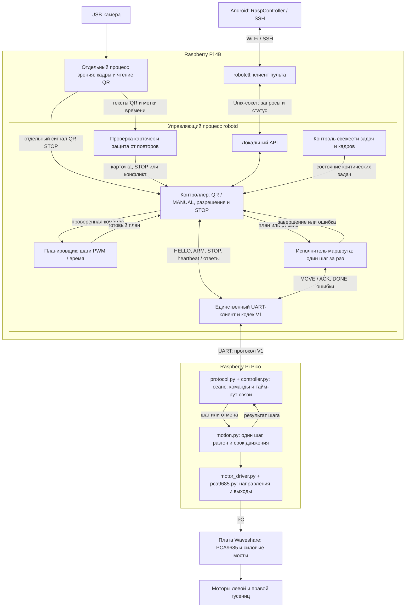

# Учим гусеничного робота читать QR-коды

Практическое руководство для первого проекта с Raspberry Pi 4B и Raspberry Pi Pico. Третья, учебная редакция — 1 октября 2026 года.

## Введение. Что мы собираемся построить

Представьте опыт: вы подносите к камере карточку с надписью «Вперёд» и QR-кодом. Робот замечает квадратный рисунок, читает спрятанное в нём сообщение и проезжает небольшое расстояние. Затем вы показываете карточку «Разворот» — гусеницы начинают вращаться в разные стороны, и робот поворачивается на месте.

Для человека эти действия выглядят просто. Внутри робота за это время происходит несколько разных вещей: камера делает снимок, компьютер находит на нём QR-код, программа понимает команду, другая плата включает двигатели, а затем вовремя их останавливает. Нам предстоит научить каждую часть делать свою работу и договориться с остальными.

Железо уже собрано — это хорошая отправная точка. Но соединённые провода ещё не объясняют роботу, что делать. **Программа** — это подробная последовательность правил для устройства. Например: «Если получил допустимую команду вперёд, включи обе гусеницы; если время закончилось, выключи; если потерял связь, тоже выключи».

Эта книга поможет пройти путь от первого включения маленького компьютера до робота, который работает без ноутбука. Знать программирование заранее не нужно. Мы будем вводить новые понятия тогда, когда они понадобятся, и после каждого большого шага проверять небольшой понятный результат.

### Что здесь можно сделать уже сейчас, а что появится позже

В репозитории есть прошивка Pico (`scr/pico/firmware/`) и программа Pi (`pi/robot/`): чтение QR, проверка карточек, планирование, обмен UART, ручное управление и остановка. В §4.13–4.18 показаны установка с GitHub, настройки и запуск. До подключения моторов можно проверить логику в режиме **dry-run**: он заменяет Pico программной имитацией и не открывает UART.

Текущая версия управляет **PWM и временем**, без измерения расстояния и угла. Она всегда ждёт явного START после запуска. Энкодеры, AUTO_BOOT и полноценная служба Bluetooth остаются дальнейшими задачами. Написанный код и программные тесты не заменяют заполнение паспорта проводки и испытания на вашем роботе.

Таким помощником может быть **LLM-агент** — ИИ, которому вы поручаете подготовить и изменить файлы программы. Он не видит ваш робот сам по себе. Если не сообщить ему, к каким контактам подключены провода, он может выбрать неподходящие значения. Поэтому важная часть нашей работы — собрать понятные исходные данные.

В книге встретятся короткие команды вроде `hostname`. Их вводят в специальное окно, чтобы настроить компьютер или получить сведения о нём. Это не готовая программа управления роботом. Где вводить команду и что она означает, будет указано рядом.

Технические задания для агентов вынесены в приложения. При первом чтении их можно пропустить: они описывают проверку готового кода и дальнейшие расширения.

### Кто за что отвечает в нашем роботе

Сначала познакомимся с деталями без сложных сокращений.

**Raspberry Pi 4B — маленький компьютер.** По возможностям он похож на обычный компьютер: к нему можно подключить экран, клавиатуру, мышь, камеру. На нём будут храниться программы и работать распознавание QR. Дальше для краткости называем его **Pi**. В нашем проекте Pi принимает решения.

**Raspberry Pi Pico — маленький исполнитель.** Его называют **микроконтроллером**: это устройство, которое выполняет сохранённую программу и работает с электрическими сигналами. У него нет привычного рабочего стола. Мы поручим Pico включать двигатели с заданным PWM и проверять, не пора ли остановиться. Измерения вращения в этой версии нет.

**Waveshare Pico-Motor-Driver — плата между Pico и двигателями.** Контакты Pico передают слабые управляющие сигналы. Питать ими мотор нельзя. На плате Waveshare есть электронные переключатели, которые по этим сигналам управляют током от моторного аккумулятора. Слово **драйвер** здесь означает устройство управления двигателем. Позже «драйвером» мы также назовём небольшой программный модуль, который умеет обращаться к этой плате; будем уточнять, о каком из двух идёт речь.

**USB-камера — глаза робота.** Она передаёт компьютеру отдельные изображения — **кадры**. Много кадров подряд образуют видео. Программа будет искать QR-коды в этих кадрах.

**Энкодеры — датчики вращения.** Если они есть на ваших двигателях, они могут сообщать, насколько повернулся вал; наличие и модель нужно подтвердить. Это похоже на счётчик оборотов. С их помощью позже получится лучше выдерживать скорость и расстояние.

**Телефон — пульт.** Сначала будем использовать компьютер для настройки. Когда всё заработает, телефон позволит запускать и останавливать работу и смотреть сообщения о состоянии.

| Устройство | Его вопрос | Его действие |
|---|---|---|
| Камера | «Что сейчас перед роботом?» | Передать изображение |
| Pi | «Что означает эта карточка?» | Прочитать QR и выбрать движение |
| Pico | «Как выполнить полученное движение?» | Управлять обеими гусеницами и временем |
| Плата моторов | «Куда и сколько тока подать?» | Управлять питанием двигателей |
| Энкодеры (будущее расширение) | «Насколько повернулись валы?» | Передать сигналы вращения |
| Телефон | «Что хочет человек?» | Передать запуск, остановку, запрос состояния |

У Pi может быть 4 или 8 ГБ оперативной памяти — временной памяти для работающих программ. Для нашей первой версии предполагается достаточным и вариант с 4 ГБ; менять план из-за этого не требуется.

### Общая блок-схема робота

Схема показывает путь команды и ответов в текущей программе: от камеры или телефона до двух гусениц. Внутри Pi распознавание работает отдельным процессом, а режимами, маршрутом и UART управляет один процесс `robotd`.



Контроллер сначала получает готовый план от планировщика, затем передаёт его исполнителю. Следующий шаг начинается только после ответа Pico `DONE completed`. Команды разрешения, heartbeat и STOP контроллер отправляет через тот же UART-клиент; STOP также отменяет оставшийся маршрут на Pi. На Pico независимо проверяются срок движения и потеря heartbeat.

Стрелки обозначают основные потоки данных и управления. Сборка модулей, загрузка настроек и журнал здесь опущены; полная карта файлов — §4.7. Отдельный сигнал QR STOP передаётся процессом зрения через флаг, который обслуживает `bootstrap.py`. Модуль `supervisor.py` оценивает свежесть по меткам управляющего цикла, исполнителя и кадров; решение об остановке принимает контроллер.

Это схема аппаратного запуска. В dry-run UART-клиент заменён имитацией Pico, и команды не уходят к моторной плате. Bluetooth в рабочий путь пока не входит: есть только адаптер `remote/bluetooth.py`, без службы BlueZ (§6.8). После включения программа ждёт явного START; AUTO_BOOT и измерение движения энкодерами не реализованы.

### Как одна карточка превращается в движение

Разберём один пример. В QR записано, что нужно ехать вперёд одну секунду с небольшой мощностью. QR — это **упаковка для данных**, а не маленькая программа, которая сама запускает мотор.

1. Камера передаёт изображение Pi.
2. Программа Pi находит QR и превращает рисунок в текст.
3. Она проверяет: это наша команда? Время и мощность допустимы?
4. Pi отправляет Pico короткое сообщение: «Обе гусеницы вперёд, вот мощность и длительность».
5. Pico управляет платой моторов. При этом он продолжает слушать: вдруг пришла команда «Стоп»?
6. Через заданное время Pico выключает движение и сообщает Pi: «Закончил».

Позже вместо «одна секунда» мы сможем использовать расстояние и показания энкодеров. Но первый опыт с коротким движением проще проверить, поэтому начнём с него.

### В каком порядке будем работать

Не нужно пытаться запустить весь робот сразу. Иначе при ошибке непонятно, где искать причину: в камере, проводах, программе или питании.

| Этап | Что делаем | Маленькая победа в конце |
|---|---|---|
| 1 | Записываем систему на карту памяти Pi | Pi включается как компьютер |
| 2 | Учимся работать с ним с экраном и по сети | Можем войти, посмотреть сведения и выключить Pi |
| 3 | Изучаем подключение и подготавливаем Pico | Знаем назначение проводов, можем записывать файлы в Pico |
| 4 | Загружаем прошивку Pico и позже проверяем моторы вместе с Pi | Каждая гусеница крутится в нужную сторону и останавливается |
| 5 | Настраиваем обмен Pi и Pico | Платы понимают запросы и ответы |
| 6 | Устанавливаем Pi-программу, проверяем камеру и dry-run | Читаем карточку без отправки моторных команд |
| 7 | Соединяем чтение QR с движением | Одна карточка вызывает одно короткое действие |
| 8 | Проверяем STOP и отмену маршрута | Остановка и сбой не приводят к повторному движению |
| 9 | Подключаем телефон и собственную сеть робота | Управляем без домашнего роутера и интернета |
| 10 | Включаем автоматический запуск | После включения питания ноутбук не требуется |

Главы сгруппированы по вашим исходным семи темам. Поэтому связь плат подробно разобрана в главе 5, но прочитать её нужно **до объединения программ** из глав 3 и 4.

### Как читать незнакомые обозначения

Слова в таком оформлении — `main.py` — обычно обозначают точное имя файла, команды или параметра. Когда их нужно вводить, буквы и знаки следует сохранять. Кавычки оформления вокруг них не вводятся.

Если написано **«пример»**, это не установленный факт о вашем роботе. Например, «левый мотор — MA» означает возможное подключение; сначала нужно посмотреть, куда он подключён у вас. Если значение неизвестно, пишем «неизвестно», а не подставляем случайное число.

**Контакт**, или **пин**, — металлический вывод платы, к которому подключают провод. На платах много контактов, и у каждого своё назначение. Их номера мы будем разбирать отдельно: номер контакта по порядку и его программное имя могут различаться.

### Первые правила работы на столе

Первые моторные опыты проводите вместе: один человек запускает опыт, второй готов отключить питание двигателей. Установите робот на устойчивую подставку так, чтобы гусеницы не касались стола, а платформа не могла упасть. Уберите волосы, одежду и провода от движущихся частей.

Пока мы устанавливаем систему и изучаем настройки, **моторное питание выключено**. Камеру, сеть и многие программы можно проверять без вращения гусениц.

Вольты, обозначаемые **В**, описывают электрическое напряжение. У моторов и электронных плат оно разное. Вход моторной платы рассчитан на 6–12 В; Pi получает около 5 В через USB-C; сигнальные контакты Pi и Pico работают с уровнями 3,3 В. Это не взаимозаменяемые подключения. Для Pi 4 ориентир по источнику питания — 5 В / 3 А; амперы, **А**, характеризуют ток, который он способен обеспечить. [Питание Pi](https://www.raspberrypi.com/documentation/computers/getting-started.html#power-supply), [плата Waveshare](https://www.waveshare.com/product/pico-motor-driver.htm).

Не переставляйте провода под питанием. Не соединяйте положительные выходы двух power bank между собой. Если непонятно, куда приходит питание, сначала нарисуйте и проверьте схему — к этому вернёмся в главе 3.

## Содержание

1. [Устанавливаем систему на Pi](#1-устанавливаем-систему-на-pi)
2. [Учимся общаться с Pi](#2-учимся-общаться-с-pi)
3. [Знакомимся с Pico и учим его управлять моторами](#3-знакомимся-с-pico-и-учим-его-управлять-моторами)
4. [Учим Pi читать QR-коды](#4-учим-pi-читать-qr-коды)
5. [Учим две платы разговаривать по UART](#5-учим-две-платы-разговаривать-по-uart)
6. [Превращаем Android-телефон в пульт](#6-превращаем-android-телефон-в-пульт)
7. [Делаем робота автономным](#7-делаем-робота-автономным)
8. [Приложения для проверки и дальнейшей разработки](#приложения-для-проверки-и-дальнейшей-разработки)
9. [Словарь для возвращения к незнакомым словам](#словарь-для-возвращения-к-незнакомым-словам)

## 1. Устанавливаем систему на Pi

### 1.1. Что такое операционная система и зачем карта памяти

На обычном домашнем компьютере после включения появляется Windows. Она умеет открывать файлы, подключаться к сети, запускать программы и показывать окна. Это **операционная система**, сокращённо ОС.

На Pi мы установим **Raspberry Pi OS** — систему, подготовленную для этих компьютеров. Она относится к семейству Linux. Сейчас достаточно понимать: это другой рабочий стол и другие команды, но назначение то же — дать нам возможность работать с компьютером.

Pi будет хранить систему и наши файлы на **microSD**, маленькой карте памяти. В этом проекте она выполняет роль диска компьютера. Просто скопировать на неё установочный файл недостаточно: нужно записать **образ системы** — заранее подготовленный набор разделов и файлов, с которого Pi умеет запускаться. Эту работу выполнит программа Raspberry Pi Imager.

На Pico мы эту систему не устанавливаем. Его подготовка другая и описана в главе 3.

### 1.2. Подготовим рабочее место

Понадобятся Windows-компьютер с интернетом, карта microSD объёмом 32 ГБ или больше и **кардридер** — устройство, через которое компьютер читает карту. Он может быть встроен в ноутбук или подключаться по USB.

Если на карте есть фотографии или другие нужные файлы, сначала скопируйте их в безопасное место. Запись системы удалит прежнее содержимое карты.

Откройте [официальную страницу Raspberry Pi Imager](https://www.raspberrypi.com/software/), скачайте версию для Windows и установите её. Это программа для подготовки карты, а не сама Raspberry Pi OS.

### 1.3. Выберем систему

Вставьте карту через кардридер и запустите Imager. Интерфейс программы со временем меняется, поэтому ориентируйтесь по смыслу полей:

1. В выборе устройства укажите **Raspberry Pi 4**. Это модель нашего компьютера.
2. В выборе ОС укажите **Raspberry Pi OS, 64-bit, с рабочим столом**.
3. В выборе накопителя укажите свою microSD. Сравните объём с надписью на карте. Если сомневаетесь, выньте карту, посмотрите, какой пункт исчез, затем вставьте её снова.

Почему выбираем такую систему? Рабочий стол позволяет видеть знакомые окна и удобно проверять камеру. Вариант **Lite** обходится без рабочего стола, поэтому для первого знакомства сложнее. Вариант **Full** содержит больше готовых программ, но для робота они не обязательны. **64-bit** — вариант системы, подходящий нашему Pi 4; разбираться сейчас в устройстве процессора не нужно.

Для программы из репозитория выберите Raspberry Pi OS **64-bit** с Python **3.11 или новее**. Проверка версии: `python3 --version`. Названия Bookworm и Trixie обозначают выпуски системы, а не отдельные программы для установки. [Варианты Raspberry Pi OS](https://www.raspberrypi.com/documentation/computers/os.html).

### 1.4. Настроим имя, Wi-Fi и доступ до первого включения

Перед записью Imager предлагает персонализацию — **Customisation / OS customisation**. Она особенно важна, если у Pi не будет экрана: мы заранее сообщим ему пароль от сети и разрешим удалённое подключение.

Заполните поля:

| Что спрашивает Imager | Что выбрать | Зачем |
|---|---|---|
| Hostname | `qr-robot` | Имя компьютера в нашей сети |
| Username | `robot` | Имя учётной записи человека, который работает с Pi |
| Password | Ваш собственный пароль | Защита входа в Pi |
| Wi-Fi SSID | Точное название домашней Wi-Fi-сети | Чтобы Pi нашёл нужную сеть |
| Wi-Fi password | Пароль домашней Wi-Fi-сети | Чтобы роутер разрешил подключение |
| Страна Wi-Fi | Страна, где используется робот | Чтобы устройство использовало разрешённые радиоканалы |
| Часовой пояс | Например `Europe/Moscow`, если это ваш пояс | Правильное время в сообщениях и файлах |
| Раскладка клавиатуры | Удобная вам | Чтобы при вводе получались ожидаемые символы |
| SSH / Remote access | Включить SSH, для начала вход по паролю | Чтобы управлять Pi из текстового окна другого компьютера |

Здесь **два разных пароля**: пароль Wi-Fi открывает доступ в сеть, пароль пользователя открывает доступ к самому Pi. Имя `qr-robot` и имя `robot` тоже разные: первое относится к компьютеру, второе — к учётной записи.

**SSH** пока можно понимать как защищённый способ послать Pi текстовую команду через сеть и увидеть ответ. В следующей главе попробуем его по шагам.

Запишите выбранные имена и пароли так, чтобы потом найти. Если выберете другие имена, в примерах книги нужно будет заменить `qr-robot` и `robot` на ваши значения. Не используйте пароли из старых случайных инструкций: задайте свои.

### 1.5. Запишем карту и включим Pi

Запустите запись и дождитесь её завершения и проверки. Проверка нужна, чтобы заметить ошибки записи до первого запуска. Затем безопасно извлеките карту средствами Windows.

Если Windows после записи предлагает «отформатировать диск», **откажитесь**. На карте появился раздел Linux, который Windows может не понимать. Его не нужно «исправлять» форматированием.

Вставьте карту в выключенный Pi. Пока моторное питание отключено, подготовьте вариант работы из следующей главы — с монитором либо без него. Подайте питание Pi через его USB-C. Не выключайте его через несколько секунд, если рабочий стол или сеть ещё не появились: первый запуск может занять несколько минут.

Wi-Fi, сохранённый в Imager, Pi будет использовать автоматически. Для современных систем не применяйте старый совет копировать `wpa_supplicant.conf` на карту: начиная с Bookworm такой способ первоначальной настройки не поддерживается. [Первый запуск и запись карты](https://www.raspberrypi.com/documentation/computers/getting-started.html).

### 1.6. Как понять, что этап пройден

С экраном вы увидите загрузку и затем рабочий стол или вопросы первоначальной настройки. Без экрана внешних признаков меньше: проверим подключение по сети в главе 2. Просто горящий индикатор ещё не доказывает, что система загрузилась полностью.

Если ничего не происходит, сначала проверьте питание, правильность установки карты и выбранный HDMI-вход монитора. Если карта записана с ошибкой, её можно записать заново, но это снова удалит данные. Не меняйте сразу несколько вещей: так проще понять причину.

**Запишите в тетрадь проекта:** модель Pi, выбранную ОС, имя компьютера, имя пользователя и название сети. Пароли храните отдельно от заметок, которые будете передавать агенту.

## 2. Учимся общаться с Pi

### 2.1. Два способа попасть к одному компьютеру

Первый способ привычный: сидеть рядом с Pi, смотреть в его монитор и печатать на его клавиатуре. Второй — сидеть за Windows-компьютером и передавать команды Pi через сеть.

Во втором случае Pi всё равно выполняет работу сам. Windows-компьютер лишь показывает нам окно связи. Когда позже мы уберём ноутбук, установленная система и файлы останутся на карте Pi.

Для начала выберите один способ. Если есть свободный экран, первый вариант проще для знакомства. Если экрана нет, заранее настроенный SSH позволяет начать со второго.

### 2.2. Вариант А: подключаем монитор, клавиатуру и мышь

На Pi 4 два маленьких разъёма **micro-HDMI** для изображения. Они меньше обычного HDMI на телевизоре. Понадобится подходящий кабель или переходник; USB-C у Pi используется для питания, а не для вывода изображения на монитор.

1. При выключенном Pi подключите монитор к micro-HDMI-разъёму **HDMI0**, расположенному ближе к USB-C.
2. Подключите USB-клавиатуру и мышь.
3. На мониторе выберите тот HDMI-вход, куда вставлен кабель.
4. Включите Pi. Если система задаёт вопросы, завершите первоначальную настройку.
5. Найдите значок сети на панели рабочего стола. Убедитесь, что выбрана нужная Wi-Fi-сеть. Если нет — выберите её и введите пароль.

**Рабочий стол** — экран со значками, меню и окнами, похожий по назначению на рабочий стол Windows. Названия и расположение кнопок могут отличаться, это нормально.

### 2.3. Небольшое знакомство с терминалом

Откройте программу **Terminal** через меню приложений или значок с изображением текстового окна. **Терминал** — окно, в котором вместо нажатия кнопок вводят команды словами. **Консолью** часто называют такое же текстовое окно общения с устройством. В этой книге будем говорить «терминал», а если речь пойдёт о Pico — уточнять это.

В окне видна строка примерно такого вида: `robot@qr-robot:~ $`. Это **приглашение к вводу**: компьютер готов принять команду. Эту строку копировать не нужно.

Наш первый опыт:

1. Щёлкните внутри окна.
2. Напечатайте `hostname` латинскими буквами.
3. Нажмите Enter.
4. Pi должен вывести своё имя — `qr-robot`, если вы выбрали его при установке.

Эта команда ничего не меняет: только спрашивает имя. Затем попробуйте `hostname -I`. После пробела стоит дефис и **большая латинская I**. Команда покажет сетевые адреса Pi.

Пока не нужно запоминать команды. Важно освоить ритм: ввести одну строку, нажать Enter, прочитать ответ, затем переходить дальше. Если команда сообщает об ошибке, сохраните весь текст сообщения, а не только «не работает».

### 2.4. Что такое сеть и адрес компьютера

Домашний роутер соединяет устройства в одну **локальную сеть**. «Локальная» означает, что устройства могут общаться друг с другом рядом, в пределах этой сети. Наличие интернета при этом необязательно.

Устройство получает **IP-адрес**, например `192.168.1.42`. Это похоже на номер квартиры внутри дома. По нему другая программа понимает, к какому устройству обращаться. Приведённое число — только пример; у вашего Pi адрес будет своим.

Имя `qr-robot.local` — удобный способ обратиться к компьютеру по имени, не запоминая числа. На некоторых сетях поиск по имени не работает. Тогда используем настоящий IP-адрес.

Если `hostname -I` показал несколько адресов, не копируйте всю строку в поле подключения. Нужен один адрес соединения с вашей сетью. Для первого опыта проще взять IPv4 — четыре группы чисел с точками — из списка устройств роутера или данных нужного Wi-Fi-подключения Pi. Другие адреса могут относиться к кабелю, другой сети или другому способу адресации.

### 2.5. Вариант Б: подключаемся из Windows через SSH

**Где выполняем:** сначала на Windows-компьютере. После успешного входа команды внутри этого же окна уже будут выполняться на Pi.

Убедитесь, что Pi включён, а Windows-компьютер подключён к той же домашней сети. Компьютер может быть подключён к роутеру по кабелю, а Pi по Wi-Fi — это тоже подходит, если роутер разрешает им общаться.

1. На Windows откройте меню «Пуск» и найдите **PowerShell** или **Windows Terminal**. Откройте программу.
2. Введите `ssh robot@qr-robot.local` и нажмите Enter.
3. При первом подключении может появиться вопрос о доверии ключу устройства. Ключ здесь — электронный признак конкретного Pi. Убедитесь, что подключаетесь к своему устройству по верному адресу. Если у вас есть его экран, отпечаток ключа можно сверить с данными Pi; при сомнении не подтверждайте случайный адрес. Для продолжения первого ожидаемого подключения вводят `yes`.
4. Введите пароль **пользователя Pi**, а не Wi-Fi. При наборе могут не появляться даже звёздочки. Это нормально: напечатайте пароль и нажмите Enter.
5. Посмотрите на приглашение. В нём должно появиться `robot@qr-robot`.
6. Выполните `hostname`. Ответ `qr-robot` подтверждает, что вы работаете на Pi.

Разберём строку подключения: `ssh` — программа связи; `robot` — имя пользователя; `@` отделяет его от адреса; `qr-robot.local` — компьютер, к которому подключаемся.

Чтобы закрыть связь, введите `exit`. Pi при этом остаётся включённым. Отключиться от него и выключить его — разные действия. [SSH в Windows](https://learn.microsoft.com/en-us/windows/terminal/tutorials/ssh).

### 2.6. Если подключение по имени не получилось

Попробуйте обратиться по IP: `ssh robot@192.168.1.42`, **заменив числа на адрес вашего Pi**.

Где взять адрес:

- Если есть монитор Pi, выполните на нём `hostname -I`.
- Если экрана нет, откройте список подключённых устройств в настройках домашнего роутера и найдите `qr-robot`. Расположение этого списка зависит от роутера; попросите помочь человека, который настраивал вашу домашнюю сеть.
- На этапе настройки можно временно соединить Pi сетевым кабелем Ethernet с роутером и найти его в списке проводных устройств.

Сеть с названием «Гостевая» иногда запрещает устройствам общаться между собой. В этом случае оба устройства могут иметь интернет, но SSH между ними работать не будет. Для настройки используйте обычную домашнюю сеть.

Если Windows пишет, что команда `ssh` не найдена, можно установить компонент OpenSSH Client средствами Windows или воспользоваться PuTTY из следующего пункта.

### 2.7. Тот же доступ через PuTTY

[PuTTY](https://www.chiark.greenend.org.uk/~sgtatham/putty/latest.html) — отдельная программа для подключения. Она полезна, если вам удобнее заполнить поля окна, чем вводить строку SSH.

Откройте PuTTY и заполните:

| Поле | Значение |
|---|---|
| Host Name | `qr-robot.local` или реальный IP Pi |
| Port | `22` |
| Connection type | `SSH` |

Здесь **порт 22** — номер сетевой службы, которая принимает SSH-подключения. Это не металлический разъём на плате.

Нажмите Open. При первом ожидаемом подключении подтвердите ключ своего устройства; в появившемся окне введите логин `robot` и пароль. Затем попробуйте `hostname`.

Не выбирайте в PuTTY пункт Serial для этого опыта: мы сейчас подключаемся по сети. Разговор Pi с Pico по проводам будет отдельным соединением.

### 2.8. Первое обслуживание: обновление и выключение

**Где выполняем:** в терминале Pi — непосредственно на нём или после SSH-входа. Пока моторы отключены.

В Linux многие программы устанавливаются как **пакеты**: система сама скачивает нужные файлы и размещает их. Команда `apt` управляет такими пакетами. Слово `sudo` перед командой разрешает выполнить конкретное действие с правами администратора — например, изменить установленные системные программы.

Выполните по очереди:

1. `sudo apt update` — обновить список доступных программ. Это ещё не обновляет сами программы. Дождитесь возвращения приглашения.
2. `sudo apt full-upgrade` — установить обновления. Если появится вопрос продолжить ли, прочитайте его; обычно подтверждение — `Y` и Enter. Во время обновления не отключайте питание.
3. `sudo reboot` — перезапустить Pi после обновлений. Соединение SSH оборвётся, потому что компьютер перезагружается. Подождите загрузки и подключитесь снова.

Для обычного обслуживания не применяем `rpi-update`: это инструмент для экспериментальных версий. [Обновления ОС](https://www.raspberrypi.com/documentation/computers/os.html#manage-software-and-firmware-updates).

Ещё три полезных вопроса компьютеру:

| Команда | Что узнаём |
|---|---|
| `cat /etc/os-release` | Какая версия ОС установлена; `cat` здесь показывает текст файла |
| `free -h` | Сколько оперативной памяти доступно |
| `hostname -I` | Какие адреса получил Pi |

Для выключения выполните `sudo shutdown -h now`. Это просьба завершить программы и запись на карту. После неё дождитесь окончания работы; только затем отключайте питание. Простое исчезновение SSH-связи ещё не доказывает, что все операции записи закончились. На этапе знакомства наблюдайте выключение с экраном и запомните поведение своего устройства.

### 2.9. А можно видеть весь рабочий стол удалённо?

Да. **VNC** передаёт изображение рабочего стола Pi на другой компьютер и возвращает нажатия мыши и клавиатуры. На Pi должна работать программа, которая отдаёт изображение, — **сервер**. На Windows запускается программа, которая его показывает, — **клиент**.

Для варианта Raspberry Pi OS с рабочим столом включите VNC в настройках интерфейсов. Можно открыть `sudo raspi-config`: это текстовое меню настроек Pi; перемещайтесь стрелками, выбирайте Enter. Найдите Interface Options и VNC, включите его. Затем установите совместимый клиент, например TigerVNC, на Windows и подключитесь к адресу Pi. Подробности и актуальные окна есть в [официальной инструкции удалённого доступа](https://www.raspberrypi.com/documentation/computers/remote-access.html).

Lite не содержит рабочего стола, поэтому для него этот путь не подходит без дополнительной установки. Для нашего проекта достаточно SSH; удалённый рабочий стол — удобное дополнение при проверке камеры.

Есть и [Raspberry Pi Connect](https://www.raspberrypi.com/documentation/services/connect.html), который позволяет подключаться через браузер после настройки аккаунта. Для него предусматриваем доступ в интернет. На площадке без интернета будем использовать локальные подключения, о которых рассказано в главе 6.

### 2.10. Что делать при типичных ошибках

| Сообщение или наблюдение | Что оно обычно означает | Первый шаг |
|---|---|---|
| Имя `qr-robot.local` не найдено | Компьютер не смог превратить имя в адрес | Попробовать реальный IP |
| `Connection timed out` | Ответ не пришёл за отведённое время | Проверить питание, адрес и общую сеть |
| `Connection refused` | По адресу есть ответ, но SSH не принимает соединение | Проверить, включён ли SSH на Pi |
| `Permission denied` | Вход не разрешён | Перепроверить логин, пароль и раскладку |
| Предупреждение об изменившемся ключе | Устройство представилось иначе, чем раньше | Проверить адрес; после переустановки ОС ключ действительно меняется |
| Wi-Fi не подключается | Часто неверно записаны имя или пароль | Проверить их посимвольно; попробовать сеть 2,4 ГГц |

Для добавления новой сети после установки используйте значок Wi-Fi на рабочем столе. Без рабочего стола можно открыть `sudo nmtui` — текстовое меню настройки сети. В нём **профиль подключения** означает сохранённые имя сети, пароль и правила подключения. Включите автоматическое соединение и доступность для всех пользователей: тогда сеть сможет подняться до входа человека в систему. [Справочник nmtui](https://networkmanager.dev/docs/api/latest/nmtui.html).

**Проверка главы:** вы можете подключиться, выполнить `hostname`, узнать версию ОС и корректно выключить Pi. Научиться этому достаточно; знать наизусть все команды пока не нужно.

## 3. Знакомимся с Pico и учим его управлять моторами

### 3.1. Почему Pico готовят иначе, чем Pi

Pi мы подготовили как компьютер: установили систему на карту и научились открывать программы. Pico устроен для другой работы. Он должен получить небольшую программу, хранить её во внутренней памяти и выполнять после включения.

**Python** — язык, на котором человек записывает инструкции для компьютера. Но процессор не читает такой текст сам. Нужна программа, которая понимает этот язык и выполняет инструкции, — **интерпретатор**. На большом Pi будем использовать обычный Python 3. Для Pico выберем **MicroPython**, компактный вариант, приспособленный к микроконтроллерам.

Поэтому подготовка состоит из двух отдельных действий:

1. Установить в Pico MicroPython — научить плату понимать этот язык.
2. Позже записать туда наши файлы — сообщить, что именно делать с двигателями и командами.

Словом **прошивка** часто называют и встроенное программное обеспечение устройства, и файл для его первоначальной установки. В книге будем уточнять: «установить MicroPython» или «загрузить файлы проекта», чтобы эти шаги не смешивались.

Рабочая прошивка лежит в `scr/pico/firmware/`. Окончание `.py` означает файл программы. Аппаратные модули прошивки запускают на Pico, а не обычным Python на Windows.

### 3.2. Два пути связи: кабель для нас и провода для робота

До подключения полезно различить две задачи.

**Во время разработки** мы подключаем Pico USB-кабелем к Windows-компьютеру или Pi. Через него редактор передаёт файлы в память Pico и показывает сообщения платы. Например, Pico может написать: «Готов» или «Не вижу моторную плату». Окно таких сообщений — диагностическая консоль: здесь «диагностика» означает поиск причин, почему что-то работает или не работает.

**Во время самостоятельной работы** Pi передаёт Pico команды по уже установленным проводам между контактами плат. Этот способ обмена называется **UART**. Пока достаточно представить его как отдельную линию коротких текстовых сообщений. Подробно разберём её в главе 5.

На многих контактах написано **GPIO**, что означает контакты общего назначения. Программа может использовать подходящий контакт для чтения или выдачи электрического сигнала. Если такой контакт занят UART, по нему передаются сообщения между платами. Он не предназначен для питания мотора.

Почему нельзя смешивать два разговора? Представьте, что по линии ожидается «Вперёд на секунду», но туда же кто-то отправляет «Введите команду Python». Получатель уже не знает, где команда движения, а где служебный текст. Поэтому сообщения для человека показываем через USB, а линию Pi–Pico оставляем для согласованных команд робота.

**Практический вывод:** в Thonny выбирайте подключение к Pico по USB. Никакую дополнительную «консоль через UART» включать не нужно. Если такую настройку предложит агент, напомните, что UART уже предназначен для сообщений от Pi.

### 3.3. Сначала изучим реальные провода

Даже если робот собран правильно, прошивка должна знать, куда подключён каждый сигнал. Для человека «левый мотор» очевиден. Для программы это нужно записать, например: «левый мотор подключён к клеммам MC».

**Клемма** — зажим для провода, часто с винтом. **Распиновка** — карта контактов с их номерами и назначением. **Перемычка** — маленькое соединение на плате, которым выбирают один из предусмотренных вариантов схемы. Она может выглядеть как съёмная деталь на двух штырьках или как соединяемые пайкой площадки; не переделывайте её наугад.

Подготовьте телефон для фотографий, лист бумаги, карандаш и ссылки на [распиновку Pico](https://datasheets.raspberrypi.com/pico/Pico-R3-A4-Pinout.pdf), [контакты Pi](https://www.raspberrypi.com/documentation/computers/raspberry-pi.html#gpio), [схему Waveshare](https://files.waveshare.com/upload/b/b8/Pico_Motor_Driver_SCH.pdf).

Работаем без питания: выключите оба power bank и отсоедините USB, который тоже может питать плату. Не выдёргивайте сразу все провода — сначала нужно зафиксировать существующее подключение.

1. **Сфотографируйте робот целиком.** Отметьте, где у него перед. Далее «левый» и «правый» определяем так, как будто сидим на роботе лицом вперёд.
2. **Сфотографируйте надписи плат и разъёмы.** Модель и ревизия — вариант изготовления платы — помогут сверить документацию.
3. **Выберите один провод и проследите оба конца.** Запишите не только цвет, но и надписи у обоих контактов. Цвета выбирает сборщик, их значение не гарантировано.
4. **Найдите моторные клеммы.** У каждого двигателя два силовых провода. Запишите, к какой паре MA, MB, MC или MD они приходят. Эти обозначения на Waveshare — имена выходов для моторов.
5. **Если энкодеры установлены, найдите их провода.** Их нельзя смешивать с двумя силовыми проводами двигателя. Найдите модель датчика и назначение его выводов по документации.
6. **Проследите три сигнальные связи Pi–Pico:** передача в одну сторону, передача обратно и общая земля. Их подписи и перекрёстное подключение разберём в главе 5.
7. **Проследите питание Pico.** Откуда он получает электричество, когда USB к компьютеру отключён? Это должно быть известно до автономного запуска.
8. **Сфотографируйте перемычки Waveshare.** На опубликованной схеме предусмотрены варианты связи с Pico через GP20/GP21 или GP6/GP7. Нужно определить, какой выбран на вашей плате.

Если провод уходит под плату и не виден, не угадывайте. При необходимости используйте **прозвонку** мультиметром: прибор проверяет наличие электрического соединения. Её выполняют на обесточенной схеме. Если раньше мультиметром не пользовались, попросите взрослого, знакомого с измерениями, показать этот режим. Измерение напряжения — другая операция: другой режим прибора и включённое питание.

Осмотр отвечает на вопрос «куда идёт провод», но не всегда отвечает на вопрос «какое напряжение на нём». Например, энкодер может выдавать 5 В, хотя Pico ждёт 3,3 В. Тогда нужен подходящий преобразователь уровня, а не изменение цифры в Python. Не подключайте неизвестный сигнал для проверки методом проб.

### 3.4. Номер контакта и его имя — не одно и то же

Самая частая путаница выглядит так: в программе написано `Pin(20)`, а человек ищет двадцатый контакт по порядку. Для Pico это неверное предположение.

У Pico есть физические контакты вдоль платы, а сигнальные выводы имеют имена GP0, GP1 и так далее. **GP20 находится на физическом контакте 26.** Число в `Pin(20)` означает GP20.

У Pi похожая ситуация: его сигнальный **GPIO14 находится на физическом контакте 8** большого разъёма. Названия GPIO Pi и GP Pico принадлежат разным платам: совпадение числа ещё не означает, что эти контакты нужно соединять.

| Что видим | Что это означает |
|---|---|
| Pico GP20 | Программное имя конкретного сигнального вывода Pico |
| Pico, физический контакт 26 | Место этого вывода на разъёме Pico |
| Pi GPIO14 | Программное имя вывода другого компьютера — Pi |
| Pi, физический контакт 8 | Его место на разъёме Pi |
| MA, MB, MC, MD | Выходы моторной платы, а не GPIO |
| Канал PCA9685 № 0 | Выход микросхемы внутри моторной платы, не контакт GP0 Pico |

На плате Waveshare контакты могут быть дополнительно выведены на разъём другой формы. Поэтому пользуйтесь его схемой, а не считайте контакты, как будто это сама Pico. Сверяйте ориентацию рисунка: где USB, верх платы, первый контакт.

### 3.5. Заполним паспорт нашего робота

Это обычная таблица наблюдений. Она связывает настоящие провода с настройками прошивки Pico.

| Что записать | Наш результат | Как узнать |
|---|---|---|
| Где перед робота | Заполнить | Отметить на фото |
| Ревизия Waveshare | Заполнить | Надпись на плате |
| Откуда питается Pico без USB | Заполнить | Проследить питание и сверить схему |
| Левый мотор: MA/MB/MC/MD | Заполнить | Проследить два силовых провода |
| Правый мотор: MA/MB/MC/MD | Заполнить | То же |
| Pi: контакт передачи TX | Заполнить | GPIO-имя и физический номер |
| Pi: контакт приёма RX | Заполнить | GPIO-имя и физический номер |
| Pico: контакт приёма RX | Заполнить | GP-имя и физический номер |
| Pico: контакт передачи TX | Заполнить | GP-имя и физический номер |
| Где соединены GND | Заполнить | Проследить общий провод |
| Связь Waveshare: SDA и SCL | Заполнить | Положение перемычек и схема |
| Адрес PCA9685 | Пока проверить | В `config.py` задан `0x40`; сверить с перемычками и сканированием I²C |
| Энкодер слева: модель и выводы | Заполнить | Маркировка, инструкция, проводка |
| Энкодер справа: модель и выводы | Заполнить | То же |
| Энкодеры, если установлены: питание и уровни | Проверить; для версии PWM/время не требуются | Документация и корректные измерения |
| Модели двигателей и допустимые токи | Найти | Паспорт двигателя и драйвера |
| Какие направления дают движение вперёд | Определим позже | Короткий тест на вывешенных гусеницах |

Некоторые слова — SDA, SCL, адрес — пока ещё новые. Сейчас достаточно переписать маркировки. В разделе о драйвере объясним их смысл.

**Нельзя определить совместимость двигателя только по надписи «12 В».** Важен ещё ток, особенно если вал не может вращаться. Не проверяйте это намеренным заклиниванием: ищите характеристики. Указанные для стабилизатора Waveshare «5 В, до 3 А» не означают 3 А на каждый мотор. [Waveshare](https://www.waveshare.com/wiki/Pico-Motor-Driver), [характеристики силовой микросхемы TB6612FNG](https://toshiba.semicon-storage.com/info/docget.jsp?did=10660&prodName=TB6612FNG).

### 3.6. Устанавливаем MicroPython на Pico

**Где работаем:** на Windows-компьютере; Pico подключается к нему USB-кабелем. Можно делать это и с Pi, но для первого опыта выберем один понятный вариант.

Сначала отключите питание моторов. Если Pico уже питается от Waveshare, проверьте предусмотренный схемой порядок подключения USB. Не добавляйте второй источник питания вслепую. В сомнительном случае безопаснее подготовить Pico отдельно от моторной платы после документирования подключения.

1. Откройте [страницу MicroPython для обычной Raspberry Pi Pico](https://micropython.org/download/RPI_PICO/).
2. Скачайте стабильный файл с окончанием **`.uf2`** именно для Pico на RP2040. Это специальный формат загрузочного файла. Pico 2 и Pico W — другие варианты; не выбирайте их по похожему имени.
3. Найдите на Pico кнопку **BOOTSEL**. Удерживайте её, подключая Pico к Windows по micro-USB. Кабель должен передавать данные: некоторые кабели умеют только заряжать.
4. Отпустите кнопку. В проводнике Windows должен появиться накопитель **RPI-RP2**. Pico временно представился как флешка, чтобы принять новый загрузочный файл.
5. Скопируйте скачанный UF2 на RPI-RP2. После завершения Pico перезапустится, а накопитель исчезнет. Это ожидаемое поведение.

Если накопитель не появился, проверьте кабель, другой USB-порт и то, что BOOTSEL был нажат до подключения. Не форматируйте неизвестные устройства в попытке исправить ситуацию.

### 3.7. Открываем Thonny и знакомимся с окном Pico

[Thonny](https://thonny.org/) — редактор для начинающих программистов. Он позволяет открыть текст программы, сохранить его на устройстве и увидеть сообщения выполнения.

Установите Thonny на Windows и откройте его. Найдите выбор интерпретатора — обычно через меню настроек или область внизу окна. Выберите **MicroPython (Raspberry Pi Pico)** и порт подключённого устройства.

**Порт** в этом окне — обозначение USB-соединения, часто вида COM с числом. Оно не обязано совпадать на разных компьютерах. Если устройств несколько, отключите Pico и посмотрите, какой вариант исчез; затем подключите снова. Не отсоединяйте питание работающих моторов этим способом — здесь моторы выключены.

В нижней области **Shell** должно появиться приветствие MicroPython и приглашение `>>>`. Это знак: «Я готов принять инструкцию». Здесь мы пока ничего не программируем; появление приглашения уже проверяет установку и USB-связь.

Полезно различать:

| Где находятся файлы | Что это даёт |
|---|---|
| В папке Windows-компьютера | Можно редактировать и хранить резервную копию |
| Во внутренней памяти Pico | Pico сможет использовать их после отключения компьютера |

При сохранении файла Thonny предложит место. Чтобы программа осталась в роботе, выбирайте **Raspberry Pi Pico**, а не только «This computer». Главный файл нашей прошивки называется **`main.py`**. При обычном включении Pico запускает его автоматически. Остальные файлы прошивки должны лежать рядом с ним в корне памяти Pico.

Файлы рабочей прошивки загружаем из папки `scr/pico/firmware/` в порядке, описанном в §3.8. Главный `main.py` сохраняем последним.

[Официальное знакомство с MicroPython](https://www.raspberrypi.com/documentation/microcontrollers/micropython.html).

**Ожидаемый результат сейчас:** Thonny видит Pico и показывает окно общения с MicroPython. Гусеницы при этом не двигаются.

### 3.8. Прошивка Pico: настройка, загрузка и работа

Рабочие файлы находятся в `scr/pico/firmware/`. Прошивка управляет **двумя** гусеницами конечными заданиями: знак задаёт направление, число — процент PWM, отдельное число — время в миллисекундах. Энкодеры пока не используются, поэтому процент PWM нельзя считать измеренной скоростью.

**I²C** связывает Pico с микросхемой PCA9685 на моторной плате: SDA передаёт данные, SCL задаёт такт. Это другая связь, чем UART между Pi и Pico. В `config.py` выбраны I²C0, SDA на GP20, SCL на GP21 и адрес PCA9685 `0x40`. Плата допускает другую пару контактов и адрес; настройки сверяют с её перемычками и результатом сканирования I²C.

**PWM**, или ШИМ, управляет долей времени, в течение которого на мотор подаётся сигнал. Частота указывает число циклов PWM за секунду; в `config.py` сейчас установлено 50 Гц. Эти 50 Гц не равны 50% PWM, а процент PWM не гарантирует определённую скорость вращения.

Каждая моторная клемма использует три **канала PCA9685**: PWM задаёт мощность, IN1 и IN2 — направление. Номера каналов не являются номерами GP Pico:

| Клемма | PWM | IN1 | IN2 |
|---|---:|---:|---:|
| MA | 0 | 1 | 2 |
| MB | 3 | 4 | 5 |
| MC | 6 | 7 | 8 |
| MD | 9 | 10 | 11 |

В `config.py` левая гусеница назначена MA, правая — MB. Физические клеммы и направление вращения нужно сверить на собранном шасси. При необходимости направление каждой стороны меняется флагом инверсии.

При запуске прошивка не включает моторы автоматически. Она проверяет настройки, выключает выходы и ждёт команд Pi.

#### Сначала заполняем config.py

Откройте `scr/pico/firmware/config.py` **на компьютере** и перенесите в него результаты таблицы из §3.5. `None` здесь означает «пока неизвестно». Если обязательное поле осталось `None`, `main.py` выдаст ошибку и не перейдёт к рабочему циклу. Импорт `config.py` сам по себе моторы не включает.

| Поле | Что записать и откуда это узнать |
|---|---|
| `I2C_ID`, `I2C_SDA_GP`, `I2C_SCL_GP` | Номер шины и контакты Pico по перемычкам Waveshare: I²C0/GP20/GP21 или I²C1/GP6/GP7. Порядок в настройках — SDA, затем SCL. |
| `PCA9685_ADDRESS` | Адрес микросхемы на I²C. В настройках задан `0x40`; сравните его с результатом сканирования шины. Перемычки адреса могут изменить значение. |
| `PWM_FREQ_HZ` | Общая частота PWM моторных каналов в герцах. Начальное значение — 50 Гц; работу привода при этой частоте проверьте на стенде. |
| `LEFT_MOTOR`, `RIGHT_MOTOR` | Разные надписи клемм `"MA"`, `"MB"`, `"MC"` или `"MD"` по фактическим силовым проводам. Кавычки здесь часть записи Python. |
| `LEFT_INVERTED`, `RIGHT_INVERTED` | `True` или `False` **без кавычек**: нужно ли перевернуть электрическое направление, чтобы положительный PWM вёл гусеницу вперёд. Если направление ещё не измерено, `False` допустимо только как явно записанное начальное предположение для короткой проверки на вывешенном шасси; затем исправьте настройку по наблюдению. |
| `UART_ID`, `UART_TX_GP`, `UART_RX_GP` | Номер UART и контакты Pico, которые реально соединены с Pi. В прошивке разрешены UART0 с парами TX/RX GP0/GP1, GP12/GP13, GP16/GP17 либо UART1 с GP4/GP5, GP8/GP9. TX Pico идёт к RX Pi, RX Pico — к TX Pi; нужна общая GND. |
| `DIRECTION_DEADTIME_MS` | Пауза после выключения PWM перед сменой направления. Начальное значение — 20 мс; его нужно проверить на шасси. |
| `RAMP_PCT_PER_S` | Предел нарастания PWM. Начальное значение — 200 %/с; уточните его по стендовым испытаниям. Это ограничение команды, а не измерение ускорения робота. |
| `MAX_PWM_PCT`, `MAX_STEP_MS`, `HB_TIMEOUT_MS` | Начальные программные пределы: 30%, 2000 мс на шаг и 500 мс без нового heartbeat. Не повышайте их ради первого опыта. |

Карта каналов задана в `motor_driver.py`. Проверка настроек принимает только согласованные пары I²C и UART. Если фактическая проводка другая, сначала сверяйте схему и поддержку MicroPython, а затем меняйте код проверки осознанно.

#### Загружаем файлы через Thonny

Понадобятся установленный MicroPython из §3.6, работающий USB Shell из §3.7 и папка репозитория на компьютере, где открыт Thonny. **Питание моторов всё время отключено.** Если на Pico уже есть старый `main.py`, сначала отключите моторное питание, остановите его через **Ctrl+C** в Shell и переименуйте либо удалите старый файл в панели файлов Thonny. Не оставляйте старый автозапуск рядом с новым.

1. В Thonny выберите интерпретатор **MicroPython (Raspberry Pi Pico)** и USB-порт Pico. Откройте панель файлов, если она скрыта: в ней должны различаться файлы компьютера и файлы Raspberry Pi Pico.
2. В папке `scr/pico/firmware/` откройте **с компьютера** `protocol.py`, затем `boot_counter.py`. Каждый файл сохраните через **File → Save as… → Raspberry Pi Pico** в корень памяти Pico, сохранив точное имя. Для отдельных версий Thonny названия пунктов меню могут немного отличаться; проверяйте выбранное устройство и список файлов на нём.
3. Инициализируйте журнал загрузок **один раз**. При отключённом питании моторов в USB Shell введите:

   ```python
   from boot_counter import initialize
   initialize()
   ```

   Команда создаёт `boot0.dat`. Повторный вызов выдаёт ошибку «journal already exists» — это правильно: при обычном обновлении прошивки журнал не стирают и не создают заново. Если обе записи журнала повреждены, разбирать причину нужно с отключённым питанием моторов; обычное удаление файлов для «исправления» недопустимо, потому что может повторить старые идентификаторы сеанса.

4. Сохраните на Pico `config.py`, `pca9685.py`, `motor_driver.py`, `motion.py` и `controller.py`. Все файлы должны лежать **в корне**, рядом друг с другом, с теми же именами и расширением `.py`. README и папку тестов на Pico не копируйте.

5. Пока `main.py` ещё не скопирован, проверьте настройки в USB Shell:

   ```python
   import config
   config.validate()
   ```

   Отсутствие сообщения об ошибке означает, что поля заполнены и значения проходят программную проверку. Это **не** подтверждает правильность проводов. Если показан список `unfilled wiring passport`, заполните названные поля в файле на компьютере, снова сохраните `config.py` на Pico и перезапустите MicroPython перед повторной проверкой, чтобы он прочитал новую версию модуля.

6. При подключённой логике моторной платы можно дополнительно проверить адрес по I²C, всё ещё без питания моторов:

   ```python
   from machine import I2C, Pin
   bus = I2C(config.I2C_ID, sda=Pin(config.I2C_SDA_GP),
             scl=Pin(config.I2C_SCL_GP), freq=100000)
   print([hex(address) for address in bus.scan()])
   ```

   Ищите настроенный `PCA9685_ADDRESS`. Дополнительные адреса в ответе не обязательно означают вторую плату: у PCA9685 есть групповые адреса. Если нужного адреса нет, проверьте питание логики, перемычки и провода, не включая моторы.

7. **Последним** сохраните на Pico `main.py`. Перезапустите MicroPython через Thonny или выключите и снова включите Pico при отключённом питании моторов. При корректном запуске `main.py` остаётся в цикле ожидания Pi и ничего не вращает. Сообщение об ошибке в Shell означает, что соответствующий шаг настройки нужно исправить. Если `main.py` мешает работе в Shell, отключите моторное питание, нажмите **Ctrl+C**, затем исправьте или переименуйте файл на Pico.

На Pico должны оказаться ровно восемь файлов прошивки: `protocol.py`, `boot_counter.py`, `config.py`, `pca9685.py`, `motor_driver.py`, `motion.py`, `controller.py` и `main.py`. Файлы журнала `boot0.dat` и позднее `boot1.dat` создаются самой процедурой и прошивкой. Для проверки логики на обычном компьютере, **без Pico и движения**, разработчик может запустить из корня репозитория `python -B -m unittest discover -s tests -p 'test_pico_*.py'`.

#### Что делает прошивка после запуска

`main.py` проверяет настройки, открывает I²C, явно выключает моторные каналы и создаёт UART 115200, 8N1. `pca9685.py` записывает уровни в PCA9685; `motor_driver.py` переводит задания левой и правой гусениц в каналы конкретных клемм и применяет инверсию. `motion.py` хранит один конечный шаг, учитывает его срок, плавное нарастание PWM и паузу при обратном направлении. Долгого `sleep` на время движения нет: основной цикл коротко проверяет таймеры и UART каждые несколько миллисекунд.

`protocol.py` принимает только кадры V1 правильной длины с CRC. `controller.py` требует нового знакомства `HELLO`, затем явного `ARM`; сама подача питания не разрешает движение. После `MOVE` Pico отвечает `ACK`, а когда выходы выключены — `DONE`. Повтор того же задания с прежним ID не запускает шаг второй раз. `STOP` имеет приоритет и снимает разрешение; после него для нового движения требуется новый сеанс. `STATUS` сообщает текущее **задание**, состояние и оставшееся время, а не скорость или пройденное расстояние.

Время шага и время ожидания связи проверяются независимо. Pico ожидает новые `HEARTBEAT` от Pi: если их нет 500 мс, он пытается выключить моторы и снимает `ARM`. Каждый `MOVE` также заканчивается по собственному сроку не более 2000 мс. Ошибка I²C переводит контроллер в неисправность и вызывает попытку выключения. `boot_counter.py` меняет номер загрузки, чтобы команды старого сеанса не стали новыми после перезапуска Pico. Аппаратный watchdog в этой версии не включён: сначала нужно проверить поведение PCA9685 при сбросе Pico.

PCA9685 работает отдельно от Pico. Если I²C не отвечает или Pico перезапустился, программная команда остановки может не дойти до его выходов. Поэтому исправная прошивка не заменяет доступного отключения моторного питания и стендовой проверки. Окончание `DONE` подтверждает работу программы с выходами, но не точное расстояние или механическую остановку гусениц. Эти сообщения отправляет готовый модуль Pi `transport/serial_client.py`: установка и запуск — §4.13–4.17, подключение UART — глава 5. Без разрешения Pi прошивка только ждёт связь и не выполняет поездку.


## 4. Учим Pi читать QR-коды

### 4.1. Чему учимся в этой главе

Теперь посмотрим на задачу глазами большого компьютера. У него есть камера и возможность отправить Pico команду. Между ними нужна программа, которая решит: «Это наша карточка? Что она означает? Можно ли сейчас выполнять её действие?»

Первый вариант делаем намеренно простым: робот стоит, человек показывает карточку, робот выполняет короткое движение и снова останавливается. Чтение меток на полу во время езды можно добавить позже. Для него потребуется подходящее положение камеры, освещение и скорость, при которой изображение ещё не смазывается.

Камера сама по себе не даёт умения объезжать препятствия. В первой версии робот выполняет только предусмотренные команды на свободной площадке.

### 4.2. Что именно «читает» программа

Если открыть QR-код камерой телефона, можно получить ссылку, текст или контакт. Чёрно-белый рисунок хранит данные. Мы будем хранить в нём короткое сообщение о движении.

**Распознать QR** означает найти рисунок в изображении и восстановить записанные данные. **Понять команду** — уже другая задача: прочитать эти данные по нашим правилам. Например, QR со ссылкой на сайт вполне исправен, но не должен заставлять робот ехать.

Под QR можно напечатать русскую подпись «Вперёд на одну секунду». Программа читает данные внутри квадрата, а человеку помогает подпись под ним. Позже мы сможем менять подписи, не меняя способ обмена с Pico.

### 4.3. Не обязательно изобретать распознавание самостоятельно

**Библиотека** в программировании — набор готовых функций, которые можно подключить к своей программе. Это похоже на готовый инструмент: нам не нужно изготавливать отвёртку, чтобы собрать устройство.

В программе уже используется **OpenCV** — библиотеку работы с изображениями. Она умеет получать кадры камеры и содержит инструмент чтения QR, называемый `QRCodeDetector`. Модуль `vision/decoder.py` вызывает `QRCodeDetector.detectAndDecodeMulti`, чтобы замечать несколько кодов в кадре.

| Вариант | Простыми словами | Когда пригодится |
|---|---|---|
| OpenCV | Один набор инструментов получает изображение и читает QR | Начинаем с него |
| OpenCV + pyzbar | Один инструмент получает картинку, другой читает код через библиотеку ZBar | Если лучше работает с вашими карточками |
| OpenCV + ZXing-C++ | Другой готовый читатель кодов с возможностью использования из Python | Для сравнения качества распознавания |
| Готовая утилита ZBar | Уже готовая программа для чтения кодов | Проверить камеру и карточки отдельно от робота |
| Собственный читатель QR | Самостоятельно реализовать поиск узоров, исправление искажений и восстановление данных | Отдельный сложный учебный проект |

Даже готовая утилита не знает ваши моторы и правила остановки. Поэтому какая-то собственная программа всё равно нужна, но большую часть работы с рисунком разумно поручить проверенной библиотеке.

Источники: [OpenCV](https://docs.opencv.org/4.x/de/dc3/classcv_1_1QRCodeDetector.html), [pyzbar](https://github.com/NaturalHistoryMuseum/pyzbar), [ZXing-C++](https://github.com/zxing-cpp/zxing-cpp), [ZBar](https://zbar.sourceforge.net/).

### 4.4. Проверим, что Pi видит USB-камеру

**Где выполняем:** в терминале Pi. Моторы отключены. Для установки пакетов пока нужен интернет.

Подключите USB-камеру к Pi. Мы используем USB-камеру, поэтому инструкции о подключении камеры плоским шлейфом к специальному разъёму Pi здесь не нужны. Желательно, чтобы камера поддерживала обычный USB-стандарт UVC, но окончательный ответ даст её документация и проверка.

Установите инструменты одной командой:

`sudo apt update`

`sudo apt install git python3-venv python3-pip v4l-utils usbutils`

Что мы попросили установить:

| Имя пакета | Зачем он нужен |
|---|---|
| `git` | Скачивает проект с GitHub и получает обновления |
| `python3-pip` | Устанавливает библиотеки в окружение проекта |
| `usbutils` | Предоставляет команду `lsusb` |
| `python3-venv` | Позволит подготовить отдельное окружение проекта, пояснение ниже |
| `v4l-utils` | Команды для проверки видеоустройств Linux |

Дождитесь окончания. Затем выполните `lsusb`. Это список подключённых USB-устройств. Найдите название камеры или её производителя. Иногда название непонятно — сравните списки до и после подключения, когда ничего не записывается и моторы отключены.

Выполните `v4l2-ctl --list-devices`. Это список видеоустройств. У камеры появится имя вроде `/dev/video0`.

**Что означает `/dev/video0`?** В Linux многие устройства представлены специальными путями, похожими на имена файлов. Программа открывает этот путь, чтобы получать данные камеры. Это не папка с сохранённым фильмом.

Одна камера иногда создаёт несколько таких путей, и не все из них дают изображение. Для выбранного пути посмотрите доступные режимы: `v4l2-ctl -d /dev/video0 --list-formats-ext`. Замените `/dev/video0`, если у вашей камеры другой путь. Здесь появятся поддерживаемые размеры кадров и частоты.

Запишите выбранный путь и доступные режимы. После установки программы в §4.13 выполните отдельную проверку снимка и текста QR из §4.16: она **не открывает UART**. Сначала убеждаемся, что картинка есть, затем проверяем карточки.

Если камера не видна, проверьте USB-порт, соединение и питание Pi. Если она видна, но изображение не открывается, возможны неверный видеопуть, занятость камеры другой программой или неподдерживаемый режим. Передайте агенту точный вывод команд.

### 4.5. Настройки картинки без лишней теории

**Разрешение** — ширина и высота кадра в точках, например 640×480. Больше точек может помочь увидеть маленький QR, но требует больше работы от компьютера. **Кадры в секунду** говорят, сколько изображений камера выдаёт за секунду.

Для первых опытов можно начать с 640×480 и 10–15 кадров/с, если камера это поддерживает. Это не обязательные значения: оцените, насколько крупно виден QR и быстро ли программа отвечает.

Сделайте карточку достаточно большой, оставьте вокруг рисунка белую рамку, используйте ровный свет без бликов. Сначала держите карточку неподвижно. Если изображение размыто, улучшите свет, расстояние и фокус — нельзя исправить любую нечитаемую картинку увеличением сложности программы.

**Полезный опыт:** покажите одну карточку сначала близко, затем дальше; под небольшим углом; при другом освещении. Запишите условия, где она читается надёжно. Так вы получите реальные рабочие границы камеры.

### 4.6. Папка проекта и отдельное окружение

В примерах репозиторий скачивается в `~/mobile_robot`, где `~` означает домашнюю папку текущего пользователя. Исходники лежат в `pi/robot/`; личные настройки будут в `~/.config/qr-robot/`, чтобы обновление проекта их не заменило.

**Виртуальное окружение Python**, или `venv`, — отдельная папка с Python и библиотеками проекта. В §4.13 создаём `.venv` и устанавливаем туда `pyserial>=3.5` и `opencv-python-headless>=4.8` согласно `pi/pyproject.toml`. Вариант headless работает без окон рабочего стола. Системные `python3-opencv`/`python3-serial` для этого способа не нужны; `--system-site-packages` не используем. Не запускайте `sudo pip`.

Все команды ниже используют путь `.venv/bin/...`, поэтому вручную активировать окружение не требуется. [Установка в venv — руководство Python Packaging](https://packaging.python.org/en/latest/guides/installing-using-pip-and-virtual-environments/).

### 4.7. Какие модули уже написаны

Это реализация карты модулей из §3.1 [архитектуры](robot_architecture_ru.md). Пути в таблице указаны относительно `pi/robot/`. Комментарии и пояснения в коде написаны по-русски.

| Файл | Что делает |
|---|---|
| `config.py` | Читает JSON-настройки, проверяет поля, типы, пределы и профили разворота; сам не открывает устройства |
| `types.py` | Описывает кадр, распознанную карточку, шаг, маршрут, запрос и статус общими структурами данных |
| `vision/capture.py` | Открывает USB-камеру через V4L2 и ставит кадрам номер и монотонную метку времени |
| `vision/decoder.py` | Превращает QR в кадре в строки с помощью OpenCV; не управляет моторами |
| `vision/worker.py` | Запускает зрение отдельным процессом; оставляет последний результат, передаёт STOP отдельным флагом |
| `qr/schema.py` | Проверяет строгий JSON v1, действия, ID, числа и весь состав маршрута |
| `qr/gate.py` | Проверяет устойчивость чтения, чистое поле, повторное предъявление, конфликт карточек и приоритет STOP |
| `planning.py` | Переводит действия в левый/правый PWM и длительность; учитывает пределы Pi и Pico и профили разворота |
| `execution.py` | Выполняет по одному шагу, ждёт завершения, следит за общим сроком, отменяет остаток маршрута |
| `transport/codec.py` | Собирает и разбирает UART V1, проверяет CRC, поля и размер сообщения |
| `transport/serial_client.py` | Владеет UART, создаёт сеанс HELLO/READY, отправляет ARM/MOVE/STOP и heartbeat, ограниченно повторяет запросы с прежним ID; содержит имитацию Pico для dry-run |
| `controller.py` | Принимает все команды, выбирает QR/MANUAL, разрешает движение, обрабатывает STOP и ошибки |
| `supervisor.py` | Проверяет свежесть управляющего цикла, исполнителя и зрения перед heartbeat |
| `remote/local_api.py` | Обслуживает локальный Unix-сокет с запросами JSON; блокирует вторую копию на том же сокете |
| `remote/cli.py` | Команда `robotctl`: обращается к работающему процессу, не открывает UART |
| `remote/bluetooth.py` | Необязательный адаптер четырёх текстовых команд к локальному API; службы сопряжения и прослушивания BlueZ пока нет |
| `telemetry.py` | Хранит ограниченный журнал событий и счётчики ошибок; выводит сообщения через фоновый поток |
| `bootstrap.py` | Команда `robotd`: собирает модули, запускает камеру/API, обслуживает цикл, завершает работу по Ctrl+C/SIGTERM |

Запускают **один `robotd`**, а не каждый файл отдельно. `robotctl` можно вызывать многократно, в том числе по SSH с телефона. QR и ручной пульт поступают в один контроллер, поэтому не создают независимых очередей движений.

В dry-run вместо физического UART используется `FakePicoTransport`: он записывает шаги в память и имитирует ожидание завершения. Это проверка логики, а не электрической связи, механики или всех отказов настоящего Pico. При заданном `camera_path` камера остаётся настоящей даже в dry-run.

### 4.8. Точный формат карточек

В QR записываем **текст JSON**, а подпись «Вперёд» печатаем отдельно. Формат уже выбран: `schema` равен `qr-robot`, `v` — целое число `1`. `card_id` — 1–32 латинские буквы, цифры, `_` или `-`. Каждому разному содержимому дайте отдельный ID.

Пример короткого движения:

```json
{"schema":"qr-robot","v":1,"card_id":"forward-01","action":"forward","pwm_pct":20,"duration_ms":200}
```

Пример STOP (у него нет мощности и длительности):

```json
{"schema":"qr-robot","v":1,"card_id":"stop-01","action":"stop"}
```

Пример маршрута:

```json
{"schema":"qr-robot","v":1,"card_id":"route-01","action":"route","steps":[{"action":"forward","pwm_pct":20,"duration_ms":200},{"action":"turn_left","pwm_pct":20,"duration_ms":200}]}
```

| `action` | Результат |
|---|---|
| `forward` / `backward` | Обе гусеницы вперёд / назад |
| `turn_left` / `turn_right` | Поворот на месте: гусеницы в противоположных направлениях |
| `turn_around` | Разворот по проверенному профилю; вместо `pwm_pct` и `duration_ms` требуется `profile` |
| `route` | От 1 до 10 шагов из движений выше; вложенные маршруты и STOP внутри запрещены |
| `stop` | Немедленная отмена движения и остатка маршрута |

Максимум — 1024 байта UTF-8 на карточку. Неизвестные и повторяющиеся ключи, ссылки, произвольный текст, дробные числа и `true` вместо числа отклоняются. Неправильный QR не запускает движение; отдельного сообщения для каждой такой карточки текущий журнал не выводит. Текст никогда не выполняется как Python или команда Linux.

Начальные настройки: до 30% PWM, до 2000 мс на шаг, до 10 шагов и 20000 мс суммарного движения; ручной импульс — до 300 мс. Превышение предела отклоняет весь план до первого MOVE. Рабочий предел PWM/шага — меньший из настроек Pi и значений READY Pico. Общий срок ожидания маршрута дополнительно ограничен суммой длительностей плюс 1000 мс на шаг; UART имеет свои более короткие сроки ожидания ответов.

Поворот на заданное время не измеряет угол. `turn_around` требует существующего профиля с `verified: true`, датой и условиями испытания (§4.14). В поставляемой конфигурации список профилей пуст, поэтому такая карточка пока не выполнится.

### 4.9. Одна карточка — одно выполнение

Камера читает одну карточку много раз в секунду. Модуль `qr/gate.py` применяет следующие правила:

- После успешного START QR сначала требуется **800 мс чистого поля**: свежие кадры без допустимых команд, с промежутками не более 250 мс. Уберите все карточки хотя бы на секунду.
- Затем одна и та же обычная карточка должна встретиться в **трёх последовательных кадрах**, промежутки не более 250 мс. Кадры старше 500 мс не принимаются.
- Удержание карточки не повторяет действие. Для следующего предъявления снова нужно чистое поле. Обычные карточки во время движения не накапливаются в очередь; уберите их и покажите заново после завершения.
- Две разные допустимые команды или один ID с разным содержимым вызывают ошибку в активном QR-режиме. Нужны STOP при необходимости, устранение причины и новый START. История ID действует до сброса допуска, а не хранится между запусками.
- Корректный QR STOP принимается после **одного кадра**, в том числе рядом с другой карточкой и в ручном режиме. Для него не нужно чистое поле.

Потеря свежих кадров в QR-режиме отменяет маршрут. QR STOP зависит от камеры и освещения; на стенде сохраняется возможность отключить питание моторов.

### 4.10. «Принял» и «закончил» — разные ответы

Pico отвечает ACK на принятие MOVE, а DONE — на окончание. Исполнитель Pi запускает следующий шаг только после `DONE completed`. Ошибка, тайм-аут, отмена и STOP прекращают весь маршрут. Потерянный ответ допускает ограниченные повторы того же кадра с тем же ID; при неопределённом результате Pi останавливается, не повторяет движение новым ID.

Локальные ответы `robotctl` тоже различаются: `ARMING`, `EXECUTING` и `STOPPING` означают, что запрос принят. Команда завершается **до окончания физического действия**. После неё повторно запрашивайте `status` и смотрите `status.state`, `armed` и `stop_reason`. Новый ручной MOVE во время движения получает `BUSY`.

### 4.11. Зрение и своевременная остановка

Камера и OpenCV работают в отдельном процессе, а захват использует поток с последним кадром. Очередь результатов ограничена; STOP передаётся также отдельным флагом. Управление UART работает асинхронно. Нормальный цикл Pi просыпается примерно каждые 20 мс, heartbeat запрашивается каждые 100 мс при работоспособности контроллера, исполнителя и, для QR, зрения.

Пороги контроля — 200 мс для управления/исполнителя и 500 мс для кадров. На Pico исходный `HB_TIMEOUT_MS` равен 500 мс. Это программные параметры, не измеренная гарантия времени остановки механики. При полном зависании Pi heartbeat тоже перестаёт передаваться. При неисправном I²C выключение выходов PCA9685 может не состояться; программное подтверждение не заменяет наблюдение за приводом.

### 4.12. Что проверяем по окончании главы

Сначала выполните установку, dry-run и чтение камеры из следующих разделов. Проверьте START/MOVE/STOP без оборудования; затем одну карточку, длительное удержание, снятие и повторное предъявление, две команды рядом, неподходящий QR и STOP. Журнал сообщает разрешение режима, завершение плана, отклонение плана и причину остановки; `status` показывает текущий план и шаг, пока они выполняются. Сырые тексты всех QR в журнал не выводятся.

Программные тесты из корня репозитория: `.venv/bin/python -m unittest discover -s tests -v`. Они проверяют и Pi, и логику прошивки Pico на имитациях. Настоящие UART, камера, питание, направления и время остановки проверяются отдельно на стенде (§4.17 и глава 5).

### 4.13. Скачать с GitHub и установить на Raspberry Pi

**Где выполняем:** в терминале Pi или по SSH, под обычным пользователем. Требуются интернет, Git и Python 3.11+ (§4.4). Репозиторий проекта: [ayvar-north/mobile_qr_robot](https://github.com/ayvar-north/mobile_qr_robot). Команда ниже скачивает эту ветку в папку `~/mobile_robot`.

```bash
git clone --branch master https://github.com/ayvar-north/mobile_qr_robot.git ~/mobile_robot
cd ~/mobile_robot
python3 --version
python3 -m venv .venv
.venv/bin/python -m pip install --upgrade pip
.venv/bin/python -m pip install ./pi
.venv/bin/python -c 'import cv2, serial; print("OpenCV", cv2.__version__); print("pySerial", serial.__version__)'
.venv/bin/robotd --help
.venv/bin/robotctl --help
```

Если папка уже содержит вашу копию проекта, не клонируйте поверх неё: перейдите в неё и используйте порядок обновления из §4.18. При ошибке установки остановитесь и сохраните вывод; не переходите к моторному запуску с недоустановленными библиотеками. Зависимости имеют нижние границы версий, а не фиксированный lock-файл; для журнала испытаний сохраните фактические версии командой `.venv/bin/python -m pip freeze`.

Ничего из `pi/` не нужно переносить на Pico через Thonny. На Pico загружается только прошивка по §3.8; Python-приложение устанавливается на Pi.

### 4.14. Личные настройки Pi

Создайте две личные копии шаблонов:

```bash
mkdir -p ~/.config/qr-robot
cp config/pi.dry-run.json ~/.config/qr-robot/dry-run.json
cp config/pi.hardware.example.json ~/.config/qr-robot/pi.json
```

При повторной настройке не копируйте шаблон поверх уже заполненного файла. Редактировать можно командой `nano ~/.config/qr-robot/pi.json`: Ctrl+O, Enter сохраняют файл, Ctrl+X закрывает редактор. JSON не допускает комментариев и запятых после последнего поля.

| Поле | Что указать |
|---|---|
| `version` | Целое `1` |
| `dry_run` | `true` — имитация Pico без UART; `false` — настоящее оборудование |
| `uart_path` | В dry-run `null`; на роботе подтверждённый путь `/dev/...`, например `/dev/serial0` после главы 5 |
| `camera_path` | `null` для опыта без камеры; для QR — проверенный `/dev/v4l/by-id/...` либо фактический `/dev/videoN` |
| `socket_path` | Абсолютный путь местного API: `/tmp/qr-robot-control.sock` в dry-run, `/run/qr-robot/control.sock` на роботе |
| `max_pwm_pct` | Исходно `30`; допустимо 1–100, аппаратный предел Pico дополнительно ограничивает план |
| `max_step_ms` | Исходно `2000`, допустимо 1–2000 мс |
| `max_plan_ms` | Исходно `20000`, допустимо 1–20000 мс суммарного движения |
| `manual_max_ms` | Исходно `300`, допустимо 1–300 мс на ручной импульс |
| `camera_width`, `camera_height` | Исходно `640`, `480`, допустимо 1–4096; выберите поддерживаемый камерой режим |
| `camera_fps` | Исходно `15`, допустимо 1–120; запрошенная частота не гарантирует такую скорость декодирования |
| `turn_profiles` | Исходно `[]`; записи калибровок разворота, пример ниже |
| `hardware_verified` | В шаблонах `false`; `true` только после проверки паспорта, проводки и настроек Pico |

Все поля обязательны; лишние и повторяющиеся ключи запрещены. Строки заключаются в двойные кавычки, `null`, `true`, `false` пишутся без кавычек. Аппаратный шаблон намеренно не запускается до заполнения UART и подтверждения паспорта. Камера не обязательна для MANUAL; START QR требует свежих кадров. Настройками нельзя включить AUTO_BOOT или службу Bluetooth: таких ключей нет.

Пример **непроверенного** элемента списка `turn_profiles` (числа только для объяснения структуры):

```json
{"profile_id":"turn-demo","direction":"left","pwm_pct":20,"duration_ms":1000,"verified":false,"tested_at":"","conditions":"пример, не калибровка"}
```

У профиля уникальное имя (для карточки используйте 1–32 символа `A–Z`, `a–z`, цифры, `_`, `-`), направление `left`/`right`, целые PWM и время, логическое `verified`, строки даты и условий. Для `verified: true` дата и условия не должны быть пустыми. Отметку меняют **после** измерения реального разворота; пределы Pi/Pico продолжают действовать. Формат карточки: `{"schema":"qr-robot","v":1,"card_id":"around-01","action":"turn_around","profile":"turn-demo"}`. С приведённым непроверенным профилем она будет отклонена.

Настройки Pico задаются отдельно в `scr/pico/firmware/config.py` (§3.8). Изменение JSON на Pi не меняет распиновку, инверсию, частоту PWM или тайм-аут прошивки Pico. Оставьте исходные heartbeat 100 мс на Pi и timeout 500 мс на Pico до отдельных измерений и согласования обоих концов.

### 4.15. Первый запуск без камеры и моторов

В первом терминале Pi:

```bash
cd ~/mobile_robot
.venv/bin/robotd --config ~/.config/qr-robot/dry-run.json
```

Окно остаётся занятым — это работающий процесс. Во **втором** терминале Pi или SSH:

```bash
cd ~/mobile_robot
export QR_ROBOT_SOCKET=/tmp/qr-robot-control.sock
.venv/bin/robotctl status
.venv/bin/robotctl start --mode manual
.venv/bin/robotctl status
```

Дождитесь в `status.state` значения `READY` и `armed: true`, повторяя `status`. Сразу после запуска может быть `WAIT_HARDWARE`, затем `WAIT_START`; сразу после START — `ARMING`. Только после READY выполните:

```bash
.venv/bin/robotctl move --action forward --pwm 20 --duration-ms 200
.venv/bin/robotctl status
.venv/bin/robotctl stop
.venv/bin/robotctl status
```

MOVE возвращает `EXECUTING`; спустя время статус снова READY. STOP возвращает `STOPPING`; затем ждите STOPPED и `armed: false`. В dry-run моторы не подключаются. Повторное движение после STOP требует нового START. Проверка отмены: отправьте импульс на 300 мс и сразу STOP, до его завершения.

Переменная `QR_ROBOT_SOCKET` действует только в текущем терминале. Альтернативная полная команда: `.venv/bin/robotctl --socket /tmp/qr-robot-control.sock status`. Без переменной и `--socket` клиент обращается к `/run/qr-robot/control.sock`.

Ответы — JSON. Код выхода CLI: `0` — запрос принят, `1` — отказ контроллера, `2` — ошибка обращения/разбора ответа. Код `0` не означает завершения движения. Нажмите Ctrl+C в первом терминале для завершения `robotd`: он запрещает новые задания и ограниченно ждёт STOP. При аппаратном запуске потерю процесса дополнительно контролирует Pico.

### 4.16. Камера и QR в dry-run

После §4.4 и §4.13 проверьте камеру отдельно. Остановите другой процесс, использующий её. В примере замените `/dev/video0` на проверенный видеопуть. Команда сохраняет снимок в текущей папке и печатает прочитанные строки; UART она не открывает:

```bash
cd ~/mobile_robot
timeout 10s .venv/bin/python - <<'PY'
import cv2
from robot.vision.capture import CameraCapture
from robot.vision.decoder import QrDecoder

# Подставьте подтверждённый путь вашей USB-камеры.
camera = CameraCapture("/dev/video0", 640, 480, 15)
try:
    camera.open()
    frame = camera.read()
    if not cv2.imwrite("camera-test.jpg", frame.image):
        raise RuntimeError("Не удалось сохранить снимок")
    print("Текст QR:", QrDecoder().decode(frame).payloads)
finally:
    camera.close()
PY
```

Пустой список/кортеж означает, что QR в этом кадре не прочитан. Откройте `camera-test.jpg` на Pi либо скопируйте на компьютер, проверьте свет, фокус и размер карточки. Код выхода `124` у `timeout` означает превышение десяти секунд ожидания.

Для подготовки первой карточки можно использовать утилиту `qrencode` (это отдельный инструмент, он не нужен для работы `robotd`):

```bash
sudo apt install qrencode
qrencode -o forward-01.png -s 8 '{"schema":"qr-robot","v":1,"card_id":"forward-01","action":"forward","pwm_pct":20,"duration_ms":200}'
qrencode -o stop-01.png -s 8 '{"schema":"qr-robot","v":1,"card_id":"stop-01","action":"stop"}'
```

Утилита описана в [документации libqrencode](https://github.com/fukuchi/libqrencode/blob/master/README.md). Распечатайте PNG с белой рамкой. Это обычный текст QR, не ссылка. При изменении действия используйте новый `card_id`.

Теперь в `~/.config/qr-robot/dry-run.json` измените **только `camera_path`** на проверенный путь; оставьте `dry_run: true`. Перезапустите `robotd` с этим файлом, во втором терминале выберите тот же `/tmp`-сокет и выполните `robotctl start --mode qr` через `.venv/bin/robotctl`. Если камера ещё не готова, будет `CAMERA_UNAVAILABLE`: дождитесь `camera_healthy: true` и повторите START.

После READY уберите карточки минимум на секунду, затем покажите `forward-01`. Следите за `EXECUTING`/READY через STATUS и сообщением `plan_completed` в первом терминале. Удержание не должно давать повторных завершений. Покажите STOP: должно исчезнуть разрешение `armed`; для продолжения нужны новый START, чистое поле и новое предъявление.

### 4.17. Первый аппаратный запуск

Предварительно выполните главы 3 и 5: проверьте питание/проводку, загрузите прошивку Pico, освободите UART от консоли Linux. Пока моторное питание отключено, заполните `~/.config/qr-robot/pi.json`: `dry_run: false`, фактический `uart_path`, при необходимости `camera_path`, затем `hardware_verified: true` после проверки паспорта. Начните с небольших пределов движения.

Проверьте права на устройства: `ls -l /dev/serial0` и `ls -l /dev/video0` (пути замените своими), затем `id`. При штатных группах `dialout` и `video` добавление выполняется так:

```bash
sudo usermod -aG dialout,video "$USER"
```

После этого полностью выйдите из сеанса и войдите снова либо перезагрузите Pi. Не запускайте `robotd` через sudo. Необходимо остановить dry-run и все другие программы, использующие выбранный UART/камеру.

Для **ручного запуска**, пока служба ещё не установлена, создайте каталог сокета (после перезагрузки `/run` очищается):

```bash
sudo install -d -m 0750 -o "$USER" -g "$(id -gn)" /run/qr-robot
cd ~/mobile_robot
.venv/bin/robotd --config ~/.config/qr-robot/pi.json
```

Во втором терминале уберите переменную dry-run и запросите состояние:

```bash
cd ~/mobile_robot
unset QR_ROBOT_SOCKET
.venv/bin/robotctl status
```

При успешном HELLO/READY получите WAIT_START, `armed: false`. `hardware_ready` означает успешное согласование с Pico, а не пройденное испытание механики. Если Pico питается только от моторного источника, его отсутствие питания даст WAIT_HARDWARE; порядок первого включения согласуйте с паспортом, поднимите гусеницы и подготовьте выключатель. Не меняйте схему питания наугад ради ответа READY.

Для первого моторного опыта поднимите гусеницы, включите проверенное питание и выберите `start --mode manual`. Дождитесь READY, затем выполните один `move --action forward --pwm 20 --duration-ms 200` и STOP (все команды через `.venv/bin/robotctl`). Эти PWM/время — пример, не подтверждённые параметры вашего привода. Если гусеница направлена неправильно, остановите процесс, отключите питание и исправьте сопоставление/инверсию **на Pico**; не компенсируйте проводку переписыванием смысла QR.

После отдельных моторных тестов дайте STOP, дождитесь STOPPED, затем `start --mode qr`. В READY уберите карточки минимум на секунду и предъявите одну. Из QR в MANUAL и обратно переходят через STOP и новый START; START во время READY/EXECUTING не переключает режим.

### 4.18. Состояния, ошибки и обновление

`robotctl status` читает **снимок контроллера Pi**, а не отправляет каждый раз UART STATUS к Pico. Это позволяет видеть состояние даже при неисправной связи.

| `status.state` | Значение и действие человека |
|---|---|
| `BOOTING`, `WAIT_HARDWARE` | Идёт запуск или не получен READY; проверить `stop_reason`, питание, порт и прошивку. Начальное подключение повторяется |
| `WAIT_START` | Обмен подготовлен, движение запрещено; можно выбрать режим |
| `ARMING` | Идёт новый HELLO/READY и ARM; ждать READY |
| `READY` | Режим разрешён, активного движения нет |
| `EXECUTING` | Выполняется план; `plan_id`, `step_index` (с нуля), `cmd_id` помогают наблюдать его |
| `STOPPING` | Новые движения запрещены; ожидается результат STOP |
| `STOPPED` | Остановка подтверждена; старый маршрут отменён, для нового нужен START |
| `FAULT` | Ошибка или неподтверждённая остановка; прочитать `stop_reason`, устранить причину и дать новый START |

`outputs_confirmed_off` означает недавнее программное подтверждение выключения выходов, а не датчик остановки гусениц. Оно истекает через секунду; `false` после простоя не означает, что моторы включились. `link_healthy` отражает наличие сеанса без известной ошибки; после STOP сеанс отозван. Это не непрерывная проверка провода в покое. `pico_reply_age_ms` показывает возраст последнего разобранного ответа, в dry-run он `null`. `metrics` содержит счётчики разбора, тайм-аутов и отмен.

| Симптом | Что проверить |
|---|---|
| Не найден сокет | Запущен ли `robotd`, совпадают ли `--socket`/переменная и `socket_path`, создан ли каталог `/run/qr-robot` |
| Вторая копия не запускается / UART занят | Уже работающий процесс или служба; управляйте им через `robotctl` |
| `CAMERA_UNAVAILABLE` | `camera_path`, права, захват другим приложением, освещение/частота и свежие кадры |
| `BUSY`, `NOT_READY`, `STALE_REVISION` | Обновить STATUS; дождаться нужного состояния. После STOP дать новый START; не повторять автоматически старое движение |
| `нет READY`, тайм-аут, FAULT | Паспорт, UART TX/RX/GND, питание Pico, скорость и версия прошивки; после устранения дать START, отменённый план не возобновляется |
| Карточка не запускает план | Режим QR/READY, чистое поле, три чтения, правильный JSON/пределы, проверенный профиль; отдельно прочитать её по §4.16 |
| Ошибка конфигурации при запуске | Точные ключи и типы из §4.14; в JSON нет комментариев |

Обновляйте только после STOP, остановки `robotd` (Ctrl+C либо `sudo systemctl stop robot.service`) и отключения моторного питания:

```bash
cd ~/mobile_robot
git status --short
git pull --ff-only
.venv/bin/python -m pip install ./pi
.venv/bin/python -m unittest discover -s tests -v
```

Если есть местные изменения или Git отказывается обновляться, сначала разберите их; не применяйте принудительный сброс. Установка `./pi` копирует пакет в venv: после изменения исходников её повторяют. Проверьте изменения схемы конфигурации и совместимость прошивки Pico, сохраните свои настройки и результаты предыдущих испытаний. Затем снова dry-run и запуск с явным START. Интернет после установки для местного QR/SSH-управления не требуется.

## 5. Учим две платы разговаривать по UART

### 5.1. Что передают провода

Вернёмся к связи Pi и Pico. Камера передаёт Pi большой поток изображений, но Pico они не нужны. Ему нужна короткая задача: какое движение выполнить, с какими параметрами и как долго.

**UART** — способ передавать данные последовательно, по одному биту за другим. **Бит** — одно из двух значений, 0 или 1. Физически им соответствуют разные уровни электрического сигнала. Восемь бит образуют **байт**; из байтов программа может собрать числа или текст.

Например, буква `S` в распространённой кодировке ASCII представлена числом 83. **Кодировка** — договорённость, как символы соответствуют числам. Если мы передаём слово STOP, по проводам не едет сама надпись: передаются изменения сигнала, из которых получатель восстанавливает буквы.

При этом UART сам не знает, что означает STOP. Электроника умеет передать байты, а смысл задают наши программы.

### 5.2. Три провода и один важный перекрёст

У каждой платы для этого соединения есть:

- **TX** — передача, «я говорю»;
- **RX** — приём, «я слушаю»;
- **GND** — общий электрический ноль, относительно которого оцениваются уровни сигнала.

Поэтому TX первой платы идёт в RX второй, а её TX — обратно в RX первой. GND соединяется с GND. Земля здесь не заземление розетки, а общий опорный провод низковольтной схемы.

Пример ниже применим, **только если паспорт вашего подключения подтвердил именно эти выводы**:

| Откуда | Куда | Что передаётся |
|---|---|---|
| Pi GPIO14, физический 8, TX | Pico GP1, физический 2, RX | Команды от Pi |
| Pico GP0, физический 1, TX | Pi GPIO15, физический 10, RX | Ответы Pico |
| Pi GND, например физический 6 | Pico GND, например физический 3 | Общий электрический ориентир |

Не нужно переставлять уже установленную проводку просто ради совпадения с примером. Сначала определите её, затем агент подберёт настройки. Но и произвольные контакты не подходят: конкретные блоки UART внутри Pico умеют работать с определёнными парами выводов. Допустимые примеры и проверка перечислены в приложении А.

Сигналы здесь 3,3 В. Это не старый компьютерный RS-232 с девятиконтактным разъёмом, где другие напряжения. Такой разъём напрямую подключать нельзя. Положительные выводы питания не нужно соединять ради UART.

### 5.3. Платы должны говорить с одинаковой скоростью

Если один человек произносит слова очень быстро, а второй пытается делить звук на слоги в другом ритме, понимания не получится. У UART тоже есть настройки передачи, и они должны совпадать на обоих концах.

Обе реализации используют **115200, 8N1, без управления потоком**. Смысл:

| Параметр | Простое объяснение |
|---|---|
| 115200 бод | Скорость изменения передаваемых символов сигнала; для данного UART соответствует числу битовых интервалов в секунду |
| 8 | Восемь информационных бит в одном передаваемом байте |
| N | Нет отдельного бита проверки чётности |
| 1 | Один стоп-бит, обозначающий окончание передачи байта |
| Без управления потоком | Для разрешения передачи не используются дополнительные провода |

Есть ещё стартовый бит. Поэтому 115200 не означает 115200 букв в секунду: служебные биты тоже занимают время. Для наших коротких команд скорости достаточно. Кадры камеры по этой линии не отправляем.

### 5.4. Освободим линию Pi для робота

Pi может использовать эти же контакты для другого дела — выводить служебные сообщения Linux и принимать вход пользователя через проводную консоль. Нам это мешает: Pico ждёт команды робота, а получает текст загрузки компьютера.

Поэтому нужно **включить сам UART и выключить вход в Linux через него**. Это два разных переключателя.

**Где выполняем:** в терминале Pi. Обычное сетевое SSH-подключение продолжит использоваться, мы не отключаем SSH.

1. Введите `sudo raspi-config`.
2. Стрелками найдите **Interface Options**, нажмите Enter.
3. Найдите **Serial Port**. Номер пункта может меняться, ориентируйтесь на название.
4. На вопрос **Would you like a login shell to be accessible over serial?** ответьте **No**. Перевод: «Нужен ли вход в систему через последовательную линию?» Нам не нужен.
5. На вопрос **Would you like the serial port hardware to be enabled?** ответьте **Yes**. Перевод: «Включить ли само оборудование порта?» Оно нужно.
6. Завершите меню и перезагрузите Pi командой `sudo reboot`.
7. После нового подключения выполните `ls -l /dev/serial0`.

`/dev/serial0` — удобное имя устройства, через которое программа Pi обычно обращается к основному UART. Вывод покажет, на какое реальное устройство это имя указывает. Это не файл проекта, его не нужно создавать вручную. Если его нет, передайте агенту текст ошибки и паспорт проводки: возможно, выбран другой UART или настройка не применена.

Не путайте это с USB-подключением Pico, для которого может появляться `/dev/ttyACM0`. В нашем роботе рабочая связь — через пины. [UART в документации Pi](https://www.raspberrypi.com/documentation/computers/configuration.html#configure-uarts).

### 5.5. Особенность Pi 4: UART и Bluetooth

В Pi 4 несколько аппаратных средств передачи UART. Одна из них по умолчанию связана с Bluetooth, другая — с внешними контактами. Поэтому совет из интернета «отключите Bluetooth ради UART» действительно может изменить работу робота — и одновременно лишить вас будущего Bluetooth-пульта.

В базовом варианте **сохраняем Bluetooth**. Агент должен проверить настройки основного mini UART, включая `enable_uart=1` в файле `/boot/firmware/config.txt`: это важно для стабильного ритма его передачи. Самостоятельно менять частоты или копировать набор непонятных настроек сейчас не нужно.

Если выбран вариант исключительно с Wi-Fi, существует альтернативная настройка `disable-bt`, которая отдаёт другой UART внешнему подключению, отключая Bluetooth. Это отдельное решение, а не обязательная часть главы. Точные варианты оставлены в приложениях, чтобы не перегружать первый запуск.

Ещё программа должна иметь **права доступа** к порту. Linux не позволяет любому пользователю обращаться ко всем устройствам. Если агент видит ошибку доступа, он настраивает разрешение для пользователя проекта, обычно через группу `dialout`. **Группа** — список пользователей с общим набором разрешений. Не нужно из-за такой ошибки запускать все программы робота с неограниченными правами администратора.

### 5.6. Что такое протокол — правила нашего разговора

Представьте две записки: «Вперёд, 1, 30» и «Вперёд, 30, 1». Без правил непонятно, где секунды, а где проценты. **Протокол** — договорённость, в каком виде посылаются сообщения, что означают поля и какой ответ ожидается.

В наш разговор включим такие сообщения:

| Слово | Перевод для человека | Кто обычно отправляет |
|---|---|---|
| HELLO | «Начнём новый сеанс, вот новое случайное число» | Pi |
| READY | «Я готов к обмену, вот моё состояние» | Pico |
| ARM | «Разрешаю принимать новые движения» | Pi |
| MOVE | «Выполни это движение» | Pi |
| HEARTBEAT | «Управление работает, разрешение ещё действительно» | Pi |
| ACK | «Команда принята» | Pico |
| DONE | «Действие закончилось» | Pico |
| STOP | «Прекрати движение и отмени задание» | Pi |
| STATUS | «Какое сейчас состояние?» | Pi |
| STATE | «Вот текущее состояние» | Pico |
| ERROR | «Есть ошибка, вот причина» | Обычно Pico |

Это сообщения протокола V1, реализованные в прошивке Pico и в `pi/robot/transport/`. Точный формат задан в §7 `docs/robot_architecture_ru.md`, а не в примере Waveshare. Длительность MOVE передаётся в **миллисекундах** — тысячных долях секунды. Pi использует те же миллисекунды и проверяет поля ответов.

Сообщения удобно передавать строками текста, завершая каждое специальным символом конца строки. Программа собирает символы до этого конца и только потом проверяет сообщение целиком.

Почему нужно собирать? Из порта может прийти первая половина записки, затем вторая; или сразу две записки. Один вызов «прочитать порт» не гарантирует одну целую команду. Это обязанность программы, а не человека, но полезно понимать, откуда берётся такая часть кода.

### 5.7. Как не выполнить одну команду дважды

Допустим, Pi отправил движение, Pico его выполнил, но ответ потерялся. Pi повторил запрос. Если ничего не предусмотрено, робот поедет ещё раз.

Для этого каждой команде дают **номер**. Pico запоминает: «Команду № 17 уже принял». Повтор с тем же номером вызывает повтор ответа, а не повтор движения. Время окончания тоже не продлевается.

После перезагрузки начинают новый **сеанс** — новый разговор с отдельным идентификатором. Старые записки от предыдущего разговора не должны запускать мотор. А STOP можно повторять безопасно: дополнительная просьба остановиться не заставляет ехать.

Чтобы заметить случайную порчу данных, протокол V1 использует **контрольную сумму CRC**: число, рассчитанное из точных байтов сообщения. Pico проверяет её до исполнения команды. Параметры CRC заданы в §7 архитектуры; Pi вычисляет её тем же способом; общие эталоны проверяются тестами.

Ваша проверка результата проста: повтор одного запроса не вызывает повторного движения; неверное сообщение ничего не запускает; пропавшая связь приводит к остановке.

### 5.8. Почему две платы полезнее в этом проекте

Pi занимается тяжёлой работой с картинкой, файлами и сетью. Его операционная система переключается между многими задачами. Pico выполняет более узкую работу: моторы и проверка времени. Датчики вращения появятся позже.

Если программа распознавания на Pi ошиблась и завершилась, Pico ещё может заметить отсутствие разрешающих сообщений и остановить моторы. Такое разделение делает обязанности понятнее и позволяет проверять их отдельно.

Это не значит, что робот с одной Pi невозможен. И это не обещание абсолютной защиты от любого сбоя: Pico тоже может зависнуть, а электронная плата — отказать. Поэтому мы используем несколько мер вместе: короткие команды, местные тайм-ауты, обработку ошибок и доступное отключение питания моторов.

**Проверка главы:** до первого движения должны пройти HELLO/READY и переход в WAIT_START по §4.17. `robotctl status` показывает местный статус Pi; низкоуровневый запрос STATUS/STATE поддерживается UART-клиентом, но не вызывается этой CLI-командой. Затем тест повторяют при работающей камере и коротких моторных импульсах: помехи и слабое питание иногда проявляются только под нагрузкой.

## 6. Превращаем Android-телефон в пульт

### 6.1. Чего мы хотим от телефона

Во время разработки удобно сидеть за компьютером. На площадке хочется включить робот, достать телефон, нажать «Старт», посмотреть состояние и при необходимости остановить движение.

Писать Android-приложение не будем. Начнём с **RaspController**, готовой программы, которая умеет подключаться к Pi через SSH. Она использует тот же способ связи, который мы уже проверили с Windows, только теперь клиент находится на телефоне.

Важно разделить две вещи: RaspController умеет передавать команды Pi, но не знает, как устроен именно наш робот. Команды принимает работающий `robotd`, а `robotctl` передаёт ему запросы. Эти вызовы привяжем к кнопкам или введём через терминал приложения.

### 6.2. Wi-Fi и интернет — разные вещи

Когда телефон пишет «Wi-Fi без интернета», кажется, что сеть сломана. Но для управления роботом это нормальный режим.

**Wi-Fi** соединяет устройства по радио в локальную сеть. **Интернет** позволяет этой сети обращаться к внешним сайтам и сервисам. Для передачи «Старт» от телефона к Pi внешний сайт не нужен.

У нас есть три варианта Wi-Fi:

| Кто создаёт сеть | Как подключены устройства | Когда удобно |
|---|---|---|
| Домашний роутер | Телефон и Pi подключены к роутеру | Первое знакомство дома |
| Телефон | Pi подключается к точке доступа телефона | Быстрая проверка на выезде |
| **Сам Pi** | Телефон подключается к сети робота | Основной самостоятельный режим |

Приложения и пакеты устанавливаем заранее, пока интернет есть. После этого локальное управление не должно зависеть от мобильного тарифа.

### 6.3. Первый опыт: RaspController в домашней сети

**Что уже должно работать:** Pi включён, SSH разрешён, вы знаете его адрес, телефон находится в той же домашней сети.

1. На телефоне откройте [страницу разработчика RaspController](https://www.egalnetsoftwares.com/apps/raspcontroller/) и перейдите по ссылке на магазин приложений для Android. Установите приложение.
2. Откройте его и добавьте новое устройство. Название в списке выберите понятное, например «Мой QR-робот».
3. В поле адреса введите IP Pi. Для первого теста числовой адрес обычно проще, чем поиск `.local`.
4. Укажите порт `22`, пользователя `robot` и пароль этого пользователя. Если ранее настроили вход по SSH-ключу, нужно выбрать соответствующий способ, а не пароль.
5. Откройте **SSH Shell** — уже знакомый текстовый терминал, только на телефоне.
6. Введите `hostname`. Ожидаемый ответ — `qr-robot`.

На этом этапе RaspController уже работает как удалённая клавиатура Pi. Моторы пока не запускаем. Если вход не состоялся, используйте таблицу ошибок из главы 2: пароль, адрес и общая сеть проверяются так же.

После установки по §4.13 и запуска по §4.17 можно сохранить следующие команды в кнопках или виджетах. Для пользователя `robot` и папки `/home/robot/mobile_robot`:

```bash
/home/robot/mobile_robot/.venv/bin/robotctl --socket /run/qr-robot/control.sock status
/home/robot/mobile_robot/.venv/bin/robotctl --socket /run/qr-robot/control.sock start --mode qr
/home/robot/mobile_robot/.venv/bin/robotctl --socket /run/qr-robot/control.sock stop
```

Замените домашний каталог, если имя пользователя другое. Абсолютные пути не зависят от текущей папки SSH и активации venv. Для пробного процесса используйте его `/tmp/qr-robot-control.sock`. Кнопка START не запускает новую копию `robotd`; если службы/процесса нет, будет ошибка сокета. Административное выключение Pi выполняется отдельно, после STOP (§7.10). **Виджет** здесь — маленький элемент управления, который выполняет заранее выбранное действие. Нужны как минимум «Статус», «Старт», «Стоп», «Выключить Pi». [Инструкция по виджетам](https://www.egalnetsoftwares.com/apps/raspcontroller/user_widgets/).

В RaspController есть управление GPIO, но не используйте его для произвольного переключения наших моторных контактов. Моторы должны получать команды через единую программу Pi и Pico, иначе телефон обойдёт проверки движения.

### 6.4. Быстрый выездной вариант: сеть создаёт телефон

На Android откройте настройки **Точка доступа / Режим модема / Wi-Fi hotspot**. Название раздела зависит от телефона. Задайте имя сети и пароль. Для первого опыта выберите 2,4 ГГц, если доступен выбор диапазона.

Пока рядом есть экран Pi или другой способ управления, подключите Pi к этой сети и сохраните автоматическое подключение. Заранее проверьте порядок:

1. Выключить Pi корректно.
2. Включить точку доступа телефона.
3. Включить Pi.
4. Найти Pi среди подключённых устройств телефона.
5. Подключиться к его адресу из RaspController и выполнить `hostname`.

Адрес Pi в сети телефона может отличаться от домашнего адреса. Кроме того, адрес **самого телефона** и адрес **Pi** — разные числа. Приложению нужен адрес Pi.

Проверьте этот опыт дома с выключенной передачей мобильных данных. Многие телефоны сохраняют локальный hotspot без интернета, но поведение зависит от Android, производителя и ограничений раздачи. Некоторые модели не показывают адреса клиентов или ограничивают доступ к ним. Если ваш телефон мешает такому сценарию, используйте следующую схему, где сеть создаёт робот.

Отключите автоматическое выключение точки доступа при простое, если такая настройка есть. Иначе после перерыва вам придётся включать её снова.

### 6.5. Основной вариант: робот создаёт собственную сеть

Представьте Pi в роли маленького роутера. Он объявляет сеть **QR-Robot**, а телефон подключается к ней. Мы назначим Pi постоянный адрес **10.42.0.1**, чтобы не искать его каждый раз.

Такой режим называется **точкой доступа**, или **AP**. Это обычный Wi-Fi с именем и паролем. Специальный режим Wi-Fi Direct на Android не требуется.

**Важный момент настройки:** встроенный Wi-Fi Pi сейчас занят домашней сетью. Когда мы превратим его в точку доступа, старое Wi-Fi-подключение оборвётся. Поэтому первую настройку выполняйте с монитором и клавиатурой либо временно по Ethernet. Это нужно только на этапе подготовки, а не при испытаниях.

#### Шаг 1. Посмотрим названия сети и устройства

**Где вводим:** в терминале Pi.

Выполните `nmcli device status`. `nmcli` — текстовый инструмент NetworkManager, программы, которая управляет соединениями Linux.

В выводе найдите устройство типа Wi-Fi. Обычно оно называется `wlan0`. Это имя радиоустройства **внутри Pi**, не имя сети для телефона. Если у вас другое имя, заменяйте `wlan0` в последующих командах.

Выполните `nmcli connection show`. Здесь перечислены **сохранённые профили соединений**. Запишите точное имя домашнего профиля — он понадобится, чтобы вернуться домой. Профиль и видимое имя Wi-Fi могут совпадать, но это не обязательное правило.

#### Шаг 2. Создадим сеть робота

Убедитесь, что в настройках Pi указана фактическая страна Wi-Fi. Затем выполните:

`sudo nmcli device wifi hotspot ifname wlan0 con-name robot-ap ssid QR-Robot band bg`

Перевод частей команды:

| Часть | Значение |
|---|---|
| `device wifi hotspot` | Создать Wi-Fi-точку доступа |
| `ifname wlan0` | Использовать радиоустройство `wlan0` |
| `con-name robot-ap` | Назвать сохранённый профиль `robot-ap` |
| `ssid QR-Robot` | Показывать телефону имя сети `QR-Robot` |
| `band bg` | Использовать диапазон 2,4 ГГц |

NetworkManager сгенерирует пароль. Чтобы увидеть его, выполните `sudo nmcli device wifi show-password ifname wlan0`. Запишите пароль для себя, не отправляйте его вместе с открытым журналом проекта.

Если команда сообщает об ошибке, не продолжайте наугад. Сохраните точный текст. Возможны неверное имя устройства, выключенный Wi-Fi или проблема с поддержкой режима точки доступа.

#### Шаг 3. Зададим постоянный адрес и включение при старте

Выполните:

`sudo nmcli connection modify robot-ap ipv4.method shared ipv4.addresses 10.42.0.1/24 connection.autoconnect yes connection.autoconnect-priority 100`

Длинная строка делает три понятные вещи: задаёт адрес Pi, разрешает выдавать адрес телефону и включает автоматическое поднятие этого профиля.

Часть `/24` задаёт размер локальной сети; **в RaspController её вводить не нужно**. Там адресом будет только `10.42.0.1`.

Режим `shared` включает выдачу адресов подключившимся устройствам. Такой автоматический «раздатчик адресов» называется **DHCP**. Слово shared, «общий», не означает, что интернет уже появился: если внешнего подключения нет, телефон просто общается с Pi локально.

Если на Pi уже используется сеть с теми же адресами 10.42.0.x, нужен другой свободный частный диапазон. Для обычной первой настройки это часто не требуется; при конфликте попросите агента выбрать адрес и заменить его согласованно во всех шагах.

Примените профиль: `sudo nmcli connection up robot-ap`.

#### Шаг 4. Проверим защиту сети

Выполните `nmcli -g 802-11-wireless-security.key-mgmt connection show robot-ap`.

Ожидаем современный способ защиты, например `wpa-psk`. Это означает, что сеть использует ключ-пароль. Если сеть оказалась открытой или используется устаревший WEP, попросите агента исправить профиль до использования. Для нашего робота не нужна сеть, к которой любой случайный человек подключается без разрешения.

#### Шаг 5. Сделаем выбор сети предсказуемым

Если на Pi сохранено несколько автоматически подключаемых профилей, на включении он может выбрать один из доступных. Для испытаний проще оставить автоматический старт именно точки доступа.

Выполните `sudo nmcli connection modify "ИМЯ_ДОМАШНЕГО_ПРОФИЛЯ" connection.autoconnect no`.

**Не копируйте слова «ИМЯ_ДОМАШНЕГО_ПРОФИЛЯ» буквально.** Подставьте название, записанное в шаге 1, сохранив кавычки, если в имени есть пробелы. Команда не удаляет пароль домашней сети — только отключает её автоматический выбор.

Если сохранены другие клиентские Wi-Fi-профили, их поведение тоже стоит проверить. Не выключайте наугад соединения, которыми сейчас пользуетесь для настройки.

#### Шаг 6. Подключим телефон

На Android откройте список Wi-Fi-сетей, найдите **QR-Robot**, выберите её и введите пароль.

Телефон может сказать: «В этой сети нет интернета». Выберите **оставаться подключённым**. Для опыта нам нужен робот, а не внешний интернет. Если Android упорно переключается на мобильную сеть, временно выключите мобильные данные или настройку автоматического переключения.

В RaspController добавьте второе устройство, например «Робот — поле», со значениями:

| Поле | Значение |
|---|---|
| Адрес | `10.42.0.1` |
| Порт | `22` |
| Пользователь | `robot` или ваше имя учётной записи |
| Пароль | Пароль пользователя Pi, не пароль Wi-Fi |

Откройте Shell, выполните `hostname`. Затем корректно перезагрузите Pi и повторите подключение. Этот повтор важнее однократного успеха: нам нужен робот, который сам создаёт сеть после включения.

#### Шаг 7. Проведём настоящий опыт без интернета

Отключите временный Ethernet. Уберите домашний Wi-Fi из сценария подключения и выключите мобильные данные телефона. Включите Pi, дождитесь сети QR-Robot, подключитесь и получите ответ `hostname`.

Если всё получилось, ваша локальная связь не зависит от внешней сети. Теперь по ней можно будет запускать готовую программу робота.

Настройки hotspot описаны в [справочнике nmcli](https://networkmanager.dev/docs/api/latest/nmcli.html), профиль и адреса — в [справочнике NetworkManager](https://networkmanager.dev/docs/api/latest/nm-settings-nmcli.html).

### 6.6. Как вернуться к домашнему Wi-Fi

Для скачивания пакетов можно временно снова подключить Pi к роутеру. С доступного терминала выполните `sudo nmcli connection up "ИМЯ_ДОМАШНЕГО_ПРОФИЛЯ"`, подставив реальное имя. Сеть QR-Robot при переключении может исчезнуть, и телефон потеряет это соединение. Подключитесь к Pi заново уже через домашнюю сеть и её адрес.

Чтобы вернуть полевой режим, активируйте `sudo nmcli connection up robot-ap`. Если хотите изменить выбор после перезагрузки, агент поможет согласованно поменять автоматическое подключение профилей.

В первой версии не пытаемся одним встроенным Wi-Fi одновременно подключаться к роутеру и раздавать сеть. Также автоматическое переключение «дома — клиент, на улице — точка доступа» оставим на отдельную задачу: оно требует проверки переходов и восстановления, а не одной магической галочки.

### 6.7. QR и ручное управление

`start --mode qr` разрешает карточки; телефон можно отключить, локальная обработка QR продолжится. `start --mode manual` разрешает отдельные короткие импульсы, обычные карточки в этом режиме не выполняются. QR STOP действует в обоих режимах. Для переключения сначала STOP, ожидание STOPPED, затем новый START и ожидание READY.

Пример ручной команды для кнопки телефона:

```bash
/home/robot/mobile_robot/.venv/bin/robotctl --socket /run/qr-robot/control.sock move --action turn_left --pwm 20 --duration-ms 200
```

Доступны `forward`, `backward`, `turn_left`, `turn_right`; предел импульса `manual_max_ms` не более 300 мс. Непрерывного джойстика и команды «ехать, пока не отпущена кнопка» нет. Если телефон пропал, уже принятый импульс заканчивается по сроку; новый без запроса не возникает. Потеря Pi–Pico прекращает движение по тайм-ауту Pico. Кнопка STOP остаётся отдельным действием, результат проверяйте через STATUS.

### 6.8. Bluetooth: подготовленная граница и оставшаяся работа

В `remote/bluetooth.py` есть `parse_line` и `relay`: они переводят строки `STATUS`, `STOP`, `START QR`, `START MANUAL` с окончанием LF в запросы того же Unix-сокета. Произвольные команды Linux и ручные MOVE этот адаптер не принимает. UART остаётся у `robotd`.

**Готовой службы Bluetooth в репозитории нет.** `robotd` не вызывает `relay`, не регистрирует SPP/RFCOMM-профиль BlueZ, не настраивает сопряжение и доверенные устройства. Поэтому установка Serial Bluetooth Terminal и сопряжение телефона сами по себе не создадут рабочий пульт. Сейчас используйте SSH/RaspController; Bluetooth — отдельное расширение из приложения Г.

При реализации нужно выбрать совместимый с Android профиль, зарегистрировать службу, передавать ей поток только доверенного устройства, задать предел входной строки и приоритет STOP, затем проверить START/STOP/STATUS и работу после перезагрузки. Текущий текстовый адаптер возвращает короткий код ответа, не полный JSON статуса; для информативного пульта его потребуется дополнить. [BlueZ Profile API](https://bluez.readthedocs.io/en/latest/profile-api/).

**Проверка главы:** вы получаете STATUS и передаёте STOP с телефона по SSH в собственной сети робота без интернета. Bluetooth не входит в эту проверку готовности.

## 7. Делаем робота автономным

### 7.1. Что значит «робот работает сам»

До сих пор человек открывал окна и запускал нужные программы. **Автономность** в нашей задаче означает, что после подачи питания Pi и Pico сами начинают свою работу, а монитор, клавиатура и ноутбук не нужны.

Это не означает самостоятельную навигацию в незнакомом помещении. Робот всё ещё выполняет предусмотренные QR-команды или заранее выбранный маршрут. Мы автоматизируем запуск и управление, а не обещаем способности, которых в программе нет.

Есть важное различие: **программа запущена** и **моторы движутся** — не одно и то же. Включённая программа может час ждать команду и всё время держать моторы выключенными.

### 7.2. Запуск с ожиданием START

В коде реализован **WAIT_START**: процесс запускается, согласует связь с Pico и ждёт команды человека. Новый процесс никогда не восстанавливает старый маршрут и не разрешает моторы сам. Точные названия состояний и их смысл приведены в §4.18.

**AUTO_BOOT пока не реализован.** Включение systemd-службы запускает программу, но не заменяет START. Автоматическое разрешение QR или стартового маршрута после подачи питания — отдельное расширение с правилами восстановления после сбоя (приложение Г). Не добавляйте `AUTO_BOOT` или `boot_mode` в текущий JSON: загрузчик отклонит неизвестное поле.

### 7.3. Установить службу systemd

**systemd** — штатный диспетчер фоновых программ Linux. Он запускает процесс без рабочего стола и входа пользователя, сохраняет сообщения и может перезапустить завершившийся с ошибкой процесс. Сам он не решает, можно ли двигаться: это делает контроллер Pi.

Создавайте службу **после успешного ручного запуска** из §4.17. Сначала STOP, дождитесь его результата и завершите ручной `robotd`. В примере пользователь и группа называются `robot`, проект установлен в `/home/robot/mobile_robot`, рабочие настройки — `/home/robot/.config/qr-robot/pi.json`. Если у вас иначе, замените эти значения в файле. Имя группы можно узнать через `id -gn`.

Откройте `sudo nano /etc/systemd/system/robot.service` и сохраните:

```ini
[Unit]
Description=QR robot controller
After=local-fs.target
StartLimitIntervalSec=60
StartLimitBurst=3

[Service]
Type=simple
User=robot
Group=robot
SupplementaryGroups=dialout video
WorkingDirectory=/home/robot/mobile_robot
ExecStart=/home/robot/mobile_robot/.venv/bin/robotd --config /home/robot/.config/qr-robot/pi.json
RuntimeDirectory=qr-robot
RuntimeDirectoryMode=0750
Restart=on-failure
RestartSec=2
KillSignal=SIGTERM
TimeoutStopSec=3

[Install]
WantedBy=multi-user.target
```

`ExecStart` — точная команда фонового запуска. `User`/`Group` задают обычную учётную запись; дополнительные группы дают доступ к устройствам. `RuntimeDirectory` создаёт `/run/qr-robot` с нужным владельцем, поэтому в служебном режиме команда `install -d` из §4.17 не нужна. В конфигурации должен быть сокет `/run/qr-robot/control.sock`. `~` и `$HOME` в этих путях не используйте: здесь указаны абсолютные пути.

`Restart=on-failure` повторяет запуск после аварийного завершения процесса с паузой две секунды, не более трёх запусков за минуту. FAULT внутри живого `robotd` не считается завершением процесса: причину устраняют и дают новый START. `SIGTERM` просит штатно закончить работу; приложение до 0,7 с ожидает STOP. Три секунды — общий срок systemd для завершения, после него зависший процесс может быть принудительно завершён.

Служба не зависит от внешней сети: камера и UART локальные. Точку доступа настраивают отдельно в главе 6. Файл службы в этом разделе создаётся вручную на Pi; установка пакета `pip install ./pi` сама его не устанавливает. Проверка и включение автозапуска — §7.6. [Параметры systemd.service](https://github.com/systemd/systemd/blob/main/man/systemd.service.xml), [каталоги и пользователь службы](https://github.com/systemd/systemd/blob/main/man/systemd.exec.xml).

### 7.4. Зачем программе проверять оборудование при каждом старте

После включения разные части готовы не одновременно. Pico может уже работать, когда Pi ещё загружает ОС. Или программа Pi запустилась, а камера ещё определяется.

Поэтому начало работы — это не «подождать случайные десять секунд и поехать». Нужна проверка:

1. Найден ли нужный канал связи с Pico?
2. Ответил ли Pico и совпадает ли версия правил?
3. Для START QR: открывается ли камера и приходят ли свежие кадры? В MANUAL камера необязательна.
4. Прочитаны ли допустимые настройки движения?
5. Нет ли ошибки, требующей вмешательства человека?

При начальном отсутствии Pico программа остаётся в WAIT_HARDWARE и повторяет подключение. Отсутствие камеры не мешает WAIT_START и MANUAL, но запрещает START QR. После сбоя активного режима восстановление устройства само по себе не разрешает движение: нужен новый START. Внешний интернет в этих проверках не участвует.

### 7.5. Почему после сбоя нельзя просто «продолжить как было»

Представьте, что робот ехал вперёд, программа Pi упала, а systemd запустил её снова. Если она немедленно повторит последнюю команду, положение робота уже может не соответствовать ожиданию человека.

Поэтому принимаем правило: **после сбоя текущий маршрут отменяется**. Pico прекращает движение по своему тайм-ауту. Перезапущенная программа переходит в ожидание или ошибку и требует нового START.

Текущая программа после любого перезапуска ждёт START. Если позже добавляется AUTO_BOOT, потребуется отдельная защита от автоматического повторного разрешения при перезапуске службы в той же загрузке ОС; требования записаны в приложении Г.

### 7.6. Как проверить подготовленную службу

**Эти команды выполняются после сохранения `/etc/systemd/system/robot.service` по §7.3.** Имя `robot.service` — имя созданного вами файла, а не встроенная служба Raspberry Pi OS.

**Где выполняем:** в терминале Pi либо через SSH с телефона. Для первых опытов выбран WAIT_START и гусеницы подняты.

1. После установки описания выполните `sudo systemctl daemon-reload`. Перевод: «systemd, перечитай описание служб». Команда сама не запускает робот.
2. Выполните `sudo systemctl start robot.service`. Это запускает процесс программы сейчас.
3. Выполните `systemctl status robot.service`. При успешной работе обычно виден статус `active (running)` — «процесс запущен». Это ещё не доказательство, что камера и Pico готовы: смотрим статус самой программы.
4. Посмотрите сообщения: `journalctl -u robot.service -b -n 100 --no-pager`. Здесь выбрана наша служба, текущая загрузка и последние сто сообщений. Параметр `--no-pager` показывает текст сразу, без отдельного просмотрщика.
5. Проверьте команду STOP внутри робота, затем остановите программу: `sudo systemctl stop robot.service`.
6. После успешного ручного теста разрешите запуск при включении: `sudo systemctl enable robot.service`.
7. Перезагрузите Pi и проверьте, что программа поднялась сама, но в WAIT_START не начала движение. Проверьте `.venv/bin/robotctl status` из папки проекта. Если превышен лимит неудачных запусков, сначала устраните причину, затем `sudo systemctl reset-failed robot.service` и `sudo systemctl start robot.service`.

Слова **start** и **enable** разные: первое запускает сейчас, второе включает запуск в будущем. Аналогично `sudo systemctl disable robot.service` отменяет будущий автозапуск, но не останавливает уже работающий процесс. Для немедленной остановки процесса используется stop.

Если окно `systemctl status` открыло отдельный просмотрщик и не даёт вводить команды, нажмите `q`, чтобы выйти. Если написано `Unit robot.service could not be found`, описание службы ещё не установлено или названо иначе. Если `failed`, читайте журнал и передайте ошибку агенту.

[systemd](https://systemd.io/), [описание управления службами](https://github.com/systemd/systemd/blob/main/man/systemctl.xml).

### 7.7. STOP движения и остановка программы

Для обычного пульта главная кнопка — **STOP движения**. Она оставляет программу работающей, чтобы вы могли увидеть причину остановки и затем снова начать.

Остановка службы выключает саму программу. Она тоже должна попытаться остановить моторы, но это административная операция. Не стоит использовать её как единственный способ управлять каждым шагом.

Для обращения к работающему процессу уже есть `robotctl start`, `robotctl stop`, `robotctl status`. Кнопки RaspController вызывают их (§6.3), а `robotd` запускается единожды. Контроллер один; UART открывается с эксклюзивной блокировкой, чтобы другая копия приложения не разделяла тот же порт.

Если для настройки запуска нужны права администратора, агент выдаёт только необходимые разрешения. Это не повод делать весь код робота всесильным пользователем root — так в Linux называется администратор со всеми правами.

### 7.8. Что происходит на Pico при включении

Pico автоматически выполняет сохранённый `main.py`. Сначала он проверяет настройки и выключает выходы моторов, затем готовит связь. Убедитесь, что на Pico сохранён штатный `main.py` из `scr/pico/firmware/`.

Проверьте три порядка включения: сначала Pi, сначала Pico, обе платы вместе. Во всех трёх случаях отсутствие готового партнёра означает ожидание без движения. Также проверьте, что Pico действительно получает питание без USB-кабеля к ноутбуку.

Если отключение моторного power bank одновременно выключает Pico, это свойство вашей схемы нужно учитывать. При потере Pico программа Pi должна прекращать маршрут и сообщать об исчезновении связи.

### 7.9. Первый самостоятельный выезд

Сначала освободите площадку, выберите небольшую скорость и подготовьте способ отключить моторное питание.

**Сценарий WAIT_START по собственной Wi-Fi-сети:**

1. Включите штатное питание робота.
2. Дождитесь появления `QR-Robot` в списке Wi-Fi телефона.
3. Подключитесь к ней и согласитесь остаться без интернета.
4. Откройте RaspController, подключение «Робот — поле».
5. Запросите состояние. Должно быть «Готов, ожидаю START», а не просто успешный SSH-вход.
6. Дайте START QR, дождитесь READY, уберите карточки минимум на секунду.
7. Покажите одну карточку с коротким действием. После выполнения уберите её.
8. Проверьте STOP и возможность снова запросить статус.

**AUTO_BOOT:** испытания отложены до реализации; текущая служба всегда требует явного START.

**Сценарий Bluetooth:** после реализации соответствующей службы подключитесь Serial Bluetooth Terminal к заранее сопряжённому Pi, получите STATUS и отправьте START. Wi-Fi для этого сценария не нужен, но сама Bluetooth-служба должна уже работать автоматически.

Если телефон отключился, ручной импульс заканчивается по своему сроку (не более 300 мс). В QR-режиме текущая программа продолжает обработку карточек без телефона. Потеря проводной связи Pi–Pico прекращает движение в любом режиме.

### 7.10. Как завершить работу

Дайте STOP и убедитесь, что гусеницы остановились. Отключите моторное питание доступным выключателем. Затем штатно выключите Pi с телефона командой `sudo shutdown -h now` и дождитесь завершения работы перед отключением его питания.

Если возникла опасная ситуация, сначала отключают моторы; эта возможность не должна зависеть от работающего Wi-Fi или правильного завершения Linux. Плановое выключение Pi нужно для сохранности файлов, но оно не заменяет остановку механики.

### 7.11. Проверим, что автономность настоящая

Не выполняйте все тесты впервые на полной скорости. Сначала — гусеницы на подставке, затем свободная площадка и короткие движения.

| Опыт | Что должно получиться |
|---|---|
| Включить WAIT_START без телефона | Моторы выключены, робот ждёт |
| Включить systemd-службу без внешней сети | Программа запускается и ждёт START; AUTO_BOOT не реализован |
| После START QR не показывать карточку | Робот остаётся на месте |
| Держать карточку долго | Одно выполнение |
| Показать две разные карточки | Сообщение о неоднозначности, без случайного выбора |
| Остановить во время шага | Движение прервано, остаток маршрута отменён |
| Отключить камеру в QR-режиме | Остановка и понятная ошибка |
| Прервать UART | Pico останавливает моторы по своему сроку ожидания |
| Завершить программу Pi во время движения | Движение прекращается, перезапуск программы не продолжает маршрут |
| Перезапустить Pico | Требуется новый сеанс, старые сообщения не запускают мотор |
| Увести ручной пульт из связи | Разрешение движения истекает |
| Выключить домашний роутер и мобильные данные | Связь через QR-Robot продолжает работать |
| Убрать USB-кабель к ноутбуку и включить снова | Обе платы питаются и запускаются штатно |
| После реализации энкодеров: получить отказ датчика при регулировании | Нет бесконечного повышения мощности; срабатывает ограничение и ошибка |

Записывайте результат каждого опыта: что сделали, что ожидали, что увидели. Это **испытание**, а не формальность. Прочитанная инструкция ещё не означает, что настоящий робот прошёл эти проверки.

## Как продолжать проект после этой книги

Выберите одну следующую задачу, для которой выполнены предыдущие проверки. Например: «Проверить загрузку Pico через USB/Thonny» или «Прочитать QR и только вывести его текст по §4.16». Рабочий протокол V1 использует UART на пинах, не USB-консоль.

Передавайте агенту текущие файлы проекта, паспорт подключения и точный результат предыдущего этапа. Просите небольшую законченную часть с понятной проверкой. Если всё заработало, сохраните копию файлов и настроек перед следующими изменениями.

В рабочей тетради достаточно четырёх полей: **дата; что изменили; как проверили; результат**. Если появится ошибка, вы сможете объяснить, после какого изменения она возникла, и вернуться к известному рабочему варианту.

Главная последовательность: компьютер, установка Pi-программы и dry-run, связь с Pico, отдельные моторные тесты, QR, телефон и автозапуск процесса. Энкодеры — отдельный следующий этап.

## Приложения для проверки и дальнейшей разработки

Эта часть — требования к проверке и развитию проекта; готовые возможности и отложенные расширения указаны отдельно. Она намеренно точнее и плотнее основной книги. Школьнику не нужно понимать каждое сокращение перед началом проекта: передайте нужное приложение агенту вместе с паспортом робота. Агент должен объяснить предложенные изменения простым языком и не заменять неизвестные аппаратные данные догадками.

### Приложение А. Проверка и развитие прошивки Pico

**Текущее состояние:** прошивка для PWM/времени находится в `scr/pico/firmware/`; есть программные тесты, аппаратных результатов пока нет.

**Входные материалы для следующего этапа:** эта инструкция, существующая прошивка, заполненный паспорт проводки, ревизия Waveshare, схемы, модели двигателей и версия установленного MicroPython для Pico RP2040.

**Задача следующего этапа:** проверить прошивку на стенде, устранить найденные несоответствия и зафиксировать результаты. Энкодеры и регулирование скорости остаются отдельной разработкой.

Перед аппаратным запуском перечислить неподтверждённые данные. Проверить напряжения и совместимость выводов по документации, не выводить их из цвета проводов. Уточнить питание Pico и допустимое одновременное подключение USB.

Что проверить в драйвере и на стенде:

- Передавать готовые I²C, адрес PCA9685 и настройки через конструкторы, чтобы драйвер не выбирал аппаратные параметры самостоятельно.
- Учесть фактический выбор I²C перемычками. GP20/GP21 — I²C0; GP6/GP7 — I²C1. Адрес `0x40` подтвердить; при сканировании I²C знать о возможных дополнительных адресах отклика PCA9685.
- Не смешивать GP Pico с каналами PCA9685. Проверить карту MA 0/1/2, MB 3/4/5, MC 6/7/8, MD 9/10/11; порядок — PWM, IN1, IN2. Сопоставление левого и правого моторов хранить отдельно.
- Проверять типы и диапазоны всех входных данных. Дать понятные ошибки для неизвестных моторов, направлений, отрицательной длительности и недопустимой мощности.
- Управлять обоими моторами без блокирующего ожидания: обновлять задания в коротком цикле, проверять независимые сроки. Перед изменением направления снижать PWM до нуля и соблюдать паузу; ограничивать разгон.
- Проверить точные 0/100% через биты FULL_OFF/FULL_ON PCA9685. Обычные счётчики PWM 0–4095 не заменяют постоянные уровни.
- Частота общая для всех выходов. В `config.py` установлено 50 Гц как начальное значение; проверить его на приводе. PCA9685 не следует настраивать на 20 кГц.
- Запись MODE1=0 в конструкторе не является полным сбросом всех выходных регистров. Явно обнулить использованные моторные выходы до разрешения движения; сверить реальный режим остановки моста с таблицей TB6612FNG.
- Убедиться, что штатный запуск не включает моторы без разрешения. При завершении и исключении выполнять общую попытку выключить все моторные выходы.

Требования к циклу и связи:

- Сверить прошивку с протоколом приложения В: приоритет STOP, отдельные таймеры выполнения и потери связи, ограниченный приёмный буфер. Не дублировать REPL MicroPython на рабочий UART; диагностику направлять в USB.
- Пины UART выбрать по фактической проводке и поддержке конкретной версии MicroPython. Примеры допустимых TX/RX: UART0 GP0/GP1, GP12/GP13, GP16/GP17; UART1 GP4/GP5, GP8/GP9. Это не полный перечень всех аппаратных альтернатив; другие варианты проверять по документации, не объявлять произвольными.
- Использовать монотонные таймеры `ticks_ms`/`ticks_diff` с корректной обработкой переполнения. Не связывать безопасность с календарными часами.
- Для стендового начала рассмотреть heartbeat 100 мс и тайм-аут связи 500 мс, но обозначить их как проверяемые начальные параметры, а не гарантированную безопасную задержку. Измерить худшее время реакции под нагрузкой.
- При исключении и ошибке I²C попытаться выключить выходы, снять разрешение, выдать ошибку. Явно описать, что при неработающем I²C команда отключения может не дойти до PCA9685.
- Перед включением аппаратного watchdog проверить состояние отдельно питающегося PCA9685 во время перезапуска Pico; обслуживать watchdog только при здоровье критического цикла. Если аппаратный запрет OE/STBY недоступен или закреплён схемой, не заявлять независимую аппаратную защиту, которой нет.

Энкодеры:

- Уточнить тип выхода, напряжение, питание, необходимость согласования уровней и подтяжек; не назначать входам Pico неподтверждённый 5-вольтовый сигнал.
- Уточнить PPR/CPR и его определение: импульсы канала, фронты, число отсчётов после x1/x2/x4 или уже на выходном валу. Учесть редуктор без повторного умножения готового числа.
- Проверить знаки, отсчёты за оборот, максимальную частоту событий. При пропусках MicroPython IRQ перейти к подходящему PIO-счётчику или C/C++ для критического участка. Не обещать корректный счёт быстрых энкодеров редким опросом основного цикла.
- Обратную связь PI/PID добавить после проверки измерений. Ограничить выход регулятора и время движения; предусмотреть отказ датчика, неподвижность при задании и другие доступные диагностические признаки. Не утверждать наличие измерения тока, если соответствующего датчика нет.

**Что выдать после стендовой работы:** заполненный паспорт, применённую конфигурацию, результаты проверки загрузки через Thonny, направлений, STOP и таймеров, а также список оставшихся непроверенных сценариев. Обновить код и инструкции, если испытания выявят расхождения.

**Приёмка:** совместная работа моторов, STOP во время движения, конечные сроки, остановка при потере связи, отсутствие повторного выполнения, безопасный старт при разных порядках питания. Измерить фактическое поведение, а не подтверждать его только чтением кода.

Источники: [MicroPython RP2](https://docs.micropython.org/en/latest/rp2/quickref.html), [machine.UART](https://docs.micropython.org/en/latest/library/machine.UART.html), [PCA9685](https://www.nxp.com/docs/en/data-sheet/PCA9685.pdf), [схема Waveshare](https://files.waveshare.com/upload/b/b8/Pico_Motor_Driver_SCH.pdf).

### Приложение Б. Проверка и развитие программы Pi

**Входные материалы:** инструкция, версия ОС, проверенные камера и UART-путь, протокол приложения В, ограничения движения, выбранный формат QR и результаты предыдущих аппаратных тестов.

**Текущее состояние:** Python-приложение реализовано в `pi/robot/`; карта файлов — §4.7, установка и dry-run — §4.13–4.16, аппаратный запуск — §4.17. Используется OpenCV QRCodeDetector; декодер отделён от планировщика и исполнителя. Следующий этап — испытания на реальном Pi/Pico и исправление обнаруженных аппаратных расхождений.

Сохранять разделение конфигурации, захвата изображения, декодера, валидатора, защиты от повторов, конечного автомата режимов, исполнителя, UART-клиента и диагностики. **Конечный автомат** здесь — явно заданные состояния и разрешённые переходы: ожидание, готовность, движение, остановка, ошибка.

Обязательные свойства:

- Работать без GUI и без обязательного входа в графический сеанс. Предпросмотр — опция разработки.
- Выбирать подтверждённый видеопуть, предпочтительно устойчивый `/dev/v4l/by-id/...`, если доступен; иначе документировать иной способ и настройку индекса. Не считать `/dev/video0` неизменным и всегда правильным.
- Отслеживать свежесть кадров; не накапливать устаревшую очередь. Проверять отсоединение камеры и ошибки захвата.
- Формат QR версионировать, ограничить длину, список действий, числовые диапазоны, количество шагов и суммарную длительность. Запретить `eval`, `exec`, shell-выполнение и автоматическое открытие ссылок из QR.
- Определить приоритет нескольких кодов: обычные неоднозначные команды не исполнять; STOP обрабатывать отдельно. Удерживаемая карточка не должна создавать новые задания. Повторное предъявление и снятие блокировки описать в спецификации.
- Один компонент владеет UART через pySerial. Другие источники движения обращаются к нему через общий контроллер. QR и ручной режим взаимоисключаются; STOP имеет общий приоритет.
- Следующий шаг выполнять по DONE, а не ACK. Повторы UART используют прежний ID. При неопределённости выполнения — остановка/ошибка, а не новый независимый MOVE.
- Распознавание и ожидание ответов не задерживают STOP и таймеры. Heartbeat не должен бесконечно подтверждать здоровье после зависания критического исполнителя: включить проверку его работоспособности.
- Обработать исключения, SIGTERM, пропажу камеры, потерю связи и новый сеанс Pico. **SIGTERM** — штатная просьба ОС завершить процесс; перед закрытием ресурсов запросить остановку с ограниченным ожиданием.
- Сохранять понятный журнал; дополнить текущие события ID каждого шага и причинами отказа карточек. Не записывать пароли. Память приложения ограничена, а срок хранения журналов службы настраивается средствами journald.
- Предоставить локальный интерфейс START/STOP/STATUS для RaspController и будущей Bluetooth-службы. Не запускать второй UART-контроллер для каждого нажатия.
- Сохранить реализованный WAIT_START: на сбое очищать маршрут и требовать нового разрешения. AUTO_BOOT — отдельная будущая работа по приложению Г; сейчас он не входит в готовую версию.

В текущих шаблонах установлены начальные пределы: до 30% PWM, до 2 с на шаг, до 10 шагов и 20 с на маршрут. Они не доказывают безопасность конкретной платформы; учитывать минимальную мощность старта, ток, размеры и тормозной путь.

**Что сохранить по итогам стенда:** версии Python/пакетов и Git-коммит, заполненные настройки, результаты по карточкам/связи/остановке, изменения инструкции. Схема установки уже выбрана: обычный venv и зависимости `pi/pyproject.toml`, без системного OpenCV. Шаблон systemd — §7.3; включать его после успешного ручного испытания. Расширенные журналы по каждому шагу и полный отчёт обо всех отказах QR пока остаются улучшениями.

**Приёмка:** серия реальных карточек, удержание/повторное предъявление, неправильные и слишком длинные данные, несколько QR, отключение камеры, STOP при нагрузке, потерянные ответы UART и безопасный перезапуск. Не заявлять проверку на настоящем роботе, если доступна только программная имитация.

Источник UART API: [pySerial](https://pyserial.readthedocs.io/en/latest/shortintro.html).

### Приложение В. Общая спецификация разговора Pi–Pico

Точный протокол V1 задан в §7 `docs/robot_architecture_ru.md` и реализован на стороне Pico в `scr/pico/firmware/protocol.py`. На Pi этот контракт реализован в `pi/robot/transport/codec.py` и `serial_client.py`. Это протокол нашего проекта, а не возможность примера Waveshare.

**Физический канал:** подтверждённые GPIO, 3,3 В, общая GND, перекрёст TX/RX, короткие провода вдали от силовых. Стартовые параметры 115200, 8N1, без аппаратного flow control.

**Сообщение V1:** только ASCII, одна строка `V1|TYPE|SESSION|SEQ|PAYLOAD|CRC\n`, максимум 256 байт вместе с LF. JSON в рабочем UART-протоколе не используется; маршрут целиком остаётся на Pi. Приём Pico обрабатывает части строки, несколько кадров, мусор, неверную CRC, переполнение и незавершённый кадр.

**Поля движения:** версия, идентификатор текущего сеанса, возрастающий ID команды, левое/правое задание, явные единицы, предельная длительность. В первой версии — знаковый PWM; для скорости/расстояния в будущем определить отдельные типы команд. Ответы связывать с исходным ID.

**Контроль целостности:** CRC-16/CCITT-FALSE, полином `0x1021`, начальное значение `0xFFFF`, без отражения и завершающего XOR. CRC считается по байтам от `V` до последнего байта PAYLOAD; разделитель перед CRC и сама CRC не входят. Четыре шестнадцатеричных символа CRC — прописные. Эталоны кадров есть в `tests/test_pico_protocol_vectors.py`. CRC обнаруживает случайные искажения, но не подтверждает отправителя.

**Команды и ответы:** HELLO/READY, ARM, MOVE, HEARTBEAT, STOP, STATUS/STATE, ACK, DONE, ERROR. Pico понимает эти сообщения; Pi реализует отправку и проверку ответов в `transport/codec.py` и `transport/serial_client.py`. MOVE передаёт левый PWM, правый PWM и длительность в миллисекундах. Полные поля, состояния и причины ошибок перечислены в §7 архитектуры.

**Правила исполнения:**

1. После запуска Pico находится без разрешения движения. Новый сеанс инвалидирует прежние разрешения и задания; идентификатор загрузки/сеанса не должен случайно повторяться после обычного сброса так, чтобы старые сообщения принимались за новые.
2. MOVE принимается только в разрешённом актуальном сеансе; неожиданные поля, версии, недопустимые типы, NaN/Inf и выходы за пределы отклоняются. Не подменять проверку диапазонов молчаливым приведением типов.
3. Одновременно активно одно задание двух моторов. Новый обычный MOVE во время выполнения получает BUSY, если иной порядок явно не согласован.
4. Повтор с тем же сеансом и ID возвращает сохранённое состояние/результат без нового выполнения и без изменения дедлайна. Тот же ID с другим содержимым — ошибка. Старые ID вне допустимого окна повторов отклоняются, а не воспринимаются как новые.
5. STOP идемпотентен — повторение безопасно; он прерывает движение, очищает задание и снимает разрешение. Корректный STOP на локальном проводном канале можно принимать независимо от текущего сеанса: это допускает дополнительную остановку, но не запуск.
6. ACK означает принятие, DONE — завершение с причиной. После STOP активная команда получает согласованный результат отмены. При ошибке следующая команда маршрута не запускается.
7. Потеря ACK не доказывает невыполнение. Повторять ограниченно тот же ID; при неопределённости перейти к остановке и ошибке. Не давать новому ID автоматически повторить старое движение.
8. Срок движения и тайм-аут heartbeat независимы. Повреждённые и неавторизованные сообщения не обновляют срок разрешения. Heartbeat не должен сам продлевать конечное движение за указанный предел.
9. Повторное подключение требует согласования нового сеанса и обработки старых буферов. Не восстанавливать разрешение автоматически только по факту появления UART.
10. Использовать монотонное время; обеспечить устойчивость к переполнению счётчиков. Календарные часы и интернет не входят в условия остановки.

**Проверки протокола:** частичная строка, несколько строк за одно чтение, испорченный байт, неверная CRC, переполнение, повтор MOVE до и после DONE, конфликт содержимого при одном ID, потеря ACK, перезагрузка любой стороны. STOP имеет приоритет среди корректных кадров одной порции; при непрерывном мусоре местный тайм-аут Pico должен выключить привод. Программные тесты Pico не заменяют испытания UART на роботе.

### Приложение Г. Службы, телефон и автономный старт

**systemd:** установить `robot.service` по §7.3 после проверки ручного запуска. Указать абсолютный путь к Python и программе, WorkingDirectory, конфигурацию, обычного пользователя и необходимые группы доступа. Основной процесс работает в переднем плане; обычно подходит Type=simple. Проверить UART-доступ (`dialout` при штатных правах) и доступ к камере (`video`, если требуется), не заменять это запуском всего приложения от root.

Включить ограниченные повторные подключения к поздно появившимся устройствам, понятное состояние ожидания и логи. Не блокировать автономный QR-режим ожиданием внешней сети/internet. Перезапуски службы ограничить по частоте, задать паузу. При SIGTERM запретить новые задания, запросить STOP, ограниченно дождаться ответа и закрыть ресурсы; независимый тайм-аут Pico остаётся обязательным.

**AUTO_BOOT (не реализован, отдельное расширение):** разрешение автоматического выполнения один раз на загрузку ОС. Подходящая реализация — отметка в `/run`, связанная с boot ID. Её расположение/настройки службы должны сохранять отметку при перезапуске службы и удалять при новой загрузке ОС. Создавать отметку до выдачи разрешения. Это проектная логика, не автоматическая возможность Restart=on-failure. После сбоя процесса в той же загрузке — WAIT/ERROR и новый START, без восстановления маршрута.

**Wi-Fi:** профиль точки доступа должен быть системным и активироваться до входа пользователя. Проверить страну, AP-режим, WPA-защиту, отсутствие конфликта подсети, DHCP и доступ SSH на адресе Pi. Документировать переходы домашний профиль ↔ robot-ap и способ восстановления связи. Не обещать одновременный AP+STA или надёжный fallback по одному приоритету автоподключения без отдельной реализации и тестов.

**UART/Bluetooth Pi 4:** по фактической проводке выбрать UART и проверить `/dev/serial0` либо явно заданный другой путь. При основном mini UART проверить `enable_uart=1` и стабильность передачи под нагрузкой. Если Bluetooth нужен, не применять `disable-bt`. Альтернативы — дополнительный PL011 с подтверждёнными выводами или документированное переназначение; это самостоятельное изменение с тестом. Для Wi-Fi-only допустимо явно выбрать `dtoverlay=disable-bt` и отключение `hciuart`, объяснив потерю Bluetooth. Настройки сверять с установленной ОС и `/boot/firmware/overlays/README`.

**Bluetooth (не реализована служба; есть только адаптер `remote/bluetooth.py`):** предоставить службу BlueZ с выбранным SPP/RFCOMM-профилем либо отдельно согласованным BLE/GATT-вариантом, совместимым с Android-клиентом. Сопряжение само по себе не создаёт сервис. Зарегистрировать профиль при старте, ограничить доступ доверенным устройством, передавать только ограниченный набор команд общему контроллеру. Не публиковать произвольную shell-консоль. Документировать сопряжение, окончания строк, проверку состояния, отзыв доверия и восстановление после перезагрузки. BLE и Classic не считать взаимозаменяемыми только из-за слова Bluetooth.

**Пульт:** START/STOP/STATUS направлять в уже работающий контроллер. Не запускать несколько владельцев UART. Для административных кнопок ограничить права конкретными действиями. В ручном режиме предусмотреть истекающее разрешение движения и остановку при уходе клиента в фон/разрыве связи. Для автоматического режима явно задать политику потери телефона; потеря Pi–Pico всегда прекращает движение.

**Приёмка:** холодная загрузка без экрана, USB к разработчику, Ethernet, внешнего Wi-Fi и интернета; подключение с Android; START/STOP; перезапуск службы; позднее появление камеры/Pico; холодная загрузка Bluetooth-службы; разные порядки подачи питания.

## Словарь для возвращения к незнакомым словам

Этот список не нужно учить. Он помогает, если слово встретилось снова, а объяснение осталось несколько страниц назад.

| Слово | Короткое объяснение |
|---|---|
| ОС | Операционная система: запускает программы и управляет ресурсами компьютера |
| Linux | Семейство систем, к которому относится Raspberry Pi OS |
| Терминал, консоль | Текстовое окно для команд и ответов устройства |
| SSH | Защищённое удалённое подключение к терминалу по сети |
| IP-адрес | Адрес устройства в сети |
| SSID | Видимое имя Wi-Fi-сети |
| GPIO, GP | Обозначения сигнальных контактов платы |
| Распиновка | Схема расположения и назначения контактов |
| GND | Общий электрический ноль схемы |
| TX / RX | Передача / приём данных |
| UART | Последовательный способ обмена данными; в нашем проекте связывает Pi и Pico |
| I²C | Другой способ связи; здесь Pico обращается к микросхеме моторной платы |
| PWM, ШИМ | Управление долей времени включённого сигнала |
| Драйвер | Аппаратный узел управления либо программа доступа к устройству — зависит от контекста |
| Python / MicroPython | Язык и его среда выполнения; компактный вариант используется на Pico |
| Интерпретатор | Программа, выполняющая инструкции языка Python |
| Прошивка | Встроенное программное обеспечение устройства |
| Библиотека | Готовые функции, используемые другой программой |
| Модуль | Отдельная подключаемая часть программы, часто Python-файл |
| Конфигурация | Настройки проекта: пины, адреса, пределы и режимы |
| Энкодер | Датчик вращения |
| Обратная связь | Измерение результата и исправление управления по этому измерению |
| Протокол | Общие правила записи и смысла сообщений |
| ID | Идентификатор, например номер задания |
| ACK / DONE | «Принял команду» / «Закончил действие» |
| Тайм-аут | Предельное время ожидания |
| Heartbeat | Периодическое сообщение о работоспособности |
| Watchdog | Сторожевой таймер, который может перезапустить зависшее устройство |
| CRC | Контрольная сумма для обнаружения случайного искажения данных |
| Журнал, лог | Записи о работе и ошибках программы |
| Dry-run | Пробная работа без настоящего выполнения движений |
| Служба | Фоновая программа под управлением ОС |
| systemd | Диспетчер служб Linux |
| AP, точка доступа | Устройство, создающее Wi-Fi-сеть |
| DHCP | Автоматическая выдача адресов устройствам сети |
| Сопряжение | Первоначальное установление доверия Bluetooth-устройств |
| LLM-агент | ИИ-помощник, которому можно поручить разработку файлов и объяснение изменений |

## Что мы знаем, а что ещё нужно проверить

Карта моторных каналов и начальные настройки записаны в прошивке Pico. Их наличие в коде не подтверждает фактическую проводку, ток двигателей, питание Pico или работу камеры; эти данные требуют проверки на роботе.

Pi реализует WAIT_START, QR/MANUAL, локальный API/CLI, проверку карточек, исполнение и отмену маршрута, контроль свежести и UART V1. Прошивка Pico реализует конечные движения PWM/время и тайм-аут разрешения. Программные тесты проверяют эти контракты без настоящих устройств.

AUTO_BOOT, служба BlueZ, энкодеры, измерение расстояния/угла и объезд препятствий не реализованы. Пример systemd устанавливает пользователь на Pi. Фактическая задержка STOP, питание, доступность устройств, качество распознавания и калибровка разворота требуют испытаний на собранном роботе. Никакой результат dry-run не подтверждает их автоматически.

## Источники и дальнейшее чтение

Во время первого прохода достаточно ссылок рядом с нужными шагами. Эти страницы пригодятся, если название меню изменилось или агенту нужна техническая подробность.

- [Raspberry Pi Imager](https://www.raspberrypi.com/software/), [первый запуск и питание](https://www.raspberrypi.com/documentation/computers/getting-started.html), [варианты Raspberry Pi OS и обновления](https://www.raspberrypi.com/documentation/computers/os.html).
- [Удалённый доступ к Pi](https://www.raspberrypi.com/documentation/computers/remote-access.html), [SSH в Windows](https://learn.microsoft.com/en-us/windows/terminal/tutorials/ssh), [PuTTY](https://www.chiark.greenend.org.uk/~sgtatham/putty/latest.html), [Raspberry Pi Connect](https://www.raspberrypi.com/documentation/services/connect.html).
- [Контакты Pi](https://www.raspberrypi.com/documentation/computers/raspberry-pi.html#gpio), [контакты Pico](https://datasheets.raspberrypi.com/pico/Pico-R3-A4-Pinout.pdf), [UART на Pi](https://www.raspberrypi.com/documentation/computers/configuration.html#configure-uarts).
- [Waveshare Pico-Motor-Driver Wiki](https://www.waveshare.com/wiki/Pico-Motor-Driver), [описание платы](https://www.waveshare.com/product/pico-motor-driver.htm), [схема платы](https://files.waveshare.com/upload/b/b8/Pico_Motor_Driver_SCH.pdf).
- [PCA9685 — NXP](https://www.nxp.com/docs/en/data-sheet/PCA9685.pdf), [TB6612FNG — Toshiba](https://toshiba.semicon-storage.com/info/docget.jsp?did=10660&prodName=TB6612FNG).
- [Установка MicroPython на Pico](https://www.raspberrypi.com/documentation/microcontrollers/micropython.html), [UF2 для Pico RP2040](https://micropython.org/download/RPI_PICO/), [справочник RP2](https://docs.micropython.org/en/latest/rp2/quickref.html), [Thonny](https://thonny.org/).
- [OpenCV QRCodeDetector](https://docs.opencv.org/4.x/de/dc3/classcv_1_1QRCodeDetector.html), [pyzbar](https://github.com/NaturalHistoryMuseum/pyzbar), [ZXing-C++](https://github.com/zxing-cpp/zxing-cpp), [ZBar](https://zbar.sourceforge.net/), [pySerial](https://pyserial.readthedocs.io/en/latest/shortintro.html).
- [NetworkManager: nmcli](https://networkmanager.dev/docs/api/latest/nmcli.html), [nmtui](https://networkmanager.dev/docs/api/latest/nmtui.html), [профили подключений](https://networkmanager.dev/docs/api/latest/nm-settings-nmcli.html).
- [RaspController](https://www.egalnetsoftwares.com/apps/raspcontroller/), [его виджеты](https://www.egalnetsoftwares.com/apps/raspcontroller/user_widgets/), [SSH-ключи](https://www.egalnetsoftwares.com/apps/raspcontroller/ssh_key_usage/), [Serial Bluetooth Terminal](https://www.kai-morich.de/android/), [BlueZ Profile API](https://bluez.readthedocs.io/en/latest/profile-api/).
- [systemd](https://systemd.io/), [описание службы](https://github.com/systemd/systemd/blob/main/man/systemd.service.xml), [команды systemctl](https://github.com/systemd/systemd/blob/main/man/systemctl.xml).
