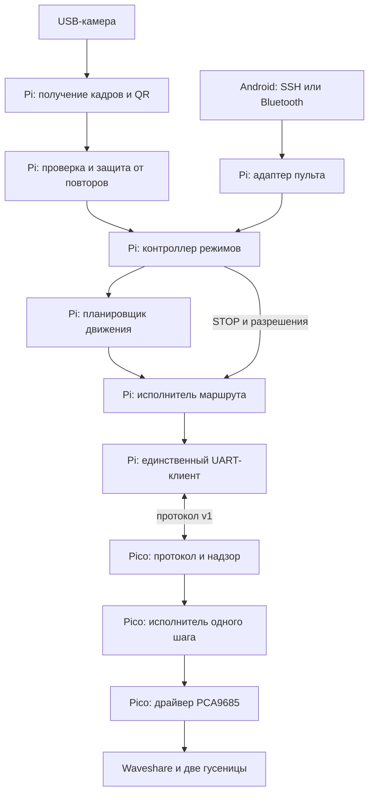

# Архитектура QR-робота на Raspberry Pi 4B и Pico

Версия архитектуры: **1.0**. Дата: **1 октября 2026 года**. Язык реализации: Python 3 на Pi, MicroPython на Pico. Адресат: агенты, которые будут разрабатывать, интегрировать и проверять ПО робота.

## 1. Назначение и статус документа

Документ преобразует `robot_guide_ru.md` (учебная редакция от 1 октября 2026 года) в модульную спецификацию для разработки. Дополнительно проверен приложенный `PCA9685.py`. Архитектура и интерфейсы ниже задают проектный контракт. Модули Pico уже добавлены в `scr/pico/firmware/` и проверены программными тестами; код Pi и аппаратные испытания ещё не выполнены. Фактическая проводка остаётся неподтверждённой.

Приоритет требований: явные указания пользователя → этот документ → исходное руководство → демонстрационный код. Главное изменение относительно руководства: **в версии 1 энкодеры не используются**. Разделы руководства о счёте импульсов, PI/PID и измерении расстояния не входят в текущие задачи.

Слова «должен», «запрещено» и «обязательно» обозначают требования. Числа, помеченные как стендовые, — начальные настройки для испытаний; они не подтверждают безопасность конкретного робота. Неизвестные аппаратные значения нельзя заменять догадками.

### 1.1. Результат первой версии

Робот загружается без монитора и ноутбука, создаёт локальную сеть, принимает START/STOP/STATUS с Android-телефона и выполняет ограниченные команды из QR-карточек. Pi распознаёт карточку и планирует последовательность шагов. Pico выполняет один шаг двух гусениц по мощности и времени и самостоятельно прекращает привод при завершении срока или потере связи.

Базовый сценарий: робот стоит → человек разрешает QR-режим → показывает одну карточку → робот выполняет короткое действие или маршрут → останавливается и ждёт новую карточку. Во время исполнения камера продолжает работать для STOP и контроля исправности, но новые обычные карточки не становятся очередью маршрутов.

### 1.2. Границы версии 1

| Входит | Не входит |
|---|---|
| USB-камера, декодирование QR, проверка команд | Нейросетевое распознавание объектов, OCR, SLAM |
| Короткие движения и последовательности по времени | Навигация к координатам, построение карты, обход препятствий |
| Знаковый PWM двух гусениц | Измерение скорости, одометрия, PID, энкодеры |
| Приблизительный разворот по калибровочному профилю | Гарантированный поворот на заданное число градусов |
| Wi-Fi/SSH-пульт; расширение через Bluetooth | Собственное Android-приложение, облачный сервис |
| Ручные короткие импульсы с конечным сроком | Непрерывный джойстик «пока держу» в базовой поставке |
| Автозапуск программы; WAIT_START по умолчанию | Автоматическое возобновление прерванного движения |

Отсутствие энкодеров должно отражаться во всех слоях: нет GPIO/IRQ для них, фонового опроса, зависимости готовности от датчиков или фиктивных измерений. В статусе `measured_speed`, `distance_mm`, `heading_deg` отсутствуют либо равны `null`, но никогда не вычисляются из PWM как реальные измерения. Успешный DONE означает завершение управления выходами, а не подтверждение пройденного пути.

## 2. Общая схема и правила зависимостей



Это модульная система из двух программ, а не набор сетевых микросервисов. На Pi работает один управляющий процесс `robotd`, отдельный процесс зрения и, при необходимости, отдельный Bluetooth-адаптер. На Pico работает один неблокирующий цикл. Маршрут целиком хранится только на Pi.

Обязательные инварианты:

1. Только `transport.serial_client` на Pi открывает UART. CLI, камера, Bluetooth и диагностические средства обращаются к контроллеру через его интерфейсы.
2. Только `pico.motion` назначает задания драйверу; общий путь остановки Pico может принудительно обнулить все моторные выходы.
3. Движение требует одновременно исправной конфигурации, актуального сеанса, разрешения ARM и неистёкшего heartbeat. Само наличие питания, UART или READY не даёт разрешения.
4. Одновременно исполняется один маршрут на Pi и один шаг на Pico. Обычный запрос во время занятости отклоняется, а не помещается в скрытую очередь.
5. STOP выше любого обычного запроса; отменяет маршрут, снимает разрешение и требует нового START. Он не ждёт завершения распознавания или текущего движения.
6. Таймер шага и таймер связи независимы. Ни heartbeat, ни повтор MOVE не продлевают шаг.
7. Следующий шаг запускается только после DONE с причиной `completed` и с идентификаторами ожидаемого шага.
8. Любая неопределённость выполнения ведёт к остановке и отмене маршрута. Нельзя «на всякий случай» повторять движение с новым ID.
9. Перезапуск любой стороны не восстанавливает старое разрешение или маршрут.
10. Время для дедлайнов монотонное. Календарь, NTP и интернет не участвуют в управлении движением.

## 3. Модули и их контракты

### 3.1. Карта модулей Pi

| Модуль | Обязанность | Вход → выход | Запрещённые зависимости |
|---|---|---|---|
| `config` | Загрузка и строгая проверка настроек | Файл → неизменяемый `RobotConfig` или ошибки | Не открывает UART и не включает моторы |
| `vision.capture` | Получение свежих кадров USB-камеры | Профиль камеры → `Frame`/`CameraFault` | Не понимает команды движения |
| `vision.decoder` | Декодирование всех QR в кадре | `Frame` → `DetectionBatch` | Не знает UART, режимы и маршрут |
| `qr.schema` | Проверка данных карточки | Текст → `CardCommand`/`QrRejected` | Не вызывает shell, `eval`, `exec`, браузер |
| `qr.gate` | Стабильность, неоднозначность, повторное предъявление | Пакет наблюдений + состояние → событие карточки | Не посылает MOVE |
| `controller` | Режим, разрешения, приоритет STOP, единая точка приёма запросов | События/запросы → переходы, план, отмена | Не пишет регистры PCA9685 |
| `planning` | Перевод действий в конечный план шагов | `CardCommand` + лимиты + калибровка → `MotionPlan` | Не открывает устройства, не ждёт время |
| `execution` | Последовательное исполнение плана | План + ACK/DONE/ошибки → один MOVE за раз | Не распознаёт QR и не выбирает режим |
| `transport.codec` | Оболочка, CRC, строгий разбор | Байты ↔ сообщение протокола | Не решает, можно ли ехать |
| `transport.serial_client` | Сеанс, ID, повторы, UART, контроль ответов | Запросы контроллера → события Pico | Не создаёт движения самостоятельно |
| `supervisor` | Свежесть критических задач, условия heartbeat | Метки прогресса + состояния → health/STOP/fault | Не заменяет независимые таймеры Pico |
| `remote.local_api` | Локальный сокет для CLI и адаптеров | Ограниченные запросы → `ControlRequest`/статус | Не открывает UART |
| `remote.cli` | Команда `robotctl` для SSH/RaspController | Аргументы → один запрос локальному API | Не запускает второй `robotd` |
| `remote.bluetooth` | Опциональный SPP/RFCOMM-пульт | Строка от доверенного телефона → локальный API | Не даёт shell и прямой доступ к GPIO |
| `telemetry` | Статус, структурированные события, метрики | Состояния → снимок/журнал | Не хранит очередь движения |
| `bootstrap` | Сборка зависимостей, жизненный цикл, сигналы ОС | Конфигурация → работа приложения | Не содержит бизнес-логику движения |

### 3.2. Карта модулей Pico

| Модуль | Обязанность | Интерфейс и ограничения |
|---|---|---|
| `config.py` | Проверенные пины, канал I²C, моторы, аппаратные пределы | Импорт не создаёт аппаратных объектов и не запускает движение |
| `pca9685.py` | Работа с регистрами PCA9685 | Получает готовый I²C, адрес и настройки; не содержит длительности движения |
| `motor_driver.py` | Знаковый PWM левой/правой гусениц | `set_tracks(left, right)`, `stop_all()`; учитывает разводку и инверсии |
| `motion.py` | Один активный шаг, разгон, смена направления, дедлайн | `start(step, now)`, `tick(now)`, `cancel(reason)`; без долгих `sleep` |
| `protocol.py` | Тот же wire-протокол, что на Pi | Ограниченный буфер, CRC, строгая схема, единицы, ответы |
| `session.py` | Новый сеанс, ARM, защита от повторов | ID загрузки/сеанса, журнал последних запросов, состояния |
| `safety.py` | Потеря heartbeat, fault latch, общий stop | Приоритет проверки дедлайнов; разрешение WDT только при здоровье цикла |
| `main.py` | Инициализация и короткий цикл | Сначала отключение выходов, затем связь; никаких моторных демонстраций |

Зависимости передаются конструкторам. На Pi доменные типы не зависят от OpenCV, pySerial и Linux; на Pico протокол и машина состояний тестируются без импорта `machine`. Переиспользование форматов важнее общего Python-пакета: CPython и MicroPython могут иметь отдельные реализации кодека с одними эталонными тестами.

### 3.3. Внутренние типы Pi

| Тип | Обязательные поля и смысл |
|---|---|
| `Frame` | `frame_id`, `captured_at_ns`, `image`; время с монотонных часов Pi |
| `DetectionBatch` | `frame_id`, `captured_at_ns`, `decoded_at_ns`, `payloads`; список может быть пустым |
| `CardCommand` | `card_id`, `action`, проверенные параметры, нормализованный хеш содержимого |
| `MotionStep` | `left_pwm_pct: int`, `right_pwm_pct: int`, `duration_ms: int` |
| `MotionPlan` | `plan_id`, `source`, `source_id`, неизменяемый список шагов, `total_duration_ms`, `calibration_id` либо `null` |
| `ControlRequest` | `request_id`, `source`, `operation`, параметры, время получения, ожидаемая ревизия состояния для START/движения |
| `ExecutionEvent` | `session_id`, `cmd_id`, тип ACK/DONE/ERROR, причина |
| `RobotStatus` | Режим, состояние, разрешение, ревизия, активные plan/step/cmd ID, здоровье камеры/связи, причина остановки |

Для `int` проверять именно целое число; Python `bool` не принимается как 0/1. Не приводить строки и дроби к числам молча. Поля с отсутствующим измерением не заменять оценкой. Структуры при передаче между задачами не должны изменяться отправителем после публикации.

## 4. Компьютерное зрение и QR

### 4.1. Исполнение зрения

Базовый декодер — OpenCV `QRCodeDetector`; конкретный доступный API выбирается и фиксируется при реализации на установленной версии. Декодер должен возвращать несколько QR из кадра, чтобы обнаруживать неоднозначность. Его можно заменить без изменения контроллера.

Захват и декодирование вынесены из управляющего процесса. Внутри процесса зрения захват поддерживает последний кадр, декодер берёт наиболее свежий. Между ними хранится максимум один ожидающий кадр; новый заменяет старый. Между зрением и `robotd` — ограниченный канал наблюдений. Полные изображения по нему не передаются в рабочем режиме.

Каждый кадр отмечается монотонным временем сразу после получения. Нужно измерить задержку внутреннего буфера камеры; одной метки после `read()` недостаточно для доказательства свежести. Конфигурация камеры и стратегия чтения должны исключать накопление старого видео. Просроченные наблюдения не допускаются к движению. STOP обрабатывается в каждом свежем пакете раньше остальных карточек.

Если канал наблюдений переполнен, событие распознанного STOP нельзя тихо заменить обычным наблюдением: использовать отдельный приоритетный флаг/канал с подтверждением контроллера. Его состояние сбрасывается при новом сеансе процесса зрения. Метки кадров и здоровья не считаются доказательством исправности контроллера.

Потеря камеры, декодера или свежих результатов в QR-режиме → STOP, отмена плана, FAULT. Перезапустить зрение можно автоматически, но разрешение движения восстанавливается только новым START. В MANUAL камера не обязательна; тогда статус явно сообщает, что QR-STOP недоступен.

### 4.2. Формат QR v1

QR содержит JSON-объект UTF-8. Это данные, не программа. Поля: `schema="qr-robot"`, `v=1`, `card_id`, `action` и поля, разрешённые для конкретного действия. `card_id` — 1–32 символа `[A-Za-z0-9_-]`. Максимум 1024 байта UTF-8 на карточку. Неизвестные и повторяющиеся ключи запрещены, как и неизвестная версия. URL и чужие QR отклоняются.

| `action` | Разрешённые дополнительные поля | Значение |
|---|---|---|
| `forward`, `backward`, `turn_left`, `turn_right` | `pwm_pct`, `duration_ms` | Короткое движение по времени |
| `turn_around` | `profile` | Разворот по явно заданному локальному профилю |
| `stop` | Нет | Общая остановка с отменой маршрута |
| `route` | `steps` | 1–10 действий из первых двух строк; вложенные route и stop в маршруте запрещены |

Внутри `steps` используются объекты с `action` и его параметрами, без `schema`, `v` и `card_id`. Время и PWM — целые числа. Для обычного движения: `1 <= pwm_pct <= max_pwm_pct`, `1 <= duration_ms <= max_step_ms`. Реальные аппаратные тесты используют отдельно утверждённый импульс; диапазон схемы не является рекомендацией длительности испытания.

```json
{"schema":"qr-robot","v":1,"card_id":"forward-01","action":"forward","pwm_pct":20,"duration_ms":700}
```

```json
{"schema":"qr-robot","v":1,"card_id":"route-01","action":"route","steps":[{"action":"forward","pwm_pct":20,"duration_ms":700},{"action":"turn_left","pwm_pct":20,"duration_ms":300}]}
```

```json
{"schema":"qr-robot","v":1,"card_id":"stop-01","action":"stop"}
```

Генератор карточек и приложение используют одну схему. Вся карточка и весь получившийся маршрут проверяются до первого MOVE. Ошибка последнего шага запрещает весь маршрут. Неизвестный или неоткалиброванный `profile` отклоняется. Профили доступны только по идентификатору из локальной конфигурации; QR не может передавать путь к файлу.

### 4.3. Правила предъявления карточек

Начальные параметры: три последовательных свежих декодированных кадра с одной и той же допустимой обычной карточкой; максимум 250 мс между наблюдениями; отсутствие карточки в течение 800 мс для повторного допуска. Отсутствие подтверждается только свежими пакетами кадров, а не отсутствием сообщений от зависшей камеры.

Идентичность карточки — `card_id` и хеш нормализованного содержимого. Один ID с другим содержимым в текущем сеансе оператора даёт `CARD_ID_CONFLICT`. Два одинаковых экземпляра одного QR считаются одной карточкой. Две разные обычные команды в одном кадре дают `AMBIGUOUS_QR`: не выбирать одну случайно. В активном QR-режиме такая неоднозначность также останавливает текущий маршрут и снимает разрешение. Любой допустимый STOP в том же кадре имеет приоритет.

Правила блокировки:

- После принятия карточка потреблена до подтверждённого отсутствия и нового предъявления.
- Во время движения обычные карточки не копятся и помечаются увиденными; их нельзя выполнить сразу после освобождения робота. Нужно убрать и предъявить заново.
- STOP принимается после одного допустимого чтения, без трёх кадров подтверждения; повторный STOP безопасен.
- После STOP/FAULT все видимые обычные карточки заблокированы. Новый START не выполняет оставшуюся перед камерой карточку: сначала нужен чистый кадр без обычных команд в течение 800 мс.
- После каждого START в QR-режим также требуется этот чистый интервал. Это предотвращает запуск от заранее оставленной карточки, в том числе после перезапуска Pi.
- При прекращении поступления свежих кадров не считать карточку «убранной».

## 5. Планирование и исполнение движения

### 5.1. Планировщик без обратной связи

Планирование в этой версии — перевод намерений в ограниченную последовательность PWM/время. Это не поиск пути по карте. Положительный знак означает движение соответствующей гусеницы вперёд относительно корпуса; физическую инверсию применяет только драйвер Pico.

| Действие | `left_pwm_pct` | `right_pwm_pct` | Время |
|---|---:|---:|---|
| Вперёд | `+p` | `+p` | Из команды |
| Назад | `-p` | `-p` | Из команды |
| Влево на месте | `-p` | `+p` | Из команды |
| Вправо на месте | `+p` | `-p` | Из команды |
| Разворот | Из профиля | Из профиля | Из профиля |

Профиль разворота хранит направление, PWM, длительность, дату и условия испытания, отметку `verified`, идентификатор. Без `verified=true` команда недоступна. Разворот означает приблизительно 180° в проверенных условиях; изменение покрытия, заряда или нагрузки меняет результат. Нельзя подставлять фиктивные градусы в статус.

Планировщик не увеличивает автоматически PWM, когда робот не поехал: без датчиков он этого не знает. Не вводить компенсаторы скорости под видом измерения. Ручная калибровка длительности и направления — отдельная процедура.

Начальные пределы планов: PWM до 30%, шаг до 2000 мс, максимум 10 шагов и 20000 мс суммарного времени шагов. Итоговые пределы на Pi — минимум локальной политики и лимитов Pico из READY. Если всё движение не укладывается в пределы, оно отклоняется, а не незаметно обрезается или разбивается. Межшаговый обмен добавляет время; предел wall-clock маршрута задаётся отдельно.

### 5.2. Исполнитель маршрута

Интерфейс: `submit(plan)`, `cancel(reason)`, `on_pico_event(event)`, `tick(now)`, `snapshot()`. `submit` разрешён только контроллером в READY и при совпадении активного источника. Исполнитель назначает `plan_id` и индекс шага; UART-клиент назначает `cmd_id`.

Порядок одного шага:

1. Зафиксировать ожидаемый шаг и его ID до отправки.
2. Отправить один MOVE и ожидать ACK/DONE с теми же session/cmd ID.
3. ACK переводит в ожидание завершения; не запускает следующий шаг.
4. DONE `completed` завершает шаг. Проверить отсутствие STOP/FAULT, действующее разрешение и лимит маршрута; только затем отправить следующий.
5. DONE с иной причиной, ERROR, истечение срока ответа или смена сеанса отменяют весь план.

DONE может прийти без ранее полученного ACK: это допустимый терминальный ответ ожидаемого MOVE. Поздний ACK после DONE игнорируется. Повторный DONE не запускает следующий шаг второй раз. Ответ от прошлого сеанса или другого ID не меняет текущий план.

Pico выключает привод в конце каждого шага; между шагами нет обещания непрерывной траектории. Время шага отсчитывается с принятия MOVE на Pico и включает разгон/смену направления. Длительность нельзя продлевать ради достижения PWM. ACK и сетевые повторы не сдвигают этот момент.

После последнего успешного шага Pi возвращается в READY с прежним режимом и разрешением. После STOP — в STOPPED без разрешения. Предельное wall-clock время плана: сумма длительностей + число шагов × 1000 мс; это начальная настройка, также проверяемая тестами.

## 6. Контроллер, состояния и приоритеты

Режим источника (`QR` или `MANUAL`) и состояние исполнения — разные поля. `WAIT_START`/`AUTO_BOOT` — политика загрузки, а не источник движения. Переключение QR ↔ MANUAL выполняется через STOP и новый START; горячее смешивание команд запрещено.

| Состояние Pi | Смысл | Разрешённый переход |
|---|---|---|
| `BOOTING` | Чтение конфигурации, создание компонентов | WAIT_HARDWARE или FAULT |
| `WAIT_HARDWARE` | Нет готового Pico/нужной камеры | WAIT_START после готовности; без движения |
| `WAIT_START` | Проверки пройдены, ARM ещё нет | ARMING по START |
| `ARMING` | Новый handshake и ожидание результата ARM | READY по ACK; STOPPED/FAULT по отмене/ошибке |
| `READY` | Разрешение есть, плана нет | EXECUTING по допустимому запросу; STOPPING по STOP |
| `EXECUTING` | Активный план/ожидание ACK или DONE | READY после плана; STOPPING при остановке/сбое |
| `STOPPING` | Запрет новых команд, запрос STOP, проверка отключения | STOPPED при подтверждении; FAULT при неопределённости |
| `STOPPED` | План отменён, разрешение снято | ARMING только по новому START и после проверок |
| `FAULT` | Ошибка; движение запрещено | START запускает самопроверку и новый сеанс; ARMING лишь после устранения причины |

Pico имеет состояния `BOOT_SAFE`, `DISARMED`, `ARMED_IDLE`, `MOVING`, `FAULT`. Нормальный DONE возвращает в ARMED_IDLE. STOP и тайм-аут heartbeat снимают ARM; ошибка аппаратуры ведёт в FAULT. Восстановление требует нового handshake, исправного драйвера и явного ARM. HELLO не очищает неисправность, которая всё ещё присутствует.

Контроллер обрабатывает события последовательно. STOP/fault — отдельный приоритетный сигнал; он устанавливает запрет движения до обработки обычных событий. Порядок: аппаратные ошибки/потеря связи → STOP → отмены и переключения → ответы Pico → START → новые движения. STATUS не влияет на управление.

Чтобы отложенный START не отменил только что принятый STOP, контроллер ведёт `control_revision`. STOP, fault и смена режима увеличивают ревизию и аннулируют уже поставленные в очередь START/движения. Такие запросы несут ожидаемую ревизию; устаревший запрос отклоняется. Адаптер получает текущую ревизию перед новым пользовательским START. Повтор сетевого запроса с тем же `request_id` возвращает прежний результат, не создаёт новое действие.

Отклонённая неподходящая карточка сама по себе не включает FAULT: она фиксируется как отказ входных данных. Потеря камеры, нарушение сеанса и ошибка моторного драйвера — причины остановки. При неясном физическом состоянии статус обязан показывать `outputs_confirmed_off=false`, а не просто «всё остановлено».

## 7. Протокол Pi–Pico v1

### 7.1. Физический транспорт и формат

Рабочий канал — GPIO UART, не USB REPL. Стартовая настройка из руководства: **115200 baud, 8N1, без flow control**. Конкретные пины и UART-путь берутся из паспорта проводки. Рабочий UART не используется для консоли или произвольных логов.

Для компактности принимается строгая текстовая оболочка с позиционными полями. Эта спецификация заменяет неопределённый выбор JSON/текста из руководства; QR и локальный API при этом остаются JSON.

```text
V1|TYPE|SESSION|SEQ|PAYLOAD|CRC\n
```

- Только ASCII, без пробелов и CR, один LF завершает кадр. Максимум **256 байт вместе с LF**.
- Ровно шесть частей, разделённых `|`. В PAYLOAD запрещены `|`, CR и LF; подполя разделяет запятая. Пустой payload обозначается `-`.
- TYPE — одно из имён таблицы ниже. SEQ — десятичный uint32 без знака и ведущих нулей, либо `0` для HELLO/READY и незапрошенных событий. Переполнение не допускается: новый сеанс до исчерпания диапазона.
- SESSION — 48 шестнадцатеричных символов нижнего регистра. Нулевой SESSION используется для HELLO и допускается для STOP. Для остальных команд — только согласованный SESSION.
- Числа payload записываются канонически: целые десятичные; знак минус только у отрицательного PWM; без `+`, `-0`, ведущих нулей, дробей и экспонент. Имена состояний/причин — ASCII-токены.
- CRC — четыре шестнадцатеричных символа верхнего регистра. **CRC-16/CCITT-FALSE**: poly `0x1021`, init `0xFFFF`, refin=false, refout=false, xorout=`0x0000`. Контрольный вектор для байтов ASCII `123456789`: `29B1`.
- CRC считается по фактическим байтам от `V` до последнего байта PAYLOAD включительно. Разделитель перед CRC, сама CRC и LF не входят. CRC не пересчитывают через повторную сериализацию.

CRC защищает от случайной порчи, но не аутентифицирует отправителя. Внешние устройства не получают прямой доступ к UART.

### 7.2. Сеанс и защита от старых сообщений

Для однозначного поведения после сброса принимается следующая схема. На каждой загрузке Pico до готовности атомарно увеличивает 32-битный `boot_counter` в небольшом устойчивом журнале с проверкой целостности. В течение загрузки ведёт 32-битный `handshake_counter`. SESSION = 32 hex-символа случайного nonce Pi + 8 hex boot_counter + 8 hex handshake_counter. При каждой новой попытке знакомства счётчик handshake увеличивается. Переполнение или повреждение журнала блокирует ARM.

Формат и восстановление журнала — отдельная задача прошивки: две проверяемые записи/слота, выбор последней завершённой записи, проверка поведения при потере питания. Счётчик записывается только при загрузке, не в каждом цикле. После полного стирания flash повторное использование старой истории сеансов не гарантируется; такое обслуживание проводится с отключённым моторным питанием и перезапуском Pi. Агент не может заменить эту схему повторяющимся `session=1` или текущим `ticks_ms()`.

Pi сначала устанавливает локальный запрет движения и очищает свои ожидающие команды. HELLO с новым nonce прекращает старое движение и ARM на Pico, создаёт новый SESSION и возвращает READY. Повтор HELLO с nonce текущего handshake возвращает прежний READY без повторной инициализации. HELLO со старым nonce другого handshake создаёт новый counter и тем самым иной SESSION: последующие старые ARM/MOVE не подходят.

После READY Pi проверяет версию, состояние и лимиты. Только явный START разрешает ARM. Пропажа/повторное открытие порта, новый READY во время работы, перезагрузка Pico или несоответствие SESSION отменяют маршрут и требуют нового START.

Каждый START проходит через новый HELLO с новым nonce. STOP, тайм-аут heartbeat и аппаратный fault **отзывают текущий сеанс для ARM/MOVE/HEARTBEAT**, помимо снятия разрешения. Это не позволяет отложенному ARM из UART-буфера повторно разрешить движение после STOP. Ответы на отмену ещё используют старый SESSION для корреляции. STATUS для последнего сеанса можно обслужить только как чтение; для нового разрешения обязателен новый handshake. Повтор HELLO возвращает прежний READY лишь пока этот handshake не отозван; после отзыва он создаёт новый handshake_counter.

### 7.3. Сообщения и точная семантика

Порядок payload-полей в таблице нормативный. Ответы на запрос используют его SEQ и SESSION; READY возвращает новый SESSION. Причины и состояния передаются токенами, пояснения для человека добавляет Pi.

| TYPE | Направление | PAYLOAD | Результат |
|---|---|---|---|
| `HELLO` | Pi → Pico | `nonce32hex` | SEQ=0; новый handshake или повтор ответа |
| `READY` | Pico → Pi | `state,max_pwm,max_step_ms,hb_timeout_ms` | SEQ=0; лимиты и состояние без ARM |
| `ARM` | Pi → Pico | `-` | ACK после проверки; разрешение, старт окна heartbeat |
| `MOVE` | Pi → Pico | `left_pwm,right_pwm,duration_ms` | ACK после принятия шага, затем DONE |
| `HEARTBEAT` | Pi → Pico | `-` | ACK; продлевает только срок связи |
| `STOP` | Pi → Pico | `reason` | Сначала выходы выключены и ARM снят; затем ACK; активный MOVE получает DONE |
| `STATUS` | Pi → Pico | `-` | STATE; чтение состояния не продлевает heartbeat |
| `STATE` | Pico → Pi | `state,active_cmd,left_set,right_set,remaining_ms,fault` | Снимок задания, не измеренных скоростей; `active_cmd=0`, если шага нет; `fault=none`, если нет ошибки |
| `ACK` | Pico → Pi | `request_type` | Запрос принят; ACK MOVE не означает завершение |
| `DONE` | Pico → Pi | `reason,elapsed_ms` | SEQ исходного MOVE; выходы выключены либо ошибка явно сообщена |
| `ERROR` | Pico → Pi | `code` | Отказ/неисправность; для несопоставимой локальной ошибки SEQ=0 |

`STATE` добавлен как отдельное имя ответа, чтобы запрос STATUS нельзя было спутать с ответом. Версия V1 проверяется до обработки. Для MOVE допустимы целые PWM в пределах `[-max_pwm,+max_pwm]`, ненулевое хотя бы одно задание и длительность `1..max_step_ms`. MOVE `0,0,...` запрещён: остановка всегда STOP, а паузы маршрута в v1 не поддерживаются.

Новый ARM принимается только в DISARMED с актуальным неотозванным handshake и исправной аппаратурой. Новый ARM при ARMED_IDLE/MOVING получает BUSY; повтор уже принятого ARM обрабатывается правилами повторов, но никогда не восстанавливает отозванный сеанс. MOVE при MOVING получает BUSY, при отсутствии разрешения — NOT_ARMED, при отозванном/чужом сеансе — BAD_SESSION.

DONE причины: `completed`, `stopped`, `link_timeout`, `session_replaced`, `driver_error`. ERROR коды: `BAD_MESSAGE`, `BAD_VERSION`, `BAD_SESSION`, `NOT_ARMED`, `BUSY`, `OUT_OF_RANGE`, `ID_CONFLICT`, `STALE_ID`, `DRIVER_FAULT`, `BOOT_COUNTER_FAULT`. Невалидные кадры без доверенного SEQ просто отбрасываются со счётчиком ошибок и ограниченной диагностикой; ответы на каждую случайную букву запрещены.

STOP допускается при любом SESSION и SEQ, но только с правильной оболочкой, CRC и допустимой причиной (`user`, `qr`, `fault`, `shutdown`, `mode_change`, `recovery`). Он не проходит обычную проверку свежести ID и всегда повторно пытается выключить выходы. ACK STOP возвращается лишь после успешной записи выключения; при I²C-ошибке — ERROR DRIVER_FAULT. Это подтверждение записи выходов, не механической остановки гусениц.

### 7.4. Повторы и подтверждения

Pi использует один возрастающий SEQ для всех новых запросов текущего сеанса, включая HEARTBEAT/STATUS. Повтор передаёт исходный SEQ и побайтно то же содержимое. Pico хранит максимальный принятый SEQ, последние 16 обработанных запросов и отдельно закреплённую запись активного/последнего MOVE до принятия следующего MOVE. Поэтому heartbeat не вытесняет нужный результат движения.

Порядок проверки: валидная оболочка/CRC → STOP отдельно → SESSION → поиск SEQ в сохранённых записях → свежесть → состояние и диапазоны. Повтор с совпадающим содержимым возвращает сохранённый ответ; для завершившегося MOVE возвращает DONE. Тот же ID с другим содержимым — ID_CONFLICT. Меньший/равный максимальному ID вне сохранённых записей — STALE_ID. Отклонённый валидный запрос также занимает свой ID и сохраняет отказ, чтобы повтор не стал исполненным позже.

Повтор ARM или HEARTBEAT не обновляет срок связи. Только **новый**, принятый HEARTBEAT текущего сеанса продлевает его. В DISARMED heartbeat возвращает NOT_ARMED. MOVE и STATUS срок связи не продлевают. Получение ARM создаёт первое окно 500 мс; Pi немедленно начинает heartbeat.

Начальные тайминги: ACK — 200 мс, максимум две повторные отправки после первой, срок DONE — исходная отправка + duration + 500 мс. Повторы не сдвигают срок ожидания. При истечении DONE допускается STATUS для диагностики, но нельзя бесконечно ждать или отправлять следующий MOVE. Сначала STOP/FAULT. Если потерян ACK ARM и затем heartbeat, восстановление тоже проходит через остановку.

### 7.5. Поток байтов и нагрузка

Кодек должен принимать фрагменты строки и несколько строк за одно чтение. Превышение 256 байт, ошибка кодировки/CRC или неполная строка старше 100 мс → сброс текущего кадра; при переполнении отбрасывать до следующего LF. Проверять максимальный размер до выделения больших объектов. Не использовать бесконечное блокирующее `readline()`.

За один цикл Pico обрабатывает ограниченное число байтов/кадров, после чего обязательно проверяет таймеры. Из полностью разобранных кадров порции STOP обслуживается раньше MOVE. На Pi STOP опережает ещё не переданные MOVE; уже отправленный кадр нельзя «отозвать», его остановит последующий STOP. Непрерывный мусор не продлевает heartbeat и не мешает локальному тайм-ауту. При физически забитом UART доставка STOP не гарантируется — обязательны короткий локальный срок шага и контроль связи.

В репозитории должны быть эталоны полных кадров HELLO/READY/ARM/MOVE/ACK/DONE/STOP/STATE с ожидаемой CRC, неправильные кадры и тесты обоих кодеков. Значения CRC эталонов нужно вычислить и независимо проверить при реализации; нельзя оставлять `<CRC>` в тестовых данных.

## 8. Прошивка Pico и моторный драйвер

### 8.1. Что взять из исходника и что изменить

Исходный `PCA9685.py` полезен как карта регистров и каналов, но не готов к работе в этой архитектуре.

| Наблюдение в приложенном коде | Требование к реализации |
|---|---|
| I²C0, GP20/GP21, адрес 0x40 созданы внутри конструктора | Передавать I²C и адрес явно; подтвердить перемычки и адрес на роботе |
| `MotorDriver()` сам создаёт PCA9685 | Внедрять готовый драйвер, не обходить конфигурацию |
| `MotorRun()` блокируется на `sleep(runtime)` | Удалить ожидание из драйвера; шаг выполняет `motion.tick()` |
| MA=0/1/2, MB=3/4/5, MC=6/7/8, MD=9/10/11 | Сохранить карту PWM/IN1/IN2; левый и правый разъёмы задать отдельно |
| Демонстрация запускает MA на 100% на 20 с при надписи «2 секунды» | Не включать её в штатную прошивку и автозагрузку |
| HIGH через 4095 и ноль через обычный PWM | Реализовать постоянные уровни и 0/100% с корректными FULL_ON/FULL_OFF |
| MODE1=0 в конструкторе | Не считать полным сбросом выходов; явно выключать каналы |
| Частота PWM 50 Гц | Считать значением демонстрации; рабочую частоту подтвердить отдельно |
| `KeyboardInterrupt` вызывает `exit()` | Общий путь остановки при выходе и исключениях |

Пара GP20/GP21 соответствует I²C0 в исходном варианте; вариант GP6/GP7 из руководства требует согласованной настройки I²C1 и аппаратных перемычек. Это варианты, а не установленная разводка данного робота. Нельзя путать GP Pico с каналами PCA9685.

Порядок применения пары заданий: при необходимости убрать PWM → задать направления → применить ограниченный PWM обеих сторон. Драйвер не обещает атомарность двух независимых I²C-записей. Если запись второй стороны не удалась, немедленно попытаться выключить обе и установить FAULT. В норме задержка между сторонами ограничена короткими операциями записи, не длительностью шага.

Изменение знака выполняется через нулевой PWM и проверенную паузу `direction_deadtime_ms`; её значение не выдумывается. Ограничение разгона задаётся `ramp_pct_per_s`. STOP и истечение дедлайна обходят плавный разгон/снижение и сразу дают выключение. Конкретную комбинацию IN1/IN2/PWM для выключения сверить с используемой платой; не называть её механическим тормозом без проверки.

### 8.2. Цикл и таймеры

Целевой период короткого цикла — до 10 мс в нормальной нагрузке. Порядок: локальные дедлайны и неисправности → ограниченный разбор UART с приоритетом STOP → обновление текущего шага → ограниченная отправка ответов → метка здоровья/WDT. Длительные операции файловой системы, большие распечатки и запись boot_counter выполняются вне движения.

Для MicroPython использовать монотонные ticks и операции сравнения, устойчивые к переполнению (`ticks_diff` и согласованное вычисление дедлайна); длительности должны быть меньше допустимого полуинтервала счётчика. Обычное сравнение абсолютных значений `now > deadline` без учёта переполнения запрещено.

Начальные значения: HEARTBEAT каждые 100 мс, тайм-аут на Pico 500 мс; срок каждого MOVE отдельно. При истечении любого срока PWM выключается, результат фиксируется до отправки ответа. Медленная передача DONE не должна задерживать выключение.

### 8.3. Реальные границы остановки

PCA9685 — отдельно работающая микросхема; reset Pico сам по себе не гарантирует сброс её выходов. Если I²C отказал, команда выключения может не дойти. Аппаратный watchdog полезен только вместе с проверенным поведением выхода после reset. Нельзя объявлять OE/STBY независимым аппаратным запретом, пока не подтверждена его доступность на данной ревизии платы.

При старте сначала выполнить доступный аппаратный запрет, если он подтверждён, затем явное выключение всех используемых и оставшихся моторных PWM-каналов платы. При отсутствии такой линии документировать остаточный риск и проводить испытания с доступным отключением моторного питания. Физическую остановку и остаточный ход измеряют отдельно от времени команды PWM=0. Программные ограничения не заменяют проверку силовой части.

## 9. Пульт со смартфона и локальный API

### 9.1. Базовый транспорт

Android → RaspController/SSH → `robotctl` → Unix-сокет `/run/qr-robot/control.sock` → контроллер. `robotctl` — короткоживущий клиент, `robotd` уже работает как служба. Сокет имеет ограниченные права для пользователя/группы робота; arbitrary shell через API отсутствует.

Контракт CLI:

```text
robotctl status
robotctl start --mode qr
robotctl start --mode manual
robotctl stop
robotctl move --action forward --pwm 20 --duration-ms 200
```

Команда move допустима только в MANUAL/READY и с теми же планировщиком и ограничениями. В первой версии — один короткий импульс, не команда «ехать до STOP». Повторные нажатия во время движения получают BUSY. Для ручного импульса лимит отдельный: начально 300 мс. Поэтому потеря SSH не оставляет бесконечное движение; максимум — остаток уже принятого импульса, если контроллер исправен.

На сокете — JSON Lines до 2048 байт с `api_v=1`, `request_id`, `op`, `params`, `expected_revision` для START/MOVE. Допустимые операции `status`, `start`, `stop`, `move`; схема каждой строгая. Контроллер запоминает последние 64 `request_id` и результат; конфликт содержимого отклоняет. Клиент не повторяет изменяющий запрос с новым ID после сетевой неопределённости: сначала STATUS.

Ответ включает `request_id`, `accepted`, `code`, `control_revision`, снимок состояния и при необходимости `plan_id`. Принятый STOP может вернуть STOPPING: клиент ждёт последующего статуса, а не показывает подтверждение отключения до ACK Pico. CLI имеет конечный тайм-аут и ненулевой код выхода при отказе/неопределённости.

### 9.2. Политика потери телефона

В QR-режиме телефон нужен для разрешения и контроля; после START потеря телефона **не отменяет** автоматическое выполнение. Это явный выбор для автономной работы. Потеря Pi–Pico или камеры в QR-режиме всегда отменяет движение.

В MANUAL разрешены только конечные импульсы; потеря пульта не создаёт новых команд, а уже принятая завершается по своему сроку. Непрерывное ручное управление — отдельное расширение с короткой истекающей арендой управления, heartbeat именно клиента и остановкой при уходе страницы/приложения в фон. Наличие heartbeat Pi–Pico само по себе не доказывает присутствие оператора.

### 9.3. Сеть, Bluetooth и административные операции

Основной полевой режим из руководства — точка доступа Pi `QR-Robot`, плановый адрес `10.42.0.1`; конфликт подсети проверяется при установке. Wi-Fi защищён паролем, управление локальное и не зависит от интернета. Системная настройка сети не входит в цикл движения.

Bluetooth — дополнительный адаптер после базовой приёмки Wi-Fi. Выбран Classic SPP/RFCOMM с BlueZ и совместимым Android-терминалом. Поддерживаемые строки: `START QR`, `START MANUAL`, `STOP`, `STATUS` с LF. Только доверенные сопряжённые устройства, максимум 128 байт строки, ограничение частоты запросов. На холодной загрузке служба регистрирует профиль и обращается к тому же локальному API. Bluetooth-адаптер не владеет UART и не переводит входные строки в shell.

При установке UART не отключать Bluetooth по умолчанию; настройки проверять на фактической ОС и проводке. Веб-панель возможна позже как новый адаптер того же API. Выключение Pi — отдельное административное действие с узкими правами: сначала запрет движения и STOP, затем системное выключение. Не включать его в QR-формат.

## 10. Конкурентность, здоровье и диагностика

`robotd` использует один цикл событий для контроллера, исполнителя, локального API и UART. Работа с UART должна быть неблокирующей либо с короткими ограниченными ожиданиями. Блокирующие операции не выполняются в этом цикле. Тяжёлое зрение находится в другом процессе; журналы имеют ограниченную очередь и не блокируют остановку.

Heartbeat отправляется только когда контроллер и исполнитель обновили свои метки прогресса, UART-сеанс актуален, а в QR-режиме свежи камера и декодер. Отдельный поток, который бесконечно шлёт heartbeat после зависания контроллера, запрещён. Отправка «догоняющей пачки» пропущенных heartbeat запрещена: отправлять лишь новый текущий запрос.

Начальные бюджеты для проверки под нагрузкой:

| Параметр | Значение | Что проверить |
|---|---:|---|
| Период heartbeat | 100 мс | Нет продления при зависании критических задач |
| Тайм-аут heartbeat Pico | 500 мс | Отключение выходов за тайм-аут + задержка цикла/I²C |
| Максимальный возраст прогресса управления Pi | 200 мс | При превышении прекращается heartbeat и запрашивается STOP |
| Максимальный возраст свежего результата зрения в QR | 500 мс | Остановка при зависшем/отключённом зрении |
| Срок ACK | 200 мс | Ограниченные повторы с тем же ID |
| Запас срока DONE | 500 мс | Нет следующего шага при неопределённости |
| Целевая реакция на локально принятый STOP | ≤100 мс до отключения выходов | Измерить под нагрузкой; это цель, не доказанная гарантия |

Возраст зрения 500 мс и стабилизация QR должны быть достижимы на выбранном разрешении камеры. Если это не так, сначала уменьшить нагрузку и измерить задержки; изменения лимитов оформлять явно, с повторной проверкой времени остановки.

Журнал содержит время, компонент, событие, session/cmd/plan/card ID, старое и новое состояние, причину. Логи не содержат пароли и не сохраняют изображения постоянно. Для диагностики по явному флагу можно сохранять ограниченное число кадров. Запись QR ограничивается длиной; постороннее содержимое можно заменять хешем.

Статус различает `service_running`, `hardware_ready`, `armed`, `executing`, `outputs_confirmed_off`, свежесть последнего подтверждения Pico и причину остановки. При потере связи подтверждение устаревает; нельзя бесконечно показывать старое OFF как актуальный факт. Метрики: CRC/parse errors, повторы, тайм-ауты, время ACK, возраст кадров, период цикла, причины отмены. Обороты, ток и положение без датчиков не публиковать как измеренные.

## 11. Конфигурация и аппаратный паспорт

На Pi — версионированный JSON конфигурации, на Pico — небольшой `config.py` или JSON по возможностям выбранной прошивки. Единая схема/проверка поставляется в репозитории; аппаратные пределы Pico действуют независимо от Pi. Удалённое изменение лимитов во время движения в v1 запрещено. Новая конфигурация применяется только после STOP, проверки и перезапуска.

| Группа | Параметры | Статус исходных данных |
|---|---|---|
| UART Pi | Путь, физические TX/RX, GPIO-имена | Не подтверждены |
| UART Pico | Номер UART, TX/RX GP, физические контакты | Не подтверждены |
| I²C | Номер, SDA/SCL, адрес, частота связи | В примере I²C0, GP20/21, 0x40, 100 кГц; проверить |
| Моторы | Левый/правый MA–MD, инверсии, модели | Не подтверждены |
| Моторная плата | Ревизия, перемычки, OE/STBY, режим выключения | Не подтверждены |
| Привод | PWM-частота, разгон, пауза смены знака, аппаратный потолок | Требуют выбора и проверки |
| Питание | Источник Pico без USB, моторное питание, совместимость токов | Требует паспорта и проверки |
| Камера | Устойчивый путь, размер/FPS, формат, задержка | Не подтверждены; индекс 0 не фиксировать как факт |
| Политика | WAIT_START, лимиты, время heartbeat, режим dry-run | Проектные значения этого документа |
| Калибровка | Идентификатор профиля, условия, PWM и время разворота | Пусто до испытаний |

Для неизвестных параметров использовать `null`/явный `UNSET` в примере конфигурации. В аппаратном режиме отсутствие обязательных значений блокирует ARM. Конфигурация dry-run может использовать фальшивые устройства, но не выдаёт их за подтверждённую проводку. Энкодерные настройки не обязательны и в v1 не создаются.

Пины проверяются на допустимость назначения и конфликты между UART/I²C/прочими функциями. Значения из руководства и демонстрации не доказывают фактическое подключение. Агент может реализовать чистую логику и симуляцию до заполнения паспорта; запуск реальных моторов до этого этапа запрещён.

## 12. Автозапуск и восстановление

Основная служба — `robot.service`, процесс в переднем плане, обычный пользователь, необходимые права UART/камеры, абсолютные пути и фиксированное окружение. Использовать ограниченные перезапуски и журнал systemd. Не ждать внешней сети для готовности локального управления. Второй экземпляр `robotd` должен завершаться из-за блокировки экземпляра/порта, а не создавать конкурирующий контроллер.

После запуска: проверить конфигурацию → установить запрет движения → открыть UART и handshake → проверить необходимые устройства → WAIT_START. При позднем появлении Pico/камеры повторять подключение с ограниченной частотой. Готовность устройства сама по себе не выполняет START.

`AUTO_BOOT` — опциональный режим после базовой приёмки. По умолчанию автоматически разрешается только QR-режим; стартовый маршрут допустим лишь как явно заданный локальный `startup_plan_id`, заранее прошедший полную валидацию. Для QR действует правило чистого кадра после START.

Авторазрешение используется один раз за загрузку Linux. Отметка в `/run`, связанная с boot ID, создаётся атомарно **до ARM** и сохраняется при перезапуске службы. Настройки systemd не должны удалять её вместе с RuntimeDirectory при каждом stop. Если первая попытка автостарта не завершилась, отметку не откатывать: дальше нужен ручной START. После сбоя Pi/Pico в той же загрузке — отмена плана и ожидание разрешения, без повторного AUTO_BOOT.

При SIGTERM: запретить новые запросы → отменить план → отправить STOP → ограниченно ждать подтверждение (начально до 700 мс) → закрыть ресурсы. Если подтверждения нет, явно зафиксировать неопределённость. Независимый тайм-аут Pico остаётся обязательным при SIGKILL, отключении питания Pi или зависании процесса.

На Pico `main.py` начинает с выключенных выходов. Проверить холодную загрузку в трёх порядках: сначала Pi, сначала Pico, одновременно. Питание Pico без USB к компьютеру должно быть подтверждено отдельно.

## 13. Структура репозитория и работа агентов

Один репозиторий; таблица показывает существующие файлы и планируемые области ответственности. Пути, которых ещё нет, не следует принимать за уже реализованные модули.

| Путь | Содержимое |
|---|---|
| `docs/robot_architecture_ru.md` | Этот документ |
| `docs/protocol_v1.md` | Детализация §7, все эталоны и таблица ошибок |
| `docs/qr_schema_v1.md` | QR-схема, правила предъявления, примеры |
| `docs/hardware_passport.md` | Проверенные подключения и остающиеся неизвестные |
| `docs/calibration.md` | Процедура и результаты калибровки |
| `docs/acceptance.md` | Матрица приёмки с фактическими результатами |
| `pi/robot/` | Пакеты из §3.1 |
| `pi/pyproject.toml` и файл фиксации зависимостей | Воспроизводимая установка на выбранной ОС |
| `scr/pico/firmware/` | Существующие модули Pico из §3.2; инструкция загрузки |
| `schemas/` | QR, local API, конфигурация |
| `protocol_vectors/` | Общие входные байты и ожидаемые результаты обоих кодеков |
| `config/` | Шаблоны без секретов, отдельные аппаратные профили |
| `tools/` | Генератор QR, диагностика камеры, симулятор Pico, `robotctl` |
| `tests/` | Модульные, контрактные, интеграционные и fault-injection проверки |
| `deploy/` | systemd, подготовка сети/прав, Bluetooth как опция |

Для агента каждой задачи обязательны: этот документ, относящиеся схемы, подтверждённые аппаратные данные, текущий код и результаты предыдущих этапов. Перед изменением общего контракта агент сначала обновляет спецификацию и эталоны, затем обе стороны. Нельзя молча менять единицы, семантику ACK/DONE, знак моторов или правила STOP в одном модуле.

Общие критерии завершения задачи:

- Изменение помещено в назначенный модуль; его зависимости соответствуют таблице.
- Добавлена содержательная проверка поведения, особенно отказов и временных границ, а не только успешного пути.
- Аппаратные параметры вынесены из кода; неизвестные явно отмечены.
- Представлены команды воспроизведения, ожидаемый результат и фактический результат.
- Симуляция отделена от аппаратного испытания. Нельзя писать «проверено на роботе» по одному прохождению unit-тестов.
- Известные ограничения и несовместимости перечислены; общие документы и примеры согласованы.

### 13.1. Очерёдность реализации

| Этап | Задача для агента | Зависимость | Условие завершения |
|---|---|---|---|
| A | Контракты, схемы, типы, протокол и эталоны | Документ | Зафиксированы форматы/единицы/состояния; CRC проверена |
| B | Чистый планировщик, QR-валидатор, машины состояний | A | Граничные и ошибочные входы, отмена, повторное предъявление проверены |
| C | Pico-драйвер и неблокирующий исполнитель | A; паспорт для железа | Оба мотора, дедлайны и stop в симуляции; аппаратные тесты отдельно |
| D | Кодеки и Pi–Pico транспорт | A | Обе реализации проходят общие эталоны и тесты потерь/повторов |
| E | Камера/QR и dry-run с фальшивым Pico | B | Свежесть, несколько QR, STOP, отсутствие реального движения |
| F | Контроллер + исполнитель + supervisor | B–E | Интеграционные сценарии, отсутствие движения при сбоях/перезапусках |
| G | Локальный API, CLI, RaspController/Wi-Fi | F | START/STOP/STATUS направлены в единственный процесс |
| H | Стендовая интеграция и калибровка | C–G; заполненный паспорт | Измерены выходы, задержки, направления и поведение при отказах |
| I | systemd, автономная загрузка, затем AUTO_BOOT | H | Холодная загрузка без внешних соединений; одно авторазрешение |
| J | Bluetooth и последующие расширения | G–I | Холодная загрузка адаптера, доверенные клиенты, общий STOP |

Эта таблица описывает зависимости этапов, а не текущий список готового ПО. На 1 октября 2026 года программная часть Pico этапа C уже есть, но аппаратная проверка C и общий контракт с кодом Pi ещё не завершены. Общие файлы схем и протокола требуют согласованного изменения обеих сторон.

## 14. Проверки и критерии приёмки

### 14.1. Режимы проверки

`dry-run` собирает приложение с `FakePicoTransport`, который вообще не открывает аппаратный UART. Он может показывать планы и симулировать ответы/время, но не посылает ARM/MOVE реальному Pico. Флаг в одном `if` перед MOVE недостаточен. Другой диагностический режим может открыть реальный UART только для HELLO/STATUS/STOP; его нельзя называть полной имитацией.

Для Pico использовать фальшивые Clock/UART/I²C при проверке логики. Интеграционный симулятор должен уметь терять ACK/DONE, задерживать сообщения, перезапускать сеанс, возвращать BUSY и ошибки. Хотя бы контрактные тесты Pico-протокола выполняются для настоящей реализации прошивки, а не только для независимо написанного симулятора.

### 14.2. Матрица обязательных сценариев

| Сценарий | Ожидаемый результат |
|---|---|
| Холодный старт WAIT_START | Нет ARM и движения до START |
| Некорректный/слишком длинный QR, неизвестный ключ, bool вместо int | Полный отказ до движения, понятная причина |
| Ошибка в последнем шаге route | Ни один шаг маршрута не выполнен |
| Одна карточка удерживается много кадров | Одно выполнение; для следующего требуется снятие |
| Новая карточка во время исполнения | Не попадает в очередь и не срабатывает после DONE без нового предъявления |
| Два разных QR | Неоднозначность; движение не начинается/прекращается |
| STOP рядом с обычным QR | STOP имеет приоритет после одного допустимого чтения |
| START при оставленной карточке после STOP | Нет движения до чистого интервала и нового предъявления |
| Части строки, несколько строк, мусор, неверная CRC, нет LF | Корректное восстановление, ограниченная память, без ложного движения |
| Повтор MOVE до и после DONE | Одно исполнение, первоначальный дедлайн, повтор сохранённого ответа |
| Тот же ID, иной payload | ID_CONFLICT, нового движения нет |
| Старый ID после вытеснения из кеша | STALE_ID, нового движения нет |
| Потерян ACK, DONE пришёл | Шаг завершён один раз; следующий только после DONE |
| Потерян DONE/ответы | Ограниченные повторы, затем STOP/FAULT; нет нового ID для повторения движения |
| STOP и DONE приходят почти одновременно | STOP отменяет весь остаток плана; следующий шаг не отправляется |
| Отложенный START после STOP | Старая ревизия отклонена; разрешение не восстановлено |
| Отложенный UART ARM/MOVE после STOP | Отозванный SESSION отклонён; только новый handshake и START могут разрешить движение |
| Потеря heartbeat | Pico выключает выходы по местному сроку, снимает ARM |
| Повтор одного старого heartbeat | Не продлевает срок связи |
| Распознавание заняло секунды/процесс зрения завис | Управление не блокируется; QR-режим останавливается по сроку свежести |
| Контроллер завис, UART-поток жив | Heartbeat не продолжает подтверждать здоровье; Pico останавливается |
| Перезапуск Pi/Pico; старые байты в буфере | Новый сеанс, старый MOVE не выполняется, новый START обязателен |
| Ошибка/обрыв I²C | FAULT, попытка выключения, нет ложного подтверждения OFF |
| Переполнение ticks и потеря питания при записи boot counter | Дедлайны корректны; сеанс не повторяется либо ARM заблокирован |
| SIGTERM и принудительное завершение Pi | Штатный STOP либо независимый тайм-аут Pico |
| Перезапуск службы при AUTO_BOOT | Нет второго автоматического разрешения в той же загрузке |
| Нет телефона в QR-режиме | Разрешённый QR-режим продолжает работу по выбранной политике |
| Разрыв SSH во время ручного импульса | Конечный импульс прекращается по своему сроку; новых движений нет |
| Запуск второй копии robotd/несколько клиентов | Один владелец UART, единый контроллер, STOP доступен авторизованным клиентам |
| Нет интернета/домашнего Wi-Fi/USB к разработчику | Автономная загрузка и управление по сети робота работают |

На стенде дополнительно проверяются реальные направления гусениц, одновременность управления, моторная нагрузка, разные порядки питания, STOP при нагрузке CPU/UART, состояние PCA9685 во время reset Pico. Первые вращения — с поднятыми гусеницами и доступным отключением питания. Проверка на полу проводится после стендовых результатов.

Для временных проверок фиксировать отдельно: момент события, момент команды выключения PWM, момент прекращения механического движения. Указать инструмент измерения и худшую наблюдаемую задержку. Числа в этом документе нельзя считать результатом измерения.

## 15. Расширения и связь с исходным руководством

Будущие энкодеры добавляются отдельным изменением: модуль измерений Pico, новые типы заданий скорости/расстояния, новые поля телеметрии и отдельная приёмка. Семантика существующего MOVE v1 остаётся PWM/время. Недопустимо переименовать PWM в скорость или возвращать оценённое расстояние как измерение. Для несовместимого wire-изменения нужна новая версия протокола.

Другие расширения — веб-пульт с арендой ручного управления, иной QR-декодер, датчики препятствий, планирование по карте — подключаются через существующие границы модулей. Они не обходят контроллер, STOP и местные пределы Pico.

| Часть исходного `robot_guide_ru.md` | Где реализована в архитектуре |
|---|---|
| §3.8–3.10, приложение А: драйвер и Pico | §3.2, §7–8, §11 |
| §4.7–4.11, приложение Б: QR и Pi | §3.1, §4–6, §10 |
| §5, приложение В: UART, ACK/DONE, повторы | §7 |
| §6: смартфон, собственная сеть, Bluetooth | §9 |
| §7, приложение Г: автозапуск и восстановление | §12 |
| Проверки глав и приложений | §13–14 |
| §3.12 и энкодерные задачи приложений | Отложены по прямому указанию пользователя |

Основание аппаратных замечаний: приложенный `PCA9685.py`; источник сценариев и требований: приложенный `robot_guide_ru.md`. PDF Danny Staple не использовался как спецификация данного подключения. Перед аппаратной реализацией агент сверяет паспорт, установленное ПО и первичную документацию оборудования; этот документ не подменяет неизвестные данные о фактическом роботе.
